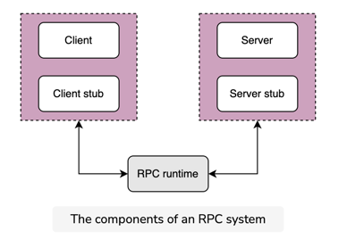
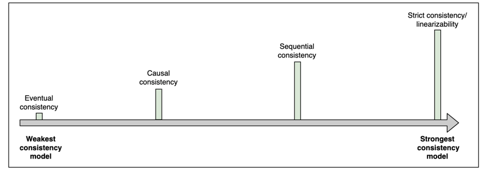
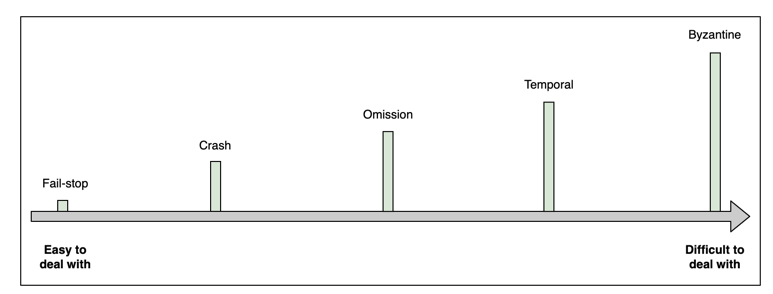
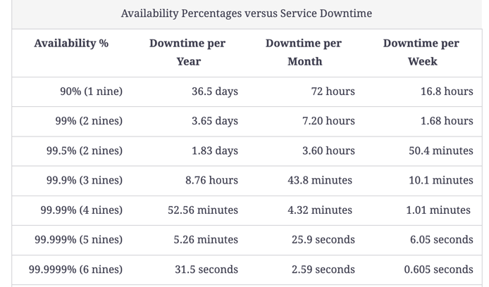
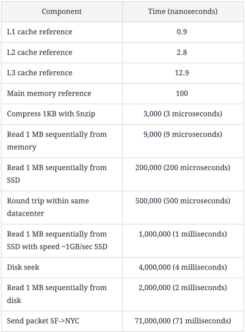
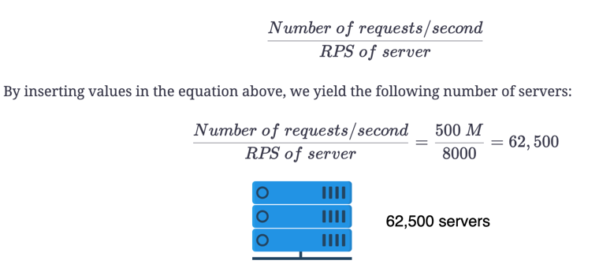
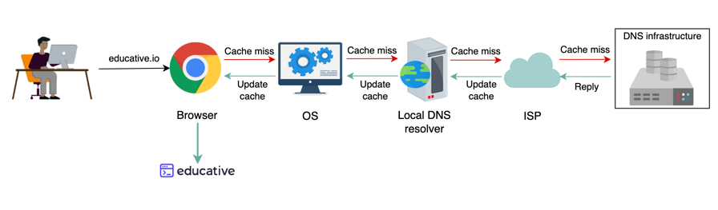
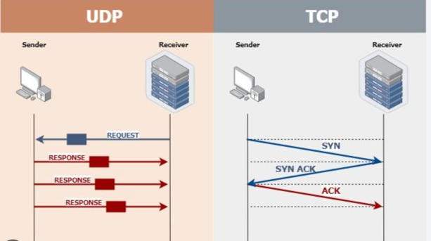
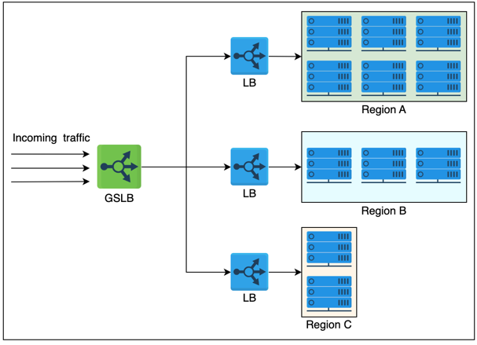
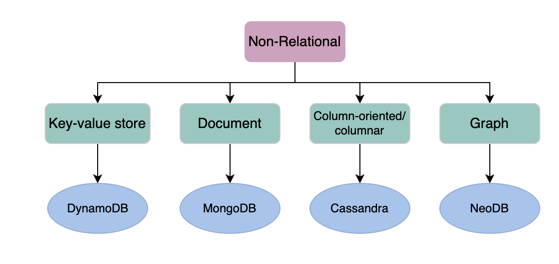

## What is System Design Interview

** Best Practice of system SDI **
1. Solidify requirement : Ask right question
2. Scope the problem :SDIs are usually about 35 to 40 minutes long.
3. Engage the interviewer:to ensure that they understand our thought process.

how a design might evolve over time as some aspect of the system increases by some order of magnitude—for example, the number of users, the number of queries per second, and so on.

\
**__Question__**
```
SDI might be related to why we don’t design a system that’s already capable of handling more work than necessary or predicted?
**My Answer**: 1. cost of on-boarding and maintainance
           2. Lost of focus from business problem to software problem
           3. Flexibility to adopt to new tech is gone for a toss.
**Book Answer**: The dollar cost associated with complex projects is a major reason why we don’t do that.
```

**R-S-A-P-E-R golden property of SD**
Design should have following properties:
* Robustness (the ability to maintain operations during a crisis)
* Scalability
* Availability 
* Performance
* Extensibility
* Resiliency (the ability to return to normal operations over an acceptable period of time post disruption)

Important blog to keep eye on 
```python
Engineering at Meta, 
Meta Research, 
AWS Architecture Blog,
Amazon Science Blog, 
Netflix TechBlog,
Google Research, 
Engineering at Quora, 
Uber Engineering Blog, 
Databricks Blog, 
Pinterest Engineering, 
BlackRock Engineering, 
Lyft Engineering
Salesforce Engineering.
```

\
We should focus less on mechanics and more on trade-offs.

## Technique of SDI ##
* Strategize, then divide and conquer
  1. Ask refining questions: Functional and non-functional requirement
  2. Handle Data: 

Some important questions to ask ourselves when searching for the right systems and components include the following:

1. What’s the size of the data right now?
2. At what rate is the data expected to grow over time? QPS and expected QPS
3. How will the data be consumed by other subsystems or end users? Peek load
4. Is the data read-heavy or write-heavy? based on functionally we have finalized
5. Do we need strict consistency of data, or will eventual consistency work? (Based on functionals and non functional requirement)
6. What’s the durability target of the data? ( Interesting)
7. What privacy and regulatory requirements do we require for storing or transmitting user data? ( Yup , GDPR/CCPA)

###Tradeoff decision### 

-----

1. Different components have different pros and cons. We’ll need to carefully weigh what works for us (Know pros and cons).
2. Different choices have different costs in terms of `money and technical complexity`. We need to efficiently utilize our resources.
3. Every design has its `weaknesses`. As designers, we should be aware of all of them, and we should have a follow-up plan to tackle them.
   An example could be that our current design can’t handle ten times more load, but we don’t expect our system to reach that level anytime soon. We have a monitoring system to keep a very close eye on load growth over time so that a new design can be implemented in time. This is an example where we intentionally had a weakness to reduce system cost.
   
***Things not to do in SDI***
Don’t `write code` in a system design interview.
Don’t start `building without a plan`.
Don’t work in `silence`.
Don’t `describe numbers without reason`. We have to frame it.
If we `don’t know something, we don’t paper over it`, and we `don’t pretend` to know it.

Today’s applications can’t remain responsive/functional if they’re based on a single node because of an exponentially growing number of users. Abstractions in distributed systems help engineers shift to distributed systems quickly to scale their applications.

###Abstraction###
RPC: Remote procedure call provides abstraction over 
    - complexities of packing and sending function arguments to the remote server
    - receiving the return values
    - Retry 

In OSI model RPC spans the transport and application layers.


RPC in 10 steps:
During the RPC process, the following steps occur:

1. A client initiates a client stub process by giving parameters as normal. The client stub is stored in the address space of the client.
2. The client stub converts the parameters into a standardized format and packs them into a message. After packing the parameter into a message, the client stub requests the local RPC runtime to deliver the message to the server.
3. The RPC runtime at the client delivers the message to the server over the network. After sending a message to the server, it waits for the message result from the server.
4. RPC runtime at the server receives the message and passes it to the server stub.
Note: The RPC runtime is responsible for transmitting messages between client and server via the network. The responsibilities of RPC runtime also include retransmission, acknowledgment, and encryption.
5. The server stub unpacks the message, takes the parameters out of it, and calls the desired server routine, using a local procedure call, to do the required execution.
6. After the server routine has been executed with the given parameters, the result is returned to the server stub.
7. The server stub packs the returned result into a message and sends it to the RPC runtime at the server on the transport layer.
8. The server’s RPC runtime returns the packed result to the client’s RPC runtime over the network.
9. The client’s RPC runtime that was waiting for the result now receives the result and sends it to the client stub.
10. The client stub unpacks the result, and the execution process returns to the caller at this point.

### Consistency Model ###
On Highlevel each read request gets the value of the recent write


Consistency spectrum

###Eventual consistency###

------
Eventual consistency ensures that all the replicas will eventually return the same value to the read request, but the returned value isn’t meant to be the latest value. However, the value will finally reach its latest state.
Eventual consistency ensures `high availability`.
domain name system is a highly available system that enables name lookups to a hundred million devices across the Internet to follow eventual consistency 

###Causal consistency###

------

Causal consistency works by categorizing operations into dependent and independent operations. 
Dependent operations are also called causally-related operations. 
Causal consistency preserves the order of the causally-related operations.

For P2 to write the value b at location y, it first needs to calculate b. Since b=x+5, the read operation on x should be performed before writing b on location y. That’s why read(x)a and write(y)b are causally related.

This model doesn’t ensure ordering for the operations that are not causally related. 
These operations can be seen in different possible orders.

Causal consistency is weaker overall, but stronger than the eventual consistency model. It’s used to prevent non-intuitive behaviors.
where is it used??
The causal consistency model is used in a commenting system. For example, for the replies to a comment on a Facebook post, we want to display comments after the comment it replies to. This is because there is a cause-and-effect relationship between a comment and its replies
`Mongo DB support Causal consistency`
### Sequential consistency ###
Sequential consistency is stronger than the causal consistency model. It preserves the ordering specified by each client’s program. However, sequential consistency doesn’t ensure that the writes are visible instantaneously or in the same order as they occurred according to some global clock.

### Strict consistency aka linearizability ###

A strict consistency or linearizability is the strongest consistency model. This model ensures that a read request from any replicas will get the latest write value. Once the client receives the acknowledgment that the write operation has been performed, other clients can read that value.

Linearizability is challenging to achieve in a distributed system.

We might need consensus algorithms such as Paxos and Raft to achieve strong consistency

Applications with strong consistency requirements use techniques like quorum-based replication to increase the system’s availability.
Sync all replica to be 100% consistent

```
Google’s Spanner database claims to be linearizable for many of its operations.
```

### Spectrum of Failure Models ###



1. **Fail-stop**:\
   a node in the distributed system halts permanently. However, the other nodes can still detect that node by communicating with it.
   
2. **Crash**\
   a node in the distributed system halts silently, and the other nodes can’t detect that the node has stopped working
   
3. **Omission failures**\
   The node fails to send or receive messages. There are two types of omission failures. If the node fails to respond to the incoming request, it’s said to be a send omission failure. If the node fails to receive the request and thus can’t acknowledge it, it’s said to be a receive omission failure

4. **Temporal failures (Late response)**\
   the node generates correct results, but is too late to be useful. This failure could be due to bad algorithms (n2 algo), a bad design strategy(system hang), or a loss of synchronization between the processor clocks
   
5. **Byzantine failures**\
   he node exhibits random behavior like transmitting arbitrary messages at arbitrary times, producing wrong results, or stopping midway. This mostly happens due to an attack by a malicious entity or a software bug. A byzantine failure is the most challenging type of failure to deal with.
   
### Availability ###
is the percentage of time that some service or infrastructure is accessible to clients and is operated upon under normal conditions. For example, if a service has 100% availability, it means that the said service functions and responds as intended (operates normally) all the time.



###Reliability

Reliability, R, is the probability that the service will perform its functions for a specified time. R measures how the service performs under varying operating conditions.

We often use mean time between failures (MTBF) and mean time to repair (MTTR) as metrics to measure R.


(We strive for a higher MTBF value and a lower MTTR value.)
Reliability (R) and availability (A) are two distinct concepts, but they are related. Mathematically, A is a function of R. This means that the value of R can change independently, and the value of A depends on R. Therefore, it’s possible to have situations where we have:

low A, low R
low A, high R
high A, low R
high A, high R (desirable)

### Scalability ###
Scalability is the ability of a system to handle an increasing amount of workload without compromising performance.

**dimensions of scalability**
Size scalability: Adding more users and resource to it
Administrative scalability: growing number of organizations or users to share a single distributed system with ease
Geographical scalability:  how easily the program can cater to other regions while maintaining acceptable performance constraints

### Maintainability
We can further divide the concept of maintainability into three underlying aspects:
Operability: This is the ease with which we can ensure the system’s smooth operational running under normal circumstances and achieve normal conditions under a fault.
Lucidity: This refers to the simplicity of the code. The simpler the code base, the easier it is to understand and maintain it, and vice versa.
Modifiability: This is the capability of the system to integrate modified, new, and unforeseen features without any hassle.

Maintainability, M, is the probability that the service will restore its functions within a specified time of fault occurrence. M measures how conveniently and swiftly the service regains its normal operating conditions.
We use (mean time to repair) MTTR as the metric to measure M.


In other words, MTTR is the average amount of time required to repair and restore a failed component. Our goal is to have as low a value of MTTR as possible.

Maintainability refers to time-to-repair, whereas reliability refers to both time-to-repair and the time-to-failure. Combining maintainability and reliability analysis can help us achieve availability, downtime, and uptime insights

### fault tolerance
Fault tolerance refers to a system’s ability to `execute persistently` even if one or more of its components fail. Here, components can be software or hardware. Conceiving a system that is hundred percent fault-tolerant is practically very difficult.

Techniques that are significant and suitable for most designs.
1. Replica based fault tolerance
2. Checkpointing: Checkpointing is a technique that saves the system’s state in stable storage when the system state is consistent. Checkpointing is performed in many stages at different time intervals. The primary purpose is to save the computational state at a given point. When a failure occurs in the system, we can get the last computed data from the previous checkpoint and start working from there.
   (Window and RDBMS uses checkpointing heavily)

### Back of the envelope calculation 
Example are
1. Storage calculation for service
2. concurrent TCP connection a server can support
3. Request per second (RPS) a web, database, or cache server can handle (QPS query per second)
4. Total active users 

***Web servers:*** High on CPU , Ram and Storage can be small to medium
e.g. Facebook has used a web server with 32 GB of RAM and 500 GB of storage space. 
But for its high-end computational needs, it partnered with Intel to build a custom 16-core processor.

***Application servers*** : High on Computation and m storage
Storage resources can be volatile and non-volatile. 
Facebook has used application servers with a RAM of up to 256 GB and two types of storage—traditional rotating disks and flash—with a capacity of up to 6.5 TB.

***Storage servers***:

For instance, YouTube uses the following datastores:

Blob storage for its encoded videos.
A temporary processing queue storage that can hold a few hundred hours of video content uploaded daily to YouTube for processing.
Specialized storage called Bigtable for storing a large number of thumbnails of videos.
Relational database management system (RDBMS) for users and videos metadata (comments, likes, user channels, and so on.

***Important Latencies***



In reality, capacity estimation is a hard problem, and organizations learn how to improve it over the years. A monitoring system keeps an eye on all parts of our infrastructure to give us early warnings about overloading servers.

Example of Twitter like service 
-------
There are 500 million (M) daily active users (DAU).
A single user makes 20 requests per day on average.
Recall that a single server can handle 8,000 RPS.

total average request per day = 10000million req per day
                              = 10000 /(24*60*60) =115 740 = 116000 RPS
                                = 15 servers in parallel 

Real systems use various methods (back-of-the-envelope calculations, simulations, prototyping, and monitoring) to improve on their initial (potentially sloppy) estimates gradually.

***Peak time estimation***
-----
We assume that there is a specific second in the day when all the requests of all the users arrive at the service simultaneously. We use it to get the capacity estimation for a peak load. To do better, we will need request and response distributions, which might be available at the prototyping level. We might assume that distributions follow a particular type of distribution, for example, the Poisson distribution. By using DAU as a proxy for peak load for a specific second, we have avoided difficulties finding the arrival rates of requests and responses.



***Storage estimation***

We have a total of 250 M daily active users.
Each user posts three tweets in a day.
Ten percent of the tweets contain images, whereas five percent of the tweets contain a video. Any tweet containing a video will not contain an image and vice versa.
Assume that an image is 200 KB and a video is 3 MB in size on average.
The tweet text and its metadata require a total of 250 Bytes of storage in the database.

- 250 M DAU
- 250*3M Post per day = 750M PPD
- 750*.1*(200 *1024) + 750*0.05*(3*1024*1024) + 750*0.85*(250) - per day storage

###DNS###
Domain Name Server: Has imp part
1. Name Server :It’s a complete infrastructure with numerous servers. DNS servers that respond to users’ queries are called name servers.
2. Resource Record: It’s a complete infrastructure with numerous servers. DNS servers that respond to users’ queries are called name servers.\

How DNS know location of any website if registered in any country ???
Ans.) Hierarchy: DNS name servers are in a hierarchical form. The hierarchical structure allows DNS to be highly scalable because of its increasing size and query load.

Since DNS is read-heavy we need cache infra to support this.

DNS Hierarchy:
DNS is infra with name  servers at different levels
1. DNS Resolver: Local or default server . Return value if cached else Resolvers initiate the querying sequence and forward requests to the other DNS name servers.
2. Root-level name servers: These servers receive requests from local servers (DNS Resolver).
This guy hold list of top DNS Server (TLD) which hold list of domain name.
   For instance, when a user requests the IP address of educative.io, root-level name servers will return a list of top-level domain (TLD) servers that hold the IP addresses of the .io domain.
   
3. Top-level domain (TLD) name servers: These servers hold the IP addresses of authoritative name servers. The querying party will get a list of IP addresses that belong to the authoritative servers  of the organization.
4. Authoritative name servers: These are the organization’s DNS name servers that provide the IP addresses of the web or application servers.


There are two ways to perform a DNS query:
Iterative: The local server requests the root, TLD, and the authoritative servers for the IP address.
Recursive: The end user requests the local server. The local server further requests the root DNS name servers. The root name servers forward the requests to other name servers.




There are `13 logical root` name servers (named letter A through M) with `many instances` spread throughout the globe. These servers are managed by `12 different organizations`.

Scale of disreibution
1. 13 Root level server with 1000 replica each
2. Top Level DNS and root are also scaled (Replica)
3.Authoritative : Org take care of this
   
Reliability:
1. Caching: It happens at
    - local Browser
    - OS
    - Local NS
    - ISP DNS Resolver
    
2. Replica: Systematic copy all around the globe
3. Protocol : UDP over TCP . TCP take 3 way hand shacking before actual file tranfer, UDP is just 2 way and that's why fast.

```python
a communication protocol used across the Internet for especially time-sensitive transmissions such as video playback or DNS lookups.

The main difference between TCP (transmission control protocol) and UDP (user datagram protocol) is that TCP is a connection-based protocol and UDP is connectionless. While TCP is more reliable, it transfers data more slowly. UDP is less reliable but works more quickly
```



***Consistent***:
DNS provides eventual consistency and updates records on replicated servers lazily. Typically, it can take from a few seconds up to three days to update records on the DNS servers across the Internet. The time it takes to propagate information among different DNS clusters depends on the DNS infrastructure, the size of the update, and which part of the DNS tree is being updated.

cached records at the default/local and ISP servers may be outdated. To mitigate this issue, each cached record comes with an expiration time called time-to-live (TTL).

\
Question.) To maintain high availability, should the TTL value be large or small?
Users will experience non-availability only for the time the TTL isn’t expired. Companies that long for high availability maintain a TTL value as low as 120 seconds. Therefore, even in case of a failure, the maximum downtime is a few minutes.

End users’ operating systems have configuration files (/etc/resolv.conf in Linux) with the DNS resolvers’ IP addresses, which in turn obtain all information for them.

***Load Balancer***
The load balancing layer is the first point of contact within a data center after the firewall
A load balancer may not be required if a service entertains a few hundred or even a few thousand requests per second.

Scalability: By adding servers, the capacity of the application/service can be increased seamlessly. Load balancers make such upscaling or downscaling transparent to the end users.
Availability: Even if some servers go down or suffer a fault, the system still remains available. One of the jobs of the load balancers is to hide faults and failures of servers.
Performance: Load balancers can forward requests to servers with a lesser load so the user can get a quicker response time. This not only improves performance but also improves resource utilization.

In reality, load balancers can be potentially used between any two services with multiple instances within the design of a system.

###Services offered by load balancers###

1.Health checking of underline servers using heartbeat protocol (the heartbeat protocol is a way of identifying failures in distributed systems. Using this protocol, every node in a cluster periodically reports its health to a monitoring service.)
2. TLS /SSL encryption with client and reduce burden of end server (app /web server)
3. Analystics (Take decision based on load pattern)
4. Service discovery:  maintain service registery which talk about list of server with specific capability
5. Security: form attack like DDoS

What if LB goies down , is it noe SPOF
Load balancers are usually deployed in pairs as a means of disaster recovery. If one load balancer fails, and there’s nothing to failover to, the overall service will go down.

###Global Load Balancer###

round-robin is still widely used by many DNS service providers. Furthermore, DNS uses short TTL for cached entries to do effective load balancing among different data centers.

### Reverse Proxy###
Reverse proxy is a component at the edge of the server-side network that sits between the server and the outside world. It can provide features like privacy, security, caching, etc.

LB: Static and dynamic
Prefer dynamic : dynamic algorithms monitor the health of the servers and forward requests to active servers only

We know LB support TLS terminal for communication, which one to use ?
L4 : TCP UDP base routing , same packet communication is forward to same servers
L7: Application based LB, possible to make application-aware forwarding decisions based on HTTP headers, URLs, cookies, and other application-specific data—for example, user ID. Apart from performing TLS termination, these LBs can take responsibilities like rate limiting users, HTTP routing, and header rewriting

```
L7 is smarter L4 is faster
```

LB Tiering

Tier-0 and tier-1 LBs
Equal cost multipath (ECMP): From the name of ECMP, it’s evident that this layer divides incoming traffic on the basis of IP or some other algorithm like round-robin or weighted round-robin

Tier 2:
Tier-2 LBs make sure that for any connection, all incoming packets are forwarded to the same tier-3 LBs. To achieve this goal, a technique like consistent hashing can be utilized. 

Tier-3:
This tier also reduces the burden on end-servers by handling low-level details like `TCP-congestion control protocols`, the discovery of Path MTU (maximum transmission unit), the difference in application protocol between client and back-end servers, and so on. The idea is to leave the computation and data serving to the application servers and effectively utilize load balancing commodity machines for trivial tasks.

```
To summarize, tier 1 balances the load among the load balancers themselves. Tier 2 enables a smooth transition from tier 1 to tier 3 in case of failures, whereas tier 3 does the actual load balancing between back-end servers. Each tier performs other tasks to reduce the burden on end-servers.
```

Software load balancers are becoming increasingly popular because of their flexibility, programmability, and cost-effectiveness. That’s all possible because they’re implemented on commodity hardware

Prefer s/w LB over h/w LB

Load Balancers as a Service (LBaaS) has been introduced. This is where cloud owners provide load balancing services. Users pay according to their usage or the service-level agreement (SLA) with the cloud provider. Cloud-based LBs may not necessarily replace a local on-premise load balancing facility, but they can perform global traffic management between different zones. Primary advantages of such load balancers include ease of use, management, metered cost, flexibility in terms of usage, auditing, and monitoring services to improve business decisions.

### Databases ###
Drawbacks - Tabular format not same as object model . example list are not support. RDBMS get it denormalized

###NOSql###
When to use
1. large volume of semi-structured and unstructured data, 
  2. low latency, 
   3. flexible data models



1. Key value : Example is Hbase , Amazon DynamoDB, Redis, and Memcached DB.
2. Document store: A document database is designed to store and retrieve documents in formats like XML, JSON, BSON, and so on. These documents are composed of a hierarchical tree data structure that can include maps, collections, and scalar values.
    Example : MongoDB, google firestore, 
   Example Ecom data , Blog and video store
   
```
Document databases support more advanced querying capabilities, and often have built-in support for indexing and searching.
Key-value databases typically have more limited querying capabilities and may not support advanced search or indexing features.

MongoDB covers a wide range of database examples and use cases, supporting key-value pair data concepts. With its flexible schema and rich query language with secondary indexes,
Document stores can be used for all use cases of a KV store database, but it also has additional advantages like there is no limitation of querying just by the key but even querying attributes within a document, also data in each document can be in a different format.
```

3. Graph store:  use the graph data structure to store data, where nodes represent entities, and edges show relationships between entities. The organization of nodes based on relationships leads to interesting patterns between the nodes.
   Each of the files contains data for a specific part of the graph, such as data regulation and privacy, machine learning research, financial services-based applications, and many more.
   Popular graph databases include Neo4J, OrientDB, and InfiniteGraph.
   
4. Columnar database:
   store data in columns instead of rows. They enable access to all entries in the database column quickly and efficiently. Popular columnar databases include Cassandra, HBase, and Amazon Redshift.
   Columnar databases are efficient for a large number of aggregation and data analytics queries. It drastically reduces the disk I/O requirements and the amount of data required to load from the disk. For example, in applications related to financial institutions, there’s a need to sum the financial transaction over a period of time. Columnar databases make this operation quicker by just reading the column for the amount of money, ignoring other attributes of customers.
    -- Good in agg because of columer nature
    DynamoDB 

Google’s Cloud Spanner is one such database that’s geo-replicated with automatic horizontal sharding ability and high-speed global snapshots of data.

https://thedataguy.in/internals-of-google-cloud-spanner/
```
Google spanner uses hardware like truetime for strong consistency 

Spanner support MVCC. So it’ll keep the old data for some period of time. If our applications are fine to get the old data (older than X seconds) then we don’t need to wait for data sync from the leader split. For example, We have to tell the Split that we are fine with 15sec old data, then it’ll check the committed timestamp and that is less than 15 seconds, then the old data will be served to the application.
```


### Partitioning of Data ###
Why do we partition data?
Data partitioning (or sharding) enables us to use multiple nodes where each node manages some part of the whole data.
- scaling is possible

Partition should be evenly loaded else we will have hotspot problem

`vertical sharding`is used to increase the speed of data retrieval from a table consisting of columns with very wide text or a binary large object (blob). In this case, the column with large text or a blob is split into a different table.
e.g. address -street lane city etc
`Horizontal sharding` Spliting into shards

Usually a foreign key can be good criteria for sharing example customer id

Sharding type
1. Key-range based sharding: Continues key in a shared
 adv:
    Range query works well
   ease to implement 
   
dis adv:
    Range query suffer if done on kesy other than paritition key
2. Hash-based sharding#
   Value mode n where n is number of shards
   Advantages
     Keys are uniformly distributed across the nodes.
   Disadvantages
     We can’t perform range queries with this technique. Keys will be spread over all partitions.


3. Dynamic partitioning: Split once size is reached into equal size partition
   It’s difficult to apply dynamic rebalancing while serving the reads and writes. This approach is used in HBase and MongoDB
   
## Secondry index ##
Each partition is fully independent in this indexing approach. Each partition has its secondary indexes covering just the documents in that partition. It’s unconcerned with the data held in other partitions. If we want to write anything to our database

###  service discovery ###

Following are a few approaches to this problem:

1. Allow the clients to request `any node` in the network. If that `node doesn’t contain the requested data, it forwards that request to the node that does contain` the related data.

2. The second approach contains a `routing tier`. All the requests are `first forwarded to the routing tier`, and it determines which node to connect to fulfill the request.

3. The `clients already have the information related to partitioning` (or partitioning algo) and which partition is connected to which node. So, they can directly contact the node that contains the data they need.
 but # 3 is not discovery
   
