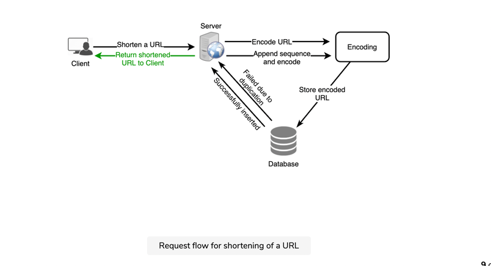
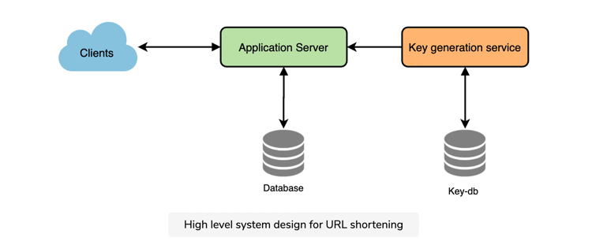
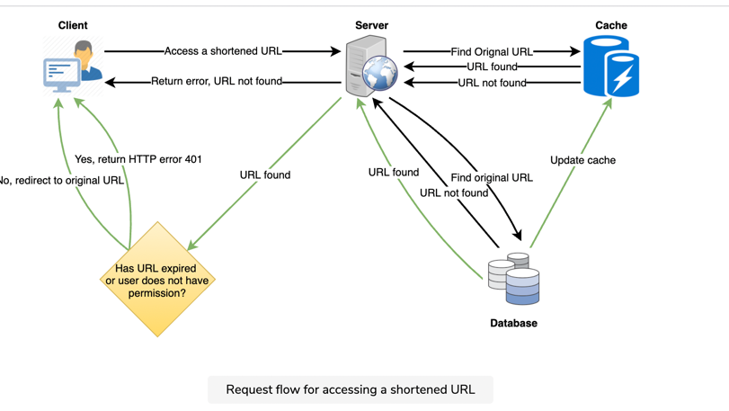

# Tiny URL #
### Requirement ###

#### Functional ####
 
 1. shorter and unique alias of it
 2. Service should Redirect to Actual URL
 3. Short URL should Expire
 4. Support for custom tiny URL

#### Non Functional ####
1. Scalable
2. Real time with min latency
3. Should not be guessable

#### Back of the Envelope ####
 1. **QPS** :\
    System is read heavy , 100:1 read:write ratio\
    **Write** = 500 M write per month\
    **Read** = 500*100 i.e. 50B Read per Month\
          500,00,00,000/ (30 X 23 X 3600) =~20K reads per second\
          500 million = 200 write per second
    

 2. **Storage**:\
    We decide to store for 5 years.\
    so 5X 12 X 500M =30000 M = 30B\
    if each URL is roughly 500 bytes\
        30BX 500/(1024X1024x1024x1024)= 13.64 TB
    
    
3. **Network Bandwith**:\
   200 Write QPS = 200X500= 10KBps\
   llly 20K X 500 = 10MBPS
   
   
4. **Memory Useage**:

    We would use 80-20 rule and meaning 20% of URLs generate 80% of traffic, \
    we would like to cache these 20% hot URLs.\
    so 20K  X 3600 X 24 X 0.20 X 500 =  ~170 GB per day
   
### API Design ###
- Rest Api to get URL\
    `getShortUrl( api_dev_key, origin_url, custom_alias=None, user_name=None, expire_date=None`)
    api_dev_key (string): throttle User Based access\
    custom_alias (string): Optional custom key for the URL\
    user_name (String): Optional User name to be used in the encoding\
    
    **Return**: String
- Delete URL
    `delete( api_dev_key, short_url )`
  
### Data base Design ###

User Table 
*  user_id
*  email_id
*  login
*  created_on

URL Table
* id
* long URL
* Short URL
* encoding
* creation time
* expire time
* user_id

### Algo ###

1. url -> Hash -> base(64) encoding  and take first 6 char \
>64 ^ 6 = ~68.7 billion ( this is good )

Problems
1. Two same URL entered by two diff user will give same tiny URL
 solution : Add a seq no. to each URL , but this would have performance penalty

2. Using offline Key generation Service
    - Generate unique 6 char keys before hand and store it in DB (key DB)
    - Key DB would have 2 table: New key and Used Key \
      With base64 encoding, we can generate 68.7B unique six letters keys
    - Size of Key DB= 6X68.7B (Base 64 encoding)=412 GB
    - SPOF : have standby Key DB
    - Cache : Cache some in App servers and move then as used
      even when server die ,we would waste it but that should be Ok
    - Concurreny : For that, it must synchronize (or get a lock on) the data structure holding the keys before removing keys from it and giving them to a server

    

### DB Partition ###
1. Use Hashing on key (tiny URL) and mode it to partition
2. use consistent hashing

### Cache ###
- we used 80-20 rule , so cache size should be 170 GB per day and we can increase it base on need
- use some thing like memcache.
- **Cache eviction policy** can be used using LRU use some thing like linked hashmap.
- we can replicate our caching servers to distribute the load between them.
- cache miss, our servers would be hitting a backend database. Whenever this happens, we can update the cache and pass the new entry to all the cache replicas. Each replica can update its cache by adding the new entry.

### Load Balancer ###
- should be between client and AppServer
- AppServer and DB
- AppServer and Cache

can start with Round Robin but can move to intelligent one where server load should be accounted before  periodically before routing

### Purge ###
- use a lazy  light weight Data clean service tigger if load on system is less
- if user request expired URL delete it form DB and Cache
- Default life is 2year
- reuse deleted key  and write it back to DB
