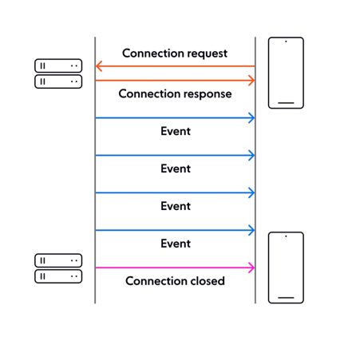
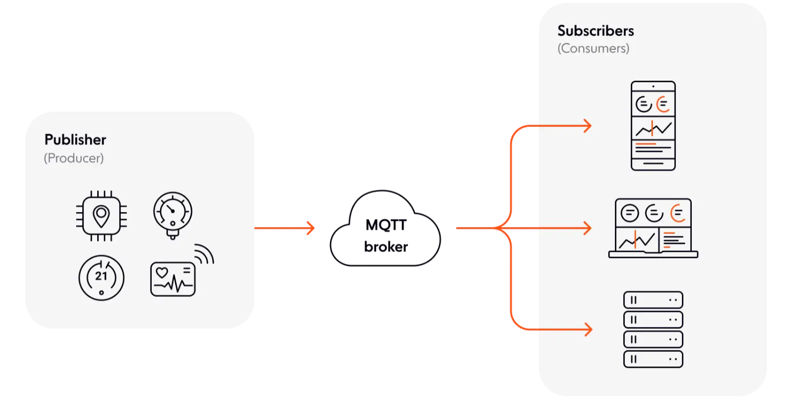
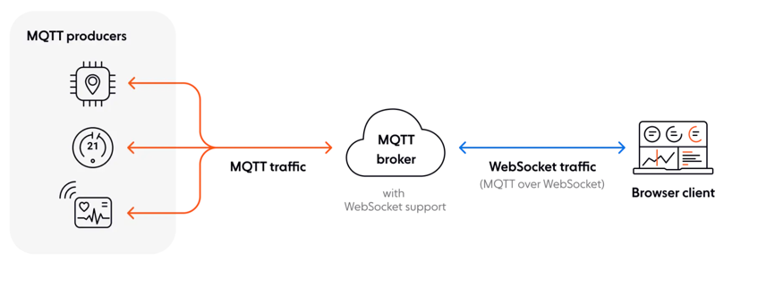

#Web socket

WebSocket is a realtime web technology that enables bidirectional, full-duplex communication between client and server over a persistent connection. The WebSocket connection is kept alive for as long as needed (in theory, it can last forever), allowing the server and the client to send data at will, with minimal overhead.

Where to use Web socket:
1. Live chat
2. Broadcast usecases:
    WebSockets are often used to facilitate data broadcast - the practice of transmitting the same data (message) to a large number of recipients simultaneously. It’s a one-to-many form of communication that’s ideal for a variety of realtime use cases, including:
    Streaming live score updates.
    Sending traffic updates.
    Transmitting financial information, such as stock quotes and market updates.
    Distributing news alerts.
   
3. Multiplayer collaboration
4. In-app alerts and notifications (Crick info)

Example of useage 
`Facebook Messenger` uses MQTT over WebSockets for sending/receiving chat messages, and features like typing indicators and read receipts.

`Discord` uses WebSockets as its primary communication protocol between the client and the server. WebSockets allow Discord to implement features like realtime chat messaging, presence (online/offline status), activity updates, and notifications.

`Slack` uses WebSockets for instant messaging between chat users, and for realtime updates and notifications (e.g, a user receives a new message, or a channel is updated).

`WhatsApp Web` uses WebSocket technology to power realtime chat messaging, and to provide other features, such as realtime updates for message delivery and read receipts, and indicators that show when someone is typing a message.

`YouTube's live streaming` feature uses WebSockets to enable realtime chat between viewers and the streamer. Similarly, YouTube's notification system uses WebSockets to push realtime updates to users, such as when a new video is uploaded or when someone they follow goes live.

`Airbnb uses WebSockets for realtime search and booking` updates.

`Uber uses WebSockets to send realtime location updates` to client devices.

`Netflix uses WebSockets for realtime streaming updates` and for its video player controls.

`Twitch` uses the WebSocket technology for `instant chat messaging`, and to push updates when various events occur (e.g., a broadcaster goes online, a user is cheered in a channel, broadcasting online/offline user status, viewer counts).

`GitHub` uses WebSockets for `realtime notifications and updates` (e.g., new comments and status indicators on pull requests).

`Figma` uses WebSockets to enable `realtime collaboration and synchronization` between multiple users working on the same design file. 

Websocket doesnot use http.

**When not to use WebSockets**
when bidirectional real-time communication is not needed

Alternate for Web socket :
1. For notification: Server-Sent Events (SSE) is an HTTP server push technology. The idea is simple: a browser client can subscribe to a stream of events generated by a server, receiving updates whenever a new event occurs. 



Disadvantage
It’s mono-directional; only the server can push data to the client.

You can only have six concurrent SSE connections per browser at any one time.

It only supports UTF-8 text data; SSE can’t handle binary data.

2. Long pooling:

Long polling is a client-pull technology that takes HTTP request/response polling and makes it more efficient. In long polling, the server elects to hold a client connection open for as long as possible, and delivers a response when new data becomes available or if a timeout threshold is reached.

Disadvantage:
Long polling is more resource intensive on the server than WebSockets.

Long polling can come with a latency overhead because it requires several hops between servers and devices. (since it is based on HTTP)

Reliable message ordering can be an issue.

3. MQTT 
   
MQTT (Message Queuing Telemetry Transport) is a publish-subscribe messaging protocol
In an MQTT architecture, we have:

Publishers (producers) and subscribers (consumers). Note that a publisher can also be a subscriber.

A broker which acts as the middleware MQTT server that manages the exchange of messages between publishers and subscribers.


Advantage:
Lightweight protocol that’s ideal for networks with limited bandwidth or unpredictable connectivity, and devices with limited CPU, memory, and battery life.

Reliable protocol, with three different levels of data delivery guarantees: 0 (at most once delivery), 1 (at least once delivery), and 2 (exactly-once delivery).

Bidirectional and flexible - it provides one-to-one, one-to-many, and many-to-many communication.

Disadvantage:
Not a good choice for sending photos, video, or audio data.

You can’t send MQTT messages to a browser, because web browsers don’t have MQTT support built-in.

The base MQTT protocol doesn’t use encrypted communication. Some MQTT brokers allow you to use MQTT over TLS for enhanced security, but this leads to increased CPU usage, which may be a problem for constrained devices.

Due to being lightweight by design, `MQTT is a better choice than WebSockets for many IoT use cases, such as collecting data from temperature or pressure sensors in realtime`. However, as previously mentioned, MQTT can’t directly send messages to a browser. That’s why WebSocket is often used as a transport for streaming MQTT data to browser clients
(MQTT over WebSockets).


4. WebRTC
Web Real-Time Communication (WebRTC) is a framework that enables you to add realtime communication (RTC) capabilities to your web and mobile applications. WebRTC allows the transmission of arbitrary data (video, voice, and generic data) in a peer-to-peer fashion.

advantages
Secure and encrypted 
Peer2peer and good choice for voice and vedio
platform and device independent

Disadvantage
1. need infra like signaling server to connect 
2. CPU intensive
3. Complex ( protocol over UDP)

```
WebSocket is a better choice when data integrity (guaranteed ordering and delivery) is crucial, as you benefit from the underlying reliability of TCP. 

```


Live chat/ score card/ broadcast => web socket
IOT - Message queue telemetry transport
Video and Audio - Web RTC
with in coorporate where web socket is not possible : Long pooling

http base -> Web socket/ Long pooling/ MQTT
UDP-> Web RTC

