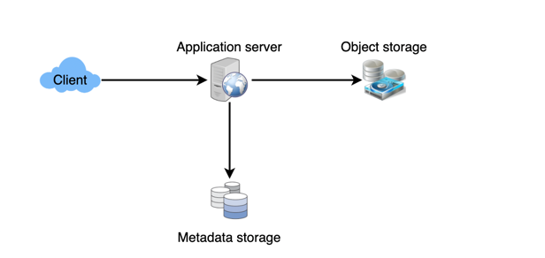
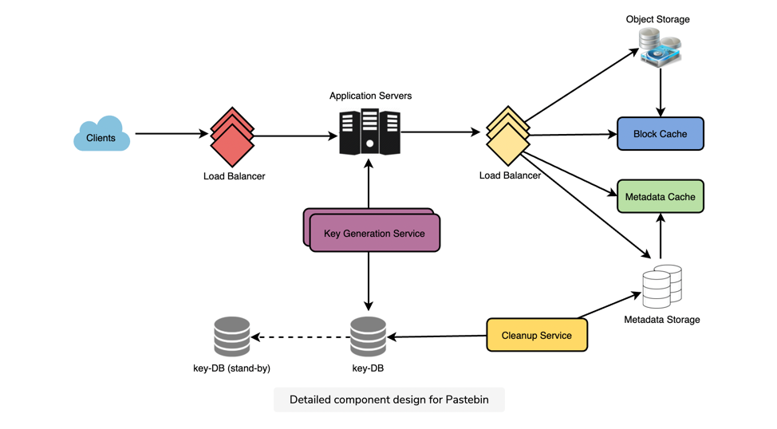

# Pastebin #

### Requirement ###

**Functional Requirements**:

- Users should be able to upload or “paste” their data and get a unique URL to access it.
- Users will only be able to upload text.
- Data and links will expire after a specific timespan automatically; users should also be able to specify expiration time.
- Users should optionally be able to pick a custom alias for their paste.

**Non-Functional Requirements**

- The system should be highly reliable, any data uploaded should not be lost.
- The system should be highly available. This is required because if our service is down, users will not be able to access their Pastes.
- Users should be able to access their Pastes in real-time with minimum latency.
- Paste links should not be guessable (not predictable).

### Back of the Envelope ###

- App would be read heavy 5:1
- 1 million paste per day\
    write = 1M ~ 12 paste/Sec\
    read  = 5M =~60 Reads/Sec 
  
    1 paste average 10 KB

**Network**:
    read= 10*60 = 600 kbps X2 = 12MBps
    write = 12 *10= 120 kbps = 2.4 MBps
  
**Storage**
    Data is kept for 10 years\
     1M X 10 kb =10 GB per day\
    ~ 3.7 Tb per year\
    ~ 3.7 TB for 10 years\
    Now using 70% model = 3.7/0.7=5.3 TB

**Memory**  
cache would be 80:20
so per day would be 50 GB data read\
so cache would be 10 GB

**System API**
1. To post pastebin\
    `paste(api_dev_key, paste_data, user_name:None, custom_tag:None, expire_timestamp:None)`\
    return \
    url_key:String
   
2. To get
    ` get(api_dev_key,url_key)`\
   return \
   paste_data:String
   
3. To Delete 
    `delete (api_dev_key,url_key)` \
    return\
    state:boolean
   
### Database design ###

user table:
- userid:String
- create_on: timestamp
- email: String
- last_login: timestamp

paste_bin:
- id:
- url_hash
- content_key
- expiry_date: timestamp
- created_dateL: timestamp

### Component Design ###

1. Application layer
    1. get 6 digit unique hash for paste. this act as key to paste in DB
    2. write paste in object store and hash and object store reference in DB
    3. if hash is not unique try again #1 and #2
    
hash can be generated using Key DB approach as we did in TinyUrl

2. Data storage layer: this is divided into two part 
    - Metadata store: this store hash and meta data of object store can be as small as MySql or can be as big as Dynamo or cassandra
    - Object Store: S3
    
    
Every thing else can be as that of tiny URL
