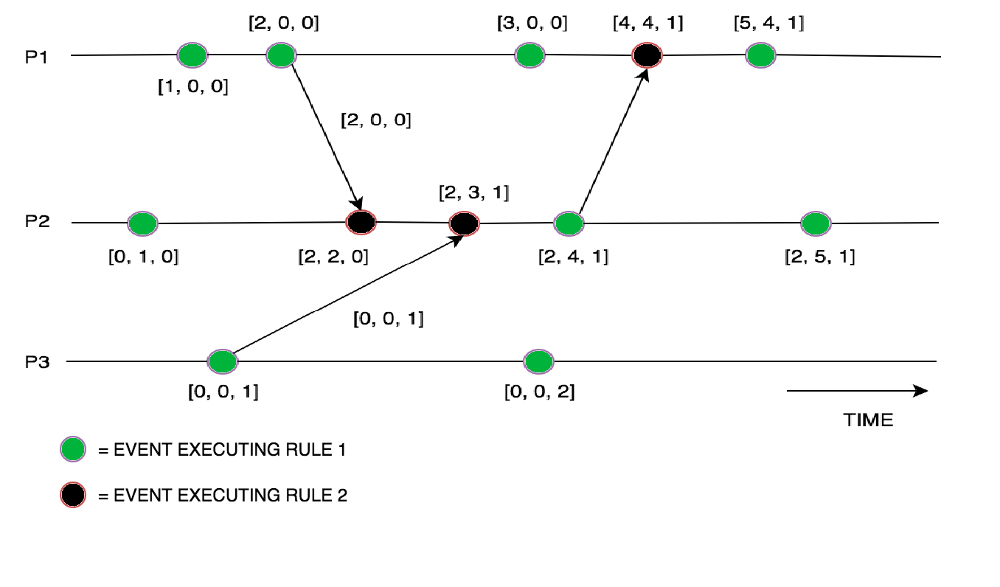

### Vector clock ###
Vector Clock is an algorithm that generates partial ordering of events and detects causality violations in a distributed system. These clocks expand on Scalar time to facilitate a causally consistent view of the distributed system, they detect whether a contributed event has caused another event in the distributed system. It essentially captures all the causal relationships. This algorithm helps us label every process with a vector(a list of integers) with an integer for each local clock of every process within the system. So for N given processes, there will be vector/ array of size N.

How does the vector clock algorithm work :

Initially, all the clocks are set to zero.
Every time, an Internal event occurs in a process, the value of the processes’s logical clock in the vector is incremented by 1
Also, every time a process sends a message, the value of the processes’s logical clock in the vector is incremented by 1.
Every time, a process receives a message, the value of the processes’s logical clock in the vector is incremented by 1, and moreover, each element is updated by taking the maximum of the value in its own vector clock and the value in the vector in the received message (for every element). 

