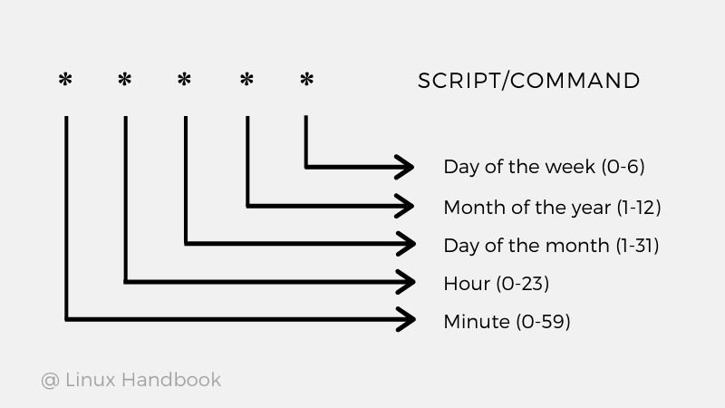
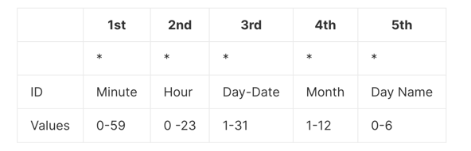
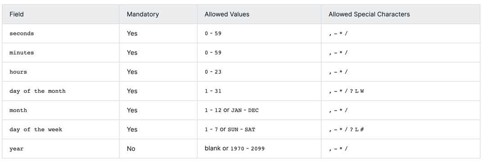
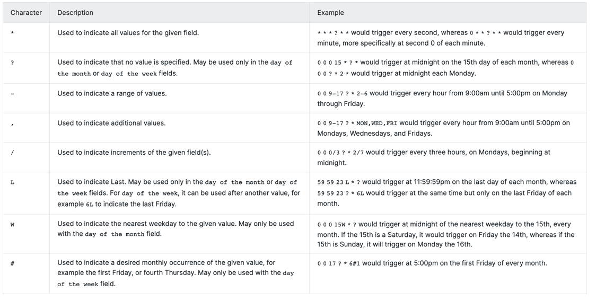

## Lombok

https://www.baeldung.com/intro-to-project-lombok

https://levelup.gitconnected.com/lombok-to-use-or-not-to-use-that-is-the-blog-e7a3a8f97e8f

## _Cron_

| **Element** | **Linux Name** | 	**Meaning** |
|---|-------- | --- |
|Daemon|‘crond’       |Pronounced “demon” or “day-mon”. These are Linux background system processes.|
|Table |‘crontab’     |You write rows to this table when entering a crontab command. Each ‘*’ asterisk represents a segment of time and a corresponding column in each row.|
|Job   | Cron Job     |The specific task to be performed described in a row, paired with its designated time id|

```java
crontab [options]

* * * * *  <command> 
OR 
* * * * * <path/to/script>

```





Great learning resource =>
1. https://www.baeldung.com/cron-expressions
2. https://docs.uipath.com/orchestrator/standalone/2023.4/user-guide/using-cron-expressions



