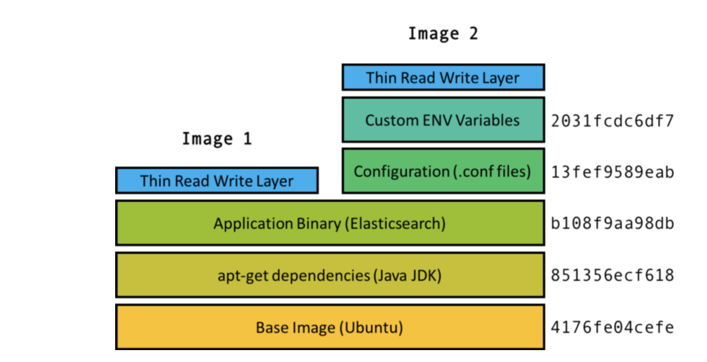

**Hypervisor**

A piece of software called a hypervisor creates the virtualized hardware which may include the virtual disk, virtual network interface, virtual CPU, and more.
Virtual machines also include a guest kernel that can talk to this virtual hardware


Hypervisor can run on bare metal also.
[img.png](img.png)

```
When there needs to be multiple isolated groups on the same machine, running a VM for each of these groups is way too heavy and wasteful of resources to be a good approach.
```


## How it All Started ##

1. 2006 Team in Google invented feature called as control group.  (CGroup)
`feature of the Linux kernel that isolates and controls the resource usage for user processes. These processes can be put into namespaces, essentially collections of processes that share the same resource limitations. A computer can have multiple namespaces, each with the resource properties enforced by the kernel.`

why is it important ? with this concept of cgroup and namespace a limit on amount of resouces (cpu ram etc) a process can use can be set and managed.
Example we wnat log aggregator to have limited resource and should not aquire resource of atual webapps etc


2.  cgroups in Linux were eventually reworked to include a feature called namespace isolation

Cgroup isolation is a higher level of isolation that makes sure processes within a cgroup namespace are independent of processes in other namespaces.

**What all is isolated in cgroup namespace isolation ?**
* PID (Process Identifier) Namespaces: this ensures that processes within one namespace are not aware of process in other namespaces.
* Network Namespaces: Isolation of the network interface controller, iptables, routing tables, and other lower level networking tools.
* Mount Namespaces: Filesystems are mounted, so that the file system scope of a namespace is limited to only the directories mounted.
* User Namespaces: Limits users within a namespace to only that namespace and avoids user ID conflicts across namespaces.

3. `Linux cgroups` paved the way for a technology called `linux containers (LXC)`. LXC was really the first major implementation of what we know today to be a container, taking advantage of cgroups and namespace isolation to create virtual environment with separate process and networking space.


**Docker is build on concept of cgroup and namespace isolation**

## HoW Docker work internally ##

A Docker container is made up of layers of images, binaries packed together into a single package. The base image contains the operating system of the container, which can be different from the OS of the host.

1. OS Layer : The OS of the container is in the form an image. This is not the full operating system as on the host, and the difference is that the image is just the file system and binaries for the OS while the full OS includes the file system, binaries, and the kernel.

2. to n Layer: On top of the base image are multiple images that each build a portion of the container. For example, on top of the base image may be the image that contains the apt-get dependencies. On top of that may be the image that contains the application binary, and so on.

## What is so cool about Docker? ##
Docker Unified file system-
The cool part is if there are two containers with the image layers a, b, c and a, b, d, then you only need to store one copy of each image layer a, b, c, d both locally and in the repository. This is Docker’s union file system.

Each image, identified by a hash, is just one of many possible layers of images that make up a container. However a container is identified only by its top level image, which has references to parent images. Two top level images (Image 1 and Image 2) shown here share the first three layers. Image 2 has two additional configuration related layers, but shares the same parent images as Image 1.

Docker has some other really really cool features, such as copy on write, volumes (shared file systems between containers), the docker daemon (manages containers on a machine), version controlled repositories (like Github for containers), and more. To learn more about them and see some practical examples of how to use Docker




## How it work under the hook? ##
When a container is booted, the image and its parent images are downloaded from the repo, the cgroup and namespaces are created, and the image is used to create a virtual environment. From within the container, the files and binaries specified in the image appear to be the only files in the entire machine. Then the container’s main process is started and the container is considered alive.

## Why Containers ?##
1. can run anywhere where they are supported 
2. They are standard unit of isolation and are by design meant to scale. Example A common paradigm is for each container to run a single web server, a single shard of a database, or a single Spark worker, etc. Then to scale an application, you simply need to scale the number of containers.
3. Horizontal scaling : In this paradigm, each container is given a fixed resource configuration (CPU, RAM, # of threads, etc) and scaling the application requires scaling just the number of containers instead of the individual resource primitives.

4. micro service architecture, where each microservice is just a set of co-operating containers


