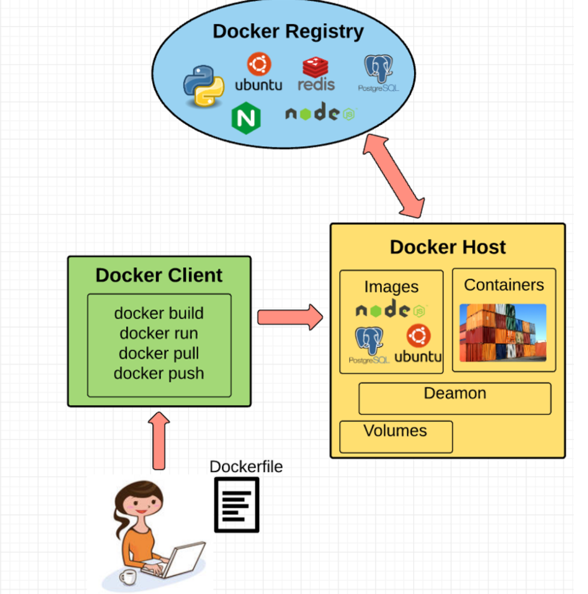

##Docker demystify##


Docker is an open-source project based on Linux containers. It uses Linux Kernel features like namespaces and control groups to create containers on top of an operating system.

**What is docker in hype ???**

1. Ease of use: Docker has made it much easier for anyone — developers, systems admins, architects and others — to take advantage of containers in order to quickly build and test portable applications. It allows anyone to package an application on their laptop, which in turn can run unmodified on any public cloud, private cloud, or even bare metal. The mantra is: “build once, run anywhere.”

2. Speed: Docker containers are very lightweight and fast. Since containers are just sandboxed environments running on the kernel, they take up fewer resources. You can create and run a Docker container in seconds, compared to VMs which might take longer because they have to boot up a full virtual operating system every time.

3. Docker Hub: Docker users also benefit from the increasingly rich ecosystem of Docker Hub, which you can think of as an “app store for Docker images.” Docker Hub has tens of thousands of public images created by the community that are readily available for use. It’s incredibly easy to search for images that meet your needs, ready to pull down and use with little-to-no modification.

4. Modularity and Scalability: Docker makes it easy to break out your application’s functionality into individual containers. For example, you might have your Postgres database running in one container and your Redis server in another while your Node.js app is in another. With Docker, it’s become easier to link these containers together to create your application, making it easy to scale or update components independently in the future.



**Fundamental of docker**

1. Docker Engine: It’s a lightweight runtime and tooling that manages containers, images, builds, and more
 it does following things 
 
- A Docker Daemon that runs in the host computer.
- A Docker Client that then communicates with the Docker Daemon to execute commands.
- A REST API for interacting with the Docker Daemon remotely.

2. Docker Client:  Think of it as the UI for Docker

3. Docker Daemon: The Docker daemon is what actually executes commands sent to the Docker Client — like building, running, and distributing your containers. The Docker Daemon runs on the host machine, but as a user, you never communicate directly with the Daemon. The Docker Client can run on the host machine as well, but it’s not required to. It can run on a different machine and communicate with the Docker Daemon that’s running on the host machine.

4. Dockerfile: A Dockerfile is where you write the instructions to build a Docker image.


5. Docker Image: Images are read-only templates that you build from a set of instructions written in your Dockerfile. Each instruction in the Dockerfile adds a new “layer” to the image, with layers representing a portion of the images file system that either adds to or replaces the layer below it. Layers are key to Docker’s lightweight yet powerful structure.

6. Union File Systems:  Docker uses Union File Systems to build up an image. You can think of a Union File System as a stackable file system, meaning files and directories of separate file systems (known as branches) can be transparently overlaid to form a single file system.

Layered systems offer two main benefits:

-1. Duplication-free: layers help avoid duplicating a complete set of files every time you use an image to create and run a new container, making instantiation of docker containers very fast and cheap.
-2. Layer segregation: Making a change is much faster — when you change an image, Docker only propagates the updates to the layer that was changed.


7. Volumes: Volumes are the “data” part of a container, initialized when a container is created. Volumes allow you to persist and share a container’s data. Data volumes are separate from the default Union File System and exist as normal directories and files on the host filesystem. So, even if you destroy, update, or rebuild your container, the data volumes will remain untouched. When you want to update a volume, you make changes to it directly. (As an added bonus, data volumes can be shared and reused among multiple containers, which is pretty neat.)


## Container Internals ##

Namespaces provide containers with their own view of the underlying Linux system, limiting what the container can see and access. When you run a container, Docker creates namespaces that the specific container will use.

There are several different types of namespaces in a kernel that Docker makes use of, for example:

1. NET: Provides a container with its own view of the network stack of the system (e.g. its own network devices, IP addresses, IP routing tables, /proc/net directory, port numbers, etc.).

2. Process ID NameSpace: The PID namespace gives containers their own scoped view of processes they can view and interact with, including an independent init (PID 1), which is the “ancestor of all processes”.

3. MNT: Gives a container its own view of the “mounts” on the system. So, processes in different mount namespaces have different views of the filesystem hierarchy.

4. UTS: UTS stands for UNIX Timesharing System. It allows a process to `identify system identifiers` (i.e. hostname, domainname, etc.). UTS allows containers to have their own `hostname and NIS domain name` that is `independent of other containers` and the `host system`.

5. IPC: IPC stands for InterProcess Communication. IPC namespace is responsible for isolating IPC resources between processes running inside each container.

6. User:  This namespace is used to isolate users within each container. It functions by allowing containers to have a different view of the uid (user ID) and gid (group ID) ranges, as compared with the host system. As a result, a process’s uid and gid can be different inside and outside a user namespace, which also allows a process to have an unprivileged user outside a container without sacrificing root privilege inside a container.


Read CGroup from container section ...

## Docker verse VM ##
 if you need to run multiple applications on multiple servers, it probably makes sense to use VMs. On the other hand, if you need to run many *copies* of a single application, Docker offers some compelling advantages.
  
  `VM can only make hypercalls to host hypervisor where as Docker can make syscalls to the host kernel, which creates a larger surface area for attack. `
  
 
 When security is particularly important, developers are likely to pick VMs, which are isolated by abstracted hardware — making it much more difficult to interfere with each other.

```
When to use a virtual machine
It’s best to use a virtual machine if you’re running applications with these requirements: 

Operating system-specific dependencies
Substantial hardware resource requirements
A need to set various controls in operating systems
Legacy applications that no longer run on modern operating systems
Different operating system requirements with a single underlying physical infrastructure available
When to use Docker
It’s best to use Docker when you’re running applications with these requirements: 

Lightweight resource requirements or a microservice architecture
A distributed physical infrastructure environment, including cloud-based servers
Rapid deployment cycles (as Dockerfiles are easier to manage than VM configurations)
A rapid scalability requirement
```
