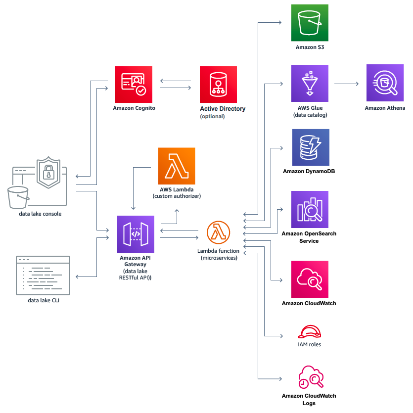
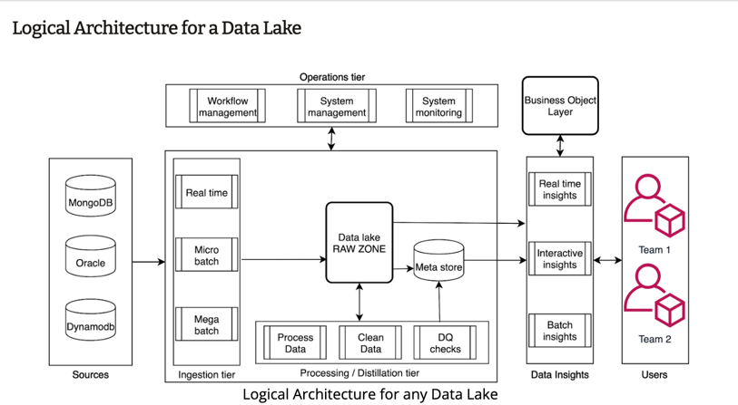
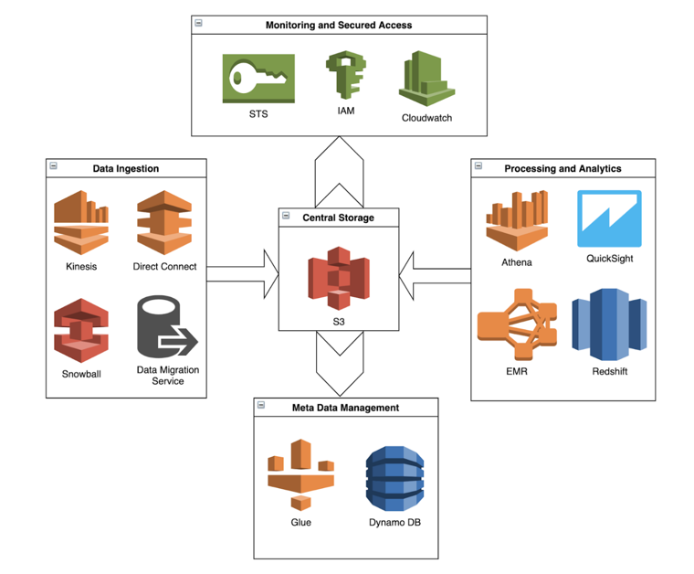
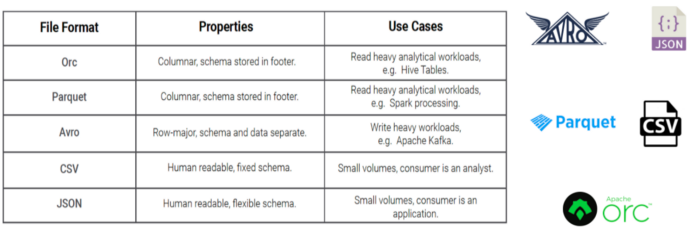
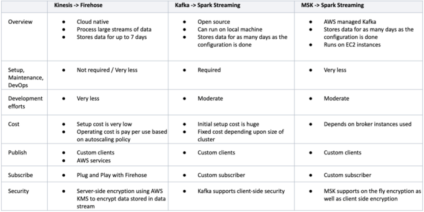
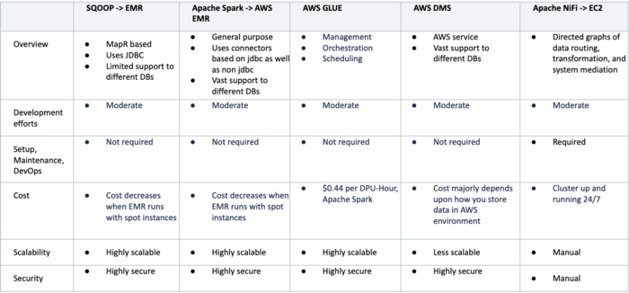
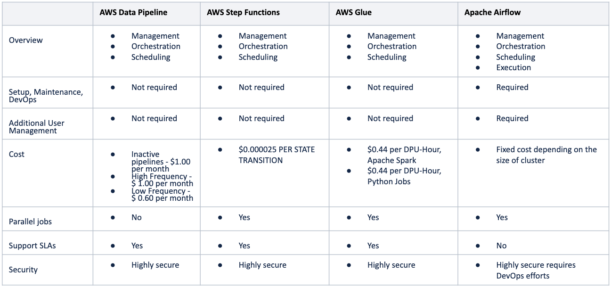
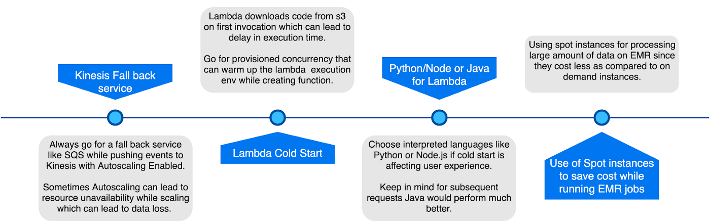

# Data Lake  (AWS View )

A data lake is a new and increasingly popular way to store and analyze data because it allows companies to manage multiple data types from a wide variety of sources, and store this data, structured and unstructured, in a centralized repository.

These include AWS managed services that help ingest, store, find, process, and analyze both structured and unstructured data

AWS Managed Services in Data lake

1. Storage - s3 and Dynamo DB
2. Transformation - Amazon GLue and Athena
3. Autherization - Amazon congnito
4. Micro service - Lambda
5. Search - Amazon open search

# Other alternatives 

Data lakes are often used to consolidate all of an organization’s data in a single, central location, where it can be saved “as is,” without the need to impose a schema or structure on it upfront. Data in all stages of the refinement process can be stored in a data lake; raw data can be ingested and stored right alongside an organization’s structured, tabular data sources (like database tables), as well as intermediate data tables generated in the process of refining raw data. Unlike most databases, data lakes can process all data types including images, video, audio, and text.

Why Datalake in cloud is good idea ?
1) Runs on top of secured AWS data centre Infrastructure

2) Lets you build a secure Data lake in days

3) Offers compliance with PCI DSS, HIPAA, and FedRAMP

4) Lets you encrypt data at rest and in-transit

S3 support open data format

## Ingestion layer 

We have 3 option for **realtime ingestion **
1. Kensis - firehose
2. Kafka
3. MSk ( full managed kafka)
 comparision is below
 
 
 
**Micro and mega batching layer**

DMS -> Data migration service provide by aws 
 
 
 
 **Workflow management**
 

 
 
 