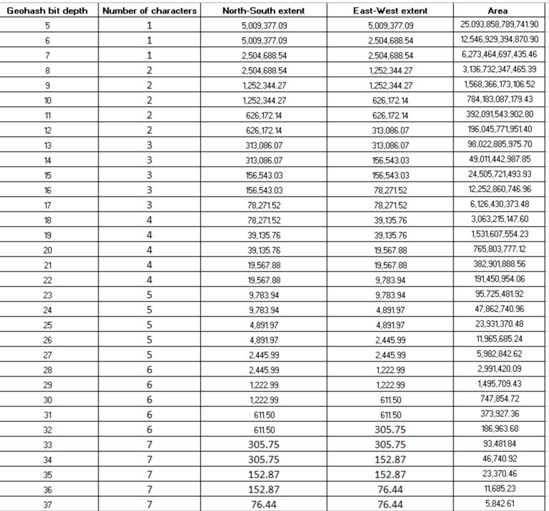
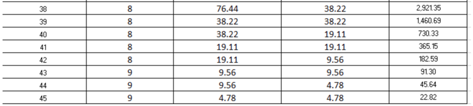

## Geohash ##

A Geohash is a unique identifier of a specific region on the Earth. The basic idea is that the Earth is divided into regions of user-defined size and each region is assigned a unique id, which is called its Geohash. For a given location on earth, the Geohash algorithm converts its latitude and longitude into a string. This string is the Geohash and will determine which of the predefined regions the point belongs to. Generally, points within close geographical proximity will have the same Geohash.

The number of bits used to encode the geohash is referred to as the bit depth, and determines the north-south and east-west extent of each individual region into which the earth is divided, and the length of the generated Geohash string. More bits means a longer geohash and smaller individual regions

