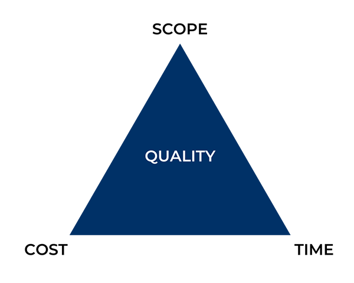

Hi Ritika,
As discussed, pls. find few details on product management
1. Good reading material (blogs)
   https://svpg.com/
   https://www.producttalk.org/
   https://www.kennorton.com/
   https://openviewpartners.com/blog#.X3wSOEFS IU
   https://productcollective.com/blog/
2. Material available on www.medium.com is also good but, you will have to refine the content suitable to your area of interest/ suitability
3.
You can listen to webinars on:
https://280group.com/

### Iron Triangle of Project management ###

### Product Performance Matrics ###

**North Star Matrix**:

Indicator can be leading or lagging.\
e.g. that retention was a lagging indicator, not a leading indicator for netflix\
So Gibson and his team dug into their data and customer patterns and discovered a characteristic that proved to be a leading indicator of retention for new members: **the number of DVDs in a new member’s queue**

A north star metric must have these three factors:
Add Customer Value
Measure Progress
Drive Revenue

**warning signs your product metrics**
A steep drop-off in the usage of a feature or area of your product
Users taking longer to complete specific tasks in your product than you had estimated
Average user time spent interacting with your product decreasing over time

***What is a KPI?***

Key Performance Indicators (KPIs) are defined as performance metrics that evaluate the success of an organization or of a particular activity. KPIs can apply to projects, programs, products, and a variety of other initiatives. They can measure the success of anything from sales goals to social media metrics.
THese are used to evaluate and forecast success.

***OKR***
Objectives and Key Results (OKRs) are defined as a metric that outlines company and team "objectives" along with the measurable "key results" that define the achievement of each objective. OKRs represent aggressive goals and define the measurable steps you’ll take towards achieving those goals. 

***Difference between OKR and KPI***\
One of the key differences between OKRs and KPIs is the intention behind the goal setting. KPI goals are typically obtainable and represent the output of a process or project already in place, while OKR goals are somewhat more aggressive and ambitious.

if you're looking to scale or improve upon a plan or project that's been done before, KPIs might be the better option. They're straightforward and allow you to add a measurement system to your ongoing projects and processes.

However, if you have a larger vision or are looking to change your overall direction, OKRs might be the better alternative. They have greater depth that will allow you to stretch your goals even further and allow you to be a bit more creative on how you plan to reach those goals.

### Example of NSM ###
LinkedIn’s initial NSM was the number of endorsements given because it was a relationship-building factor between the users. But LinkedIn soon realized that endorsements were falsified and they changed their NSM to monthly active users (MAU).
Spotify’s NSM is the time spent listening on the platform. This NSM measures the value that customers get from the platform.
Hubspot is a CRM and its NSM is the number of weekly active teams. It captures the new accounts that are getting value and providing a signal of future trial conversion and subscription revenue. Hence this metric indicates or predicts the future revenue.
Intercom is a messaging platform with the vision to build a suite of products that makes easy communication with the users of your business. It offers services for both B2B and B2C segments. Their NSM is the number of customer interactions.
Slack helps in-office collaboration with the mission to keep teams organized and its NSM is messages sent within the organization.
Quora north star metric is the number of questions answered, which is aligned with their mission of being a knowledge-sharing platform.
Airbnb has the number of nights booked as their NSM because it perfectly combines the booker’s and owner’s value.

### Few Basic Matrics for Product performance ###
Find more detail at https://eliecasa.medium.com/9-types-of-metrics-you-need-to-track-for-your-product-s-success-314e530a218f\

-->this is better
----->https://www.altexsoft.com/blog/business/15-key-product-management-metrics-and-kpis/