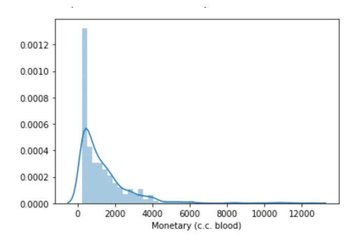
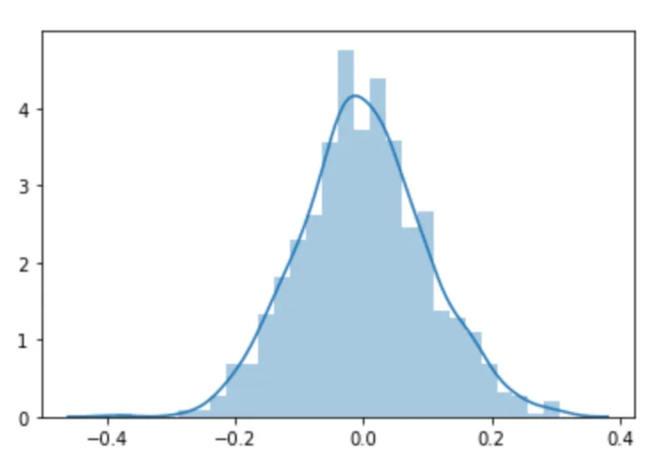
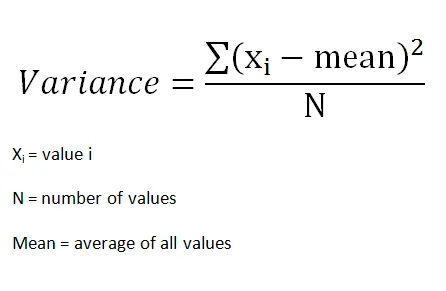
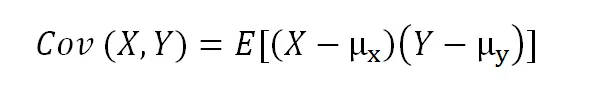
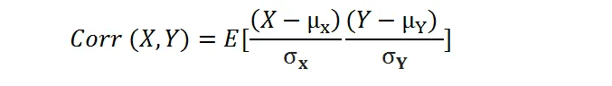
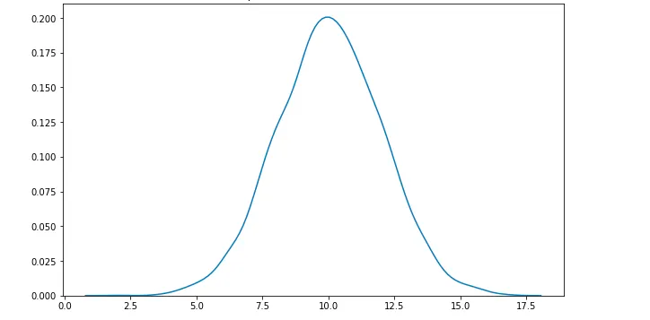
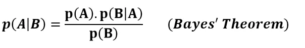

### Fundamental statistical concepts


1. Population: Entire set tof data available for testing is call population
2. Statistical sampling : portion of the population
```
Assuming our sample is sufficiently randomised and representative of the entire population we can achieve a measure of prevalence.
```

3. Descriptive statistics: helps us to describe the data. In other words, it enables us to understand the underlying characteristics. It doesn’t predict anything, make assumptions or infer anything it simply provides a description of what the data sample we have looks like.

4. Mean — the central value, commonly called the average.
5. Median — the middle value if we ordered the data from low to high and divide it exactly in half.
6. Mode - the value which occurs most often.
```doctest
The three indicators of central tendency are the mean, median, and mode. One can determine the central value of the given set of data (grouped and ungrouped) using the three measures of central tendency.
```

problem with mean: f a data set contains several numbers that are much larger than the others then the mean may be skewed and will not give us a true representation of the data.

7. histogram: that displays the frequency with which each value appears in a data set. 
This type of chart gives us information about the spread and skewness of the data.
A distribution will usually form a curve-like graph. This may be skewed more to the left or right.
the curve may not be as smooth.

8. Normal distribution(Gaussian): One of the most important distributions is the normal distribution, commonly referred to as the bell curve due to its shape. It is symmetrical in shape with most of the values clustering around the central peak and the further away values distributed equally on each side of the curve. Many variables in nature will form a normal distribution such as peoples heights and IQ scores


9. Probability: Probability for a single event is calculated by dividing the number of events by the number of total possible outcomes
event can be dependent and independent , independent event probability is also independent.
```
The probability of multiple independent events is calculated by simply multiplying the probability of each event.
```
example of dependent propbability
```doctest
If we take the M&M’s example, imagine we have a bag with only two colours red and yellow, and we know that the bag contains 3 red and 2 yellow and we want to calculate the probability of picking two reds in a row. On the first pick, the probability of picking a red is 3/5 = 0.6. On the second pick we have removed one M&M, which happened to be red, so our second probability calculation is 2/4 = 0.5. The probability of picking two reds in a row is therefore 0.6 * 0.5 = 0.3.
```

10. Bias: Bias is the tendency of a statistical or predictive model to over or underestimates a parameter. 
```doctest
Selection bias — this occurs when the sample is selected in a non-random way. In data science, an example may be stopping an AB test early when the test is running or selecting data for training a machine learning model from one time period which could mask seasonal effects.
Confirmation bias — this occurs when the person performing some analysis has a predetermined assumption about the data. In this situation, there can be a tendency to spend more time examining variables that are likely to support this assumption.
```

11. Variance: Variance measures how far each value in the data set is from the mean. Essentially it is a measurement of the spread of numbers in a data set.
12. Standard deviation:  It is a calculation that gives a value to represent how widely distributed the values are. A low standard deviation indicates that the values tend to lie quite close to the mean, whilst a high standard deviation indicates that the values are more spread out.


```doctest
If the data does not follow a normal distribution then other measures of variance are used. Commonly the interquartile range is used. This measurement is derived by first ordering the values by rank and then dividing the data points into four equal parts, called quartiles. Each quartile describes where 25% of the data points lie according to the median. The interquartile range is calculated by subtracting the median for the two central quarters, also known as Q1 and Q3.
```

```doctest
As a computation, bias is the difference between the mean prediction generated by the model and the true value.
In machine learning bias and variance make up the overall expected error for our predictions. In an ideal world, we would have both low bias and low variance. However, in practice minimizing bias will usually result in an increase in variance and vice versa. The bias/variance trade-off describes the process of balancing these two errors to minimise the overall error for a model.
```

14. Covariance:  is a quantitative measure that represents how much the variations of two variables match each other. To be more specific, covariance compares two variables in terms of the deviations from their mean (or expected) value.


where E is the expected value and µ is the mean.

13. Correlation:  Correlation is a statistical technique that measures relationships between two variables. Correlation is assumed to be linear (forming a line when displayed on a graph) and is expressed as a number between +1 and -1, this is known as the correlation coefficient.
    A correlation coefficient of +1 denotes a perfectly positive correlation (when the value for one variable increases the value of the second variable also increases), a coefficient of 0 denotes no correlation and a coefficient of -1 denotes a perfect negative correlation.

    where σ is the standard deviation.

14. Central limit theorem:In many fields including natural and social sciences, when the distribution of a random variable is unknown, normal distribution is used.

Central limit theorem (CLT) justifies why normal distribution can be used in such cases. According to the CLT, as we take more samples from a distribution, the sample averages will tend towards a normal distribution regardless of the population distribution.

15.  P-value: P-value is a measure of the likelihood of a value that a random variable takes. Consider we have a random variable A and the value x.


16. Conditional probability: Conditional probability is the likelihood of an event A to occur given that another event that has a relation with event A has already occurred.

17. Bayes’ theorem:
    According to Bayes’ theorem, probability of event A given that event B has already occurred can be calculated using the probabilities of event A and event B and probability of event B given that A has already occurred.

