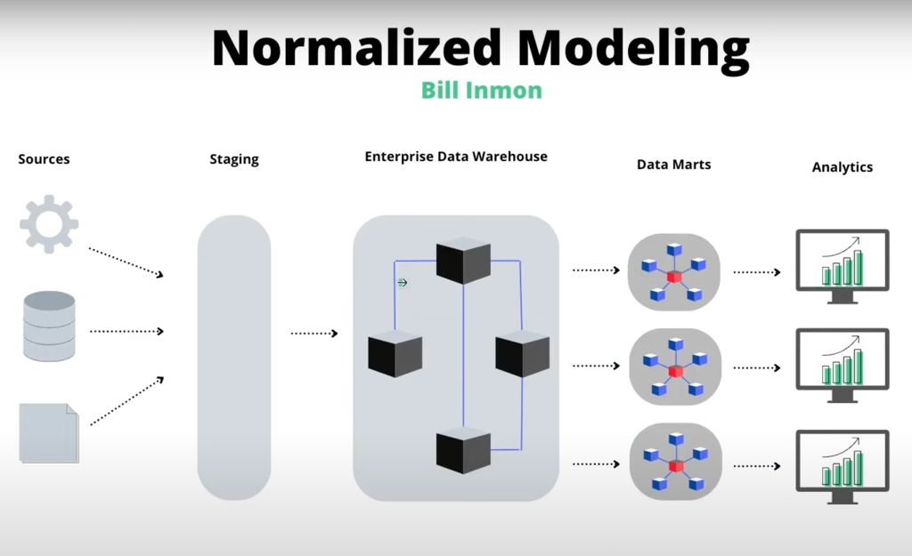
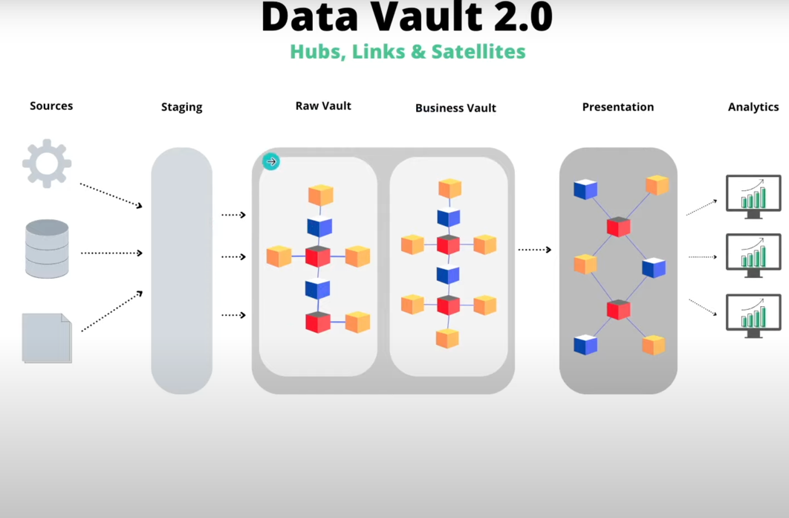
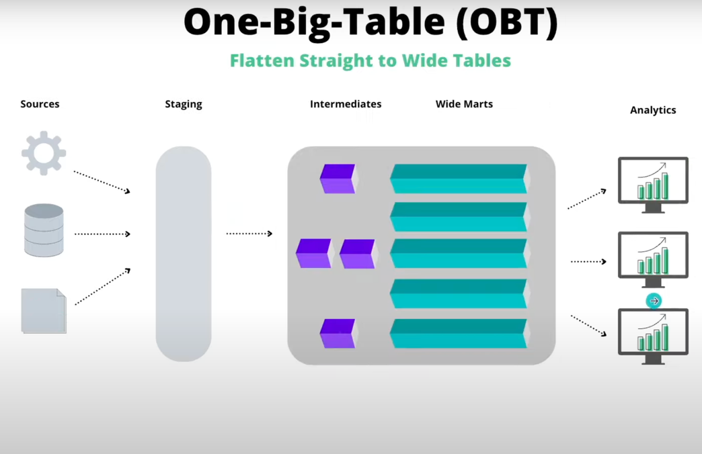
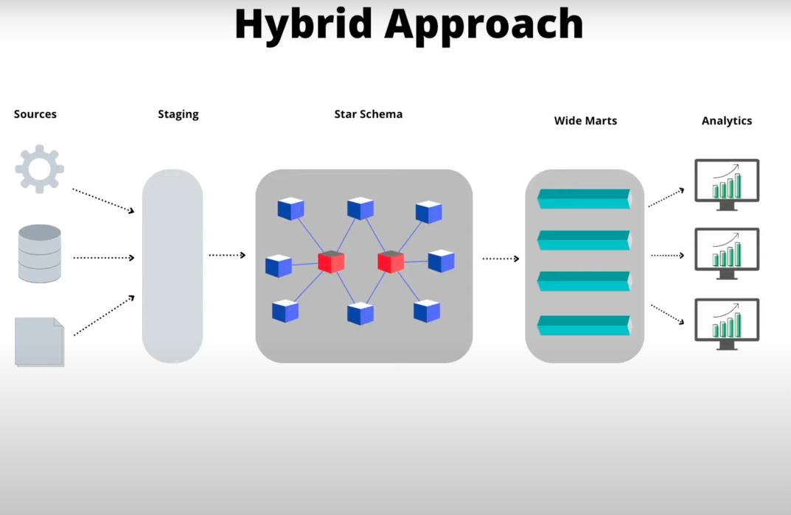
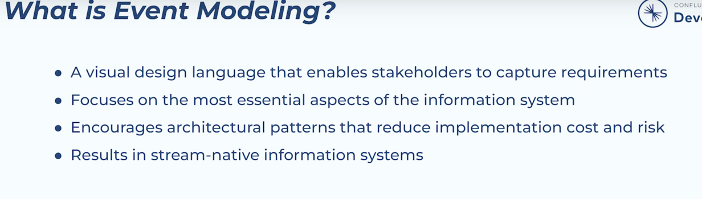

### Data Modeling ###
The four key decisions made during the design of a dimensional model include:
1. Select the business process.
2. Declare the grain.
3. Identify the dimensions.
4. Identify the facts.

**Business Process**
Choosing the process is important because it defines a specific design target and allows the grain, dimensions,
and facts to be declared. `Each business process corresponds to a row in the enterprise data warehouse bus matrix`

**Grain** - Grain is basically level of granularity.
The grain establishes exactly what a single fact table row represents.

`Atomic grain` refers to the `lowest level at
which data is captured by a given business process`. We strongly encourage you to start
by focusing on atomic-grained data because it withstands the assault of unpredictable
user queries; rolled-up summary grains are important for performance tuning, but they
pre-suppose the business’s common questions. Each proposed fact table grain results
in a separate physical table; 

- different grains must not be mixed in the same fact table

**Dimensions**
Dimensions provide the “who, what, where, when, why, and how” context surrounding
a business process event. Dimension tables contain the `descriptive attributes`
used by BI applications for filtering and grouping the facts.

-Dimension tables are sometimes called the` “soul” `of the data warehouse because
they `contain the entry points and descriptive labels` that enable the DW/BI system
to be leveraged for business analysis.

**Facts for Measurements**
Facts are the measurements that result from a business process event and are almost
always numeric.
A single fact table row has a one-to-one relationship to a measurement
event as described by the fact table’s grain

**Star Schemas and OLAP Cubes**
star schema are dimensional structures deployed in a RDBMS where fact tables linked to associated
dimension tables via primary/foreign key relationships.

`(OLAP) cube` is a dimensional structure implemented in a multidimensional database;
it can be equivalent in content to, or more often derived from, a relational star schema

Gracefull extension of dimension model
1. existing fact table can be added by creating
   new columns.
2. Dimensions can be added to an existing fact table by creating new foreign key
   columns, presuming they don’t alter the fact table’s grain.
3. Granularity : The grain of a fact table can be made more atomic by adding attributes to an existing
   dimension table, and then restating the fact table at the lower grain, being
   careful to preserve the existing column names in the fact and dimension tables.
4. Dim addition: Dimensions can be added to an existing fact table by creating new foreign key
   columns, presuming they don’t alter the fact table’s grain. 

granularity can be increased ( i.e made more atomic). Reducing need changes in fetch query.


> Fact table row is equal to any measurable event. Example transaction
fact table is entirely based on a physical activity and is not influenced by the eventual reports

**Fact table measures (Columns) type**
1. Additive : fully additive and can be summed across any dimension (Example can be salary by dept, time)
2. Semi-additive: measures can be summed across some dimensions, but not all; balance amounts are common semi-additive facts because they are additive across all dimensions except time.
3. non-additive: Some measure are non addative e.g. Ratio
```
A good approach for non-additive facts is,
where possible, to store the fully additive components of the non-additive measure
and sum these components into the fi nal answer set before calculating the final
non-additive fact.

Final aggregate on non -additive can be done at cube layer

```
Null values in fact valued measurements- it is ok to have since all agg function do right thing with null. but just make sure it is not in foreign key references


***Factless Fact Tables***
-Although most measurement events capture numerical results, it is possible that
the event merely records a set of dimensional entities coming together at a moment
in time e.g. example, an event of a student attending a class on a given day may
not have a recorded numeric fact, but a fact row with foreign keys for calendar day,
student, teacher, location, and class is well-defined.

Factless fact tables can also be used to analyze what didn’t happen.

***Aggregate Fact Tables or OLAP Cubes***
Aggregate fact tables are simple numeric rollups of atomic fact table data built solely
to accelerate query performance.

***Consolidated Fact Tables***
It is often convenient to combine facts from multiple processes together into a single
consolidated fact table if they can be expressed at the same grain.

***SSOT***
In simple terms, a Single Source of Truth (SSoT) refers to one source of data that everyone agrees is the real, trusted number.
we should point out that ‘Single Source of Truth’ is also used in information systems design to describe the practice of structuring a database so that each data point is stored exactly once (coupled with certain parameters related to database performance). 

>Increases productivity because you don’t have to toggle between systems to find an answer or transcribe data across multiple tools.
>Reduces the chances of human error by eliminating the need to copy and paste or manually update information from one system to another.
>Prevents duplicate records from being created.
>Improves communication because everyone agrees which numbers you should be discussing.
>Empowers better decision-making by putting the right information into people’s hands.


##Dimension Table Structure##
1. One primary key which can act as foreign key in other fact table
2.  Are wide ,denormalized and very verbose table

Dimension should not have operational system’s natural b\c multiple system can create this and will be poorly managed
`dimension surrogate keys` are simple integers, assigned in sequence, starting with the value 1,
every time a new key is needed. The date dimension is exempt from the surrogate key rule; 
this highly predictable and stable dimension can use a more meaningful primary key.

### Degenerate Dimensions ###
Degenerate dimensions are dimensions that have no attributes or descriptive information, but only a single identifier or key.
They are used to simplify fact tables by eliminating the need for a separate dimension table

Degenerated dimension is a dimension table which is being derived from fact table columns.
1 e.g.
In a case, a fact table contains more than one Boolean column. Group all Boolean columns into a single table along with the surrogate key. This new dimension table is called degenerated dimension.
2 e.g.
For example, when an invoice has multiple line items, the line item fact rows inherit
all the descriptive dimension foreign keys of the invoice, and the invoice is left with
no unique content. But the invoice number remains a valid dimension key for fact
tables at the line item level.

Flags and Indicators
Cryptic abbreviations, true/false flags, and operational indicators should be supplemented
in dimension tables with full text words that have meaning when
independently viewed.

Null in dim :
Nulls in dimension attributes
should be avoided because different databases handle grouping and constraining
on nulls inconsistently.

### Calendar Date Dimensions ###
Calendar date dimensions are attached to virtually every fact table to allow navigation
of the fact table through familiar dates, months, fiscal periods, and special days on the calendar.

e.g. you would never want to calculate diwali ,but use lookup in date dim for this 

### Role playing Dim ###
Single dim refered multiple time example employ id and manage id refer employ dim

### Junk Dim ###
Transactional business processes typically produce a number of miscellaneous, lowcardinality
flags and indicators. Rather than making separate dimensions for each
flag and attribute, you can create a single junk dimension combining them together.
 so degenerated dim are also type of junk dim

### Snowflaked Dimensions ###
When dim are normalized , a second level of dim are created when this is repeated in all dim a characteristic multilevel structure is created that is called a snowflake.

We should avoid snowflaking ? 
1. Performance 
2. Hard to understand by business users

### Outrigger Dimensions###
A dimension can contain a reference to another dimension table . example bank account dim reference  acc_open_dim
-> should be very rear and avoided 
-> the correlations between dimensions should be demoted to a fact table by different foreign key

**Conformed dimension**:
Dimension tables conform when attributes in separate dimension tables have the
same column names and domain contents.

**Shrunken dimensions** are conformed dimensions that are a subset of rows and/or
columns of a base dimension. Shrunken rollup dimensions are required when constructing
aggregate fact tables

Drilling Across-> stitch and multipass query to union data from different facts and dims which has conformed attribute

## The enterprise data warehouse bus architecture
This architecture decomposes the DW/
BI planning process into manageable pieces by focusing on business processes,
while delivering integration via standardized conformed dimensions that are reused
across processes.

## Enterprise Data Warehouse Bus Matrix ##

The rows of the matrix
are business processes and the columns are dimensions. The shaded cells of the
matrix indicate whether a dimension is associated with a given business process. The
design team scans each row to test whether a candidate dimension is well-defi ned for
the business process and also scans each column to see where a dimension should be
conformed across multiple business processes. 

## Dealing with Slowly Changing Dimension Attributes ##
It is quite common to have attributes in the
same dimension table that are handled with diff erent change tracking techniques
1. Type0: (Retain original) the dimension attribute value never changes, so facts are always grouped
   by this original value. Type 0 is appropriate for any attribute labeled “original,”
2. Type1: (Overwrite):the old attribute value in the dimension row is overwritten with the new
   value; type 1 attributes always refl ects the most recent assignment, and therefore
   this technique destroys history. 
   -> Cubes need to be recomputed with Type1
3. Type 2: add a new row in the dimension with the updated attribute values
   ->New serrogate key is generated
   ->used as a foreign key in all fact tables from the moment of the update until a subsequent change creates a new dimension key and updated dimension row.
   -> Min of 3 things to be added 1. added time tamp 2. valid till 3. current row indicator
4. Type 3: Adding new attribute :a new attribute in the dimension to preserve the old attribute
   value; the new value overwrites the main attribute as in a type 1 change. This kind of
   type 3 change is sometimes called an `alternate reality`. -> this tech is used infrequently
5. The type 4: technique is used when a group of attributes in a dimension rapidly
   changes and is split off to a mini-dimension. This situation is sometimes called a
   rapidly changing `monster dimension` .the primary keys of both the base dimension and mini-dimension are captured in
   the associated fact tables.
6. Type 5: Add Mini-Dimension and Type 1 Outrigger: Basically a mini dim as #4 with current type reference in base dim . this way it is linked to based dim without fact need
   The ETL
   team must overwrite this type 1 mini-dimension reference whenever the current
   mini-dimension assignment changes.

Too much ...

Late Arriving Dimensions
Real-Time Fact Tables
Error Event Schemas

---------
Data modeling in current scenario
1. Computation is more expensive then storage
2. Mental clarity

## Type of modelling in big data world ##

A. Normalized modelling

here DW will be doing lots of jons and make data available to data mart which would have ther on specific needs.
DW may not have data reductency in place
Adv:
1. DW is single source of truth

Disadvantage:
1. Complex and have too many joins
2. each Data mart is isolated and has distinct need (e.g. Dmart for Hr, finance etc). So no way to have centralized access.

B. Demormalized Model


data is denormalized to avoid multiple joins.
-> Star schema
-> Data is denormalize
-> most popular approach
-> analytic layer need less join because of denormalized nature
-> Model around business need

Question is is this still necessary ?

C. Data vault

 -> raw vault to store source data as is with minimal or no transformation
 -> business vault to store data model around business
 Adv
-> Very organized with each layer have its oun responsiblity
-> Performant in storage
Dis adv
-> complex to manage
-> have additional layer for analytics ( presentation layer)

Is only good for environment which have loot of different sources.

D. One Big table

 - Very large table (wide marts) to solve bussiness requirement

Adv
- very easy to implement

Disadv
- Extreme creek of computational cost

Things to consider
--------------
1. No one solution
So hybrid approach best of denormalized + one big table model


Reverse ETL ???
In a nutshell, reverse ETL is a technology for taking cleaned and processed data from the data warehouse and ingesting it back into business applications such as Salesforce, where it can be used for business operations and forecasting. 

Event modelling 
----------------
inspired by DDD and use common concept of CQRSM ( )



Event model reduce cost and risk by using following tech:
1. CQRS ( Command query responsiblity seggregation)
2. Event sourcing ( technique to record event in order)
3. Diverse option to read model ( read with best possible data store e.g. available vehicle can read from RDBMS where as Ride data can be read from KV store)
4. Clear system boundry and contracts

How it works?
1. All info is captured as stream ( e.g. kafka stream). this is called as stream native
2. No Need for ETL or CDC out of DB hence reduce need for data infra
3. integrate easily with streaming API , ksql and flink etc
4. Used for real time analytics

Domain Driven Design
--------------------
It is an approach for architecting software design by looking at software in top-down approach

Domain:-Business logic is area of knowledge around which application logic revolves. The business logic of an application is a set of rules and guidelines that explain how business object should interact with each other to process modeled data.
A domain in software engineering field is business on which application is intended to build.

Domain Driven design: When we are developing software our focus should not be primarily on technology, rather it should be primarily on business.

Domain-driven design talks about two kinds of design tools,
1. Strategic Design: It is a design approach that is similar to Object-oriented design where we are forced to think in terms of objects. Herewith strategic design we are forced to think in terms of a context.
   . These are common terms used in strategic Design of Domain-Driven Design
   - Model: core logic and describes selected aspects of domain. it is used to solve problems related to that business
   - Ubiquitous Language: common language used by all team members to connect all activities of team around domain model.Consider it like using common verbs and nouns for classes, methods, services, and objects while talking with domain experts and team members
   - Bounded Context: boundary conditions of context. It is a description of a boundary and acts as a threshold within which, a particular domain model is defined and applicable
   2. Tactical design: Tactical design talks about implementation details i.e., modeling domain. It generally takes care of components inside a bounded context. 
      These tools are high-level concepts that can be used to create and modify domain models.
      - Entity: Here an entity is a class that has some properties.In short, an entity implements some business logic and could be uniquely identified using an ID. In context of programming, it generally persisted as a row in DB and it consists of value objects
      - value object:  These are immutable, light-weight objects that don’t have any identity. Value objects reduce complexity by performing complex calculations, isolating heavy computational logic from entities. Example User is an entity and Address is a value object, address can change many times but identity of User never changes. Whenever an Address gets change then a new Address will be instantiated and assigned to User
      - Services: Services are stateless objects that perform some logic that do not fit with an operation on an Entity or Value Object.
        They perform domain-specific operations, which can involve multiple domain objects.
   
      -Aggregate: An Aggregate is a Cluster of one or more Entities, and may also contain Value Objects. The Parent Entity of this Cluster receives the name of Aggregate Root.
      Aggregates basically, control change and have a root entity called aggregate roots. The root entity governs lifetime of other entities in aggregates.
      example : if root entity User or Order gets deleted other entities associated with the root entity will be of no use and this associated information will also be deleted. That means an aggregate is always consistent in nature and this done with help of domain events. Domain events are generated to ensure eventual consistency.
      
      - Factories and Repositories: Factories help in creating aggregates whereas Repositories help in persisting aggregates
      
      - Events: Events indicate significant occurrences that have occurred in the domain and need to be reported to other stakeholders belonging to the domain. It is common for Aggregates to publish events
      
      
   
            Advantages of Domain-Driven Design :

              * It improves our craft.
              * It provides flexibility
              * It prefers domains over interface
              * It reduces communication gap between teams through Ubiquitous Language
     
            Disadvantages of Domain-Driven Design :
            * It requires a professional who has strong domain expertise
            * It encourages team to follow iterative practices

--------

### Pattern: Event sourcing ###
A good solution to this problem is to use event sourcing. Event sourcing persists the state of a business entity such an Order or a Customer as a sequence of state-changing events. Whenever the state of a business entity changes, a new event is appended to the list of events. Since saving an event is a single operation, it is inherently atomic. The application reconstructs an entity’s current state by replaying the events.

Applications persist events in an event store, which is a database of events. The store has an API for adding and retrieving an entity’s events. The event store also behaves like a message broker. It provides an API that enables services to subscribe to events. When a service saves an event in the event store, it is delivered to all interested subscribers.

Some entities, such as a Customer, can have a large number of events. In order to optimize loading, an application can periodically save a snapshot of an entity’s current state. To reconstruct the current state, the application finds the most recent snapshot and the events that have occurred since that snapshot. As a result, there are fewer events to replay.

Adv-

It solves one of the key problems in implementing an event-driven architecture and makes it possible to reliably publish events whenever state changes.
Because it persists events rather than domain objects, it mostly avoids the object‑relational impedance mismatch problem.
It provides a 100% reliable audit log of the changes made to a business entity
It makes it possible to implement temporal queries that determine the state of an entity at any point in time

DisAdv-

The event store is difficult to query since it requires typical queries to reconstruct the state of the business entities. That is likely to be complex and inefficient. As a result, the application must use Command Query Responsibility Segregation (CQRS) to implement queries. This in turn means that applications must handle eventually consistent data.
---------
Strangler pattern 
: It is used when we split Monolithic to microservices 
-> We pick few part of monolithic and decompose it to Micro service
-> once this is done we would enable controler which would only route small % (10% for eg ) to new MS and monitor it. it will scale it up gradually
this pattern is called as strangler pattern

Saga in microservices
----------------
Saga solve acid property issue in distributed DB in micro services
Saga is as good as sequence of local transaction. So if  transacting from t1-tn if tk fails, componsation event are generated to its parent to roll back.

Saga are of two type
1. Choregraphed  -> we have success queue and failure queue where each service will listen and handle rollback scenerio ( by reading from failure)
   Problem ?? it is possible to make cycle where s1 is dependent on s2 and s2 dependent on s1 and each are sort of blocked
2. Orchestrator -> this problem is solved by orchestrator. Orchestrator is responsible for calling service and replaying compensation incase of failure


### CQRS ###
CQRS solve Problem related to join in distributed DB

Command query request segregation
* Command can do these operation -> Create Update Delete (CUD)
* Query can do these -> select 
so how to do join 
   \__ solution is to create separate view DB which would be purely used for join.
   \__ Every time CUR is done by service a new event for view DB is also generate which will have same even handler. this handler will update state of entity as  done by service