Object oriented design 

1. Why ?\
   less software development time and high code accuracy.
## Important attribute of OOP ##
The following are the essential concepts of object-oriented programming:

* Attributes
*  Methods
*  Classes
*  Objects

objects have state(s) and behavior(s).
State e.g. on/off
Behaviour e.g. move , run, dance, etc

>Variable are attribute which represent state of object
>Method are functions that represent behaviour

The following are the four principles of object-oriented programming:
* Encapsulation
* Abstraction
* Inheritance
* Polymorphism

Data hiding is achieved by
1. Abstraction:
   It focuses only on revealing the necessary details of a system and hiding irrelevant information to minimize its complexity.
   

2. Encapsulation:Encapsulation in OOP refers to binding data and the methods to manipulate that data together in a single unit—class.
   Adv:
   - Classes are simpler to modify and maintain.
   - We choose which variables are read-only and write-only (increases flexibility).

3. Inheritance
   Adv:
   - Reusability
   - Code modification
   - Extensibility
   - Data hiding

>Object-oriented analysis
where the system requirements are identified, which are then used to create a model based on defining the roles of the objects present in the system and the tasks for which the system is responsible.
The analysis step excludes any implementation details. Rather, we identify different use cases here.


>Object-oriented design is the phase where the implementation of the defined requirements and the models created during the analysis phase begins. In this step, the models are further refined by adding additional constraints and making decisions such as adding new elements to the given initial structure. At this stage, the designer also goes into the inner details of the defined models and elaborates if any object-oriented principle is required. These models are usually built using Unified Modeling Language (UML) diagrams such as class or sequence diagrams


**UML**

UML is composed of three main building blocks: things, relationships, and diagrams. These three exist at the center of UML and play a key role in producing effective and easily understandable models.

Structural UMLs:represent the static structure of the system. They never depict the system’s dynamic behavior. The most commonly used structural diagram in software development is the `class diagram`

Behavioral UMLs: epresent the dynamic behavior of elements in the system. All systems experience dynamic occurrences. In object-oriented programming, we use behavioral diagrams to illustrate the dynamic behavioral semantics of a problem or its implementation. The most commonly used behavioral diagrams are use case diagrams, activity diagrams, and sequence diagrams

1. Usecase diagram: A use case diagram is important in the following scenarios:
* It explains the flow and objective of all use cases.
* It helps in understanding the high-level functional requirements of the system.
* It defines a system's context and needs.
* It explains system behavior from a user perspective.
* It explains the scope of the system.

Component of UCD  are 
   1. actor (passive or activr)
   2. Usecase: single function of system represented by oval
   3. package: is group of actor and usecase
   4. Note: comments
UCD relation are 
      1. Association: It represents how an actor can perform certain functions. It is denoted by a solid line without arrows.
      2. Generalization: we have parent and children classes.  The child use case has generalization with the parent use case. Each child inherits the behavior of its parent. It is denoted by a solid line with an arrow on only one side (toward the parent use case).
      3. Include:  It shows that one use case includes the behavior of another use case.
      4. Extend: shows that one use case extends the behaviors of another use case. It is represented by a dashed line with an arrow on only one side (toward the base use case), and we write <<extend>> above the line.
   


## Class Diagram ##


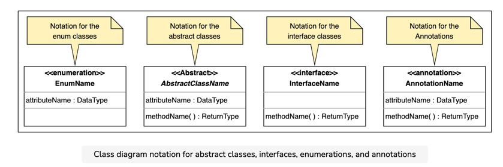

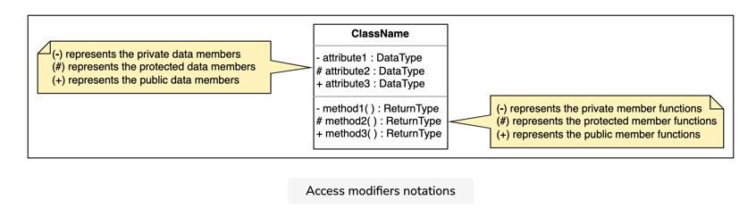

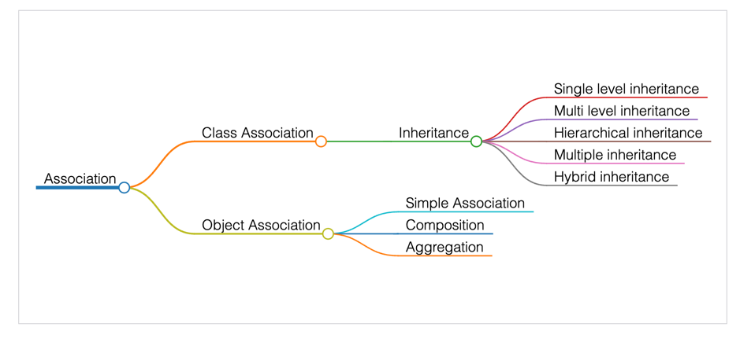

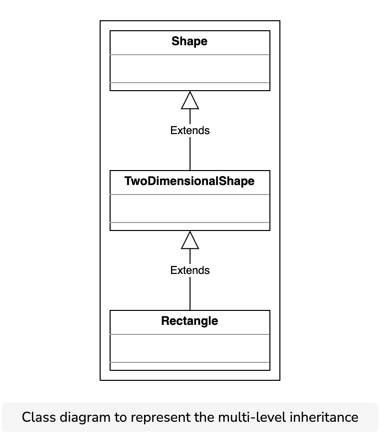


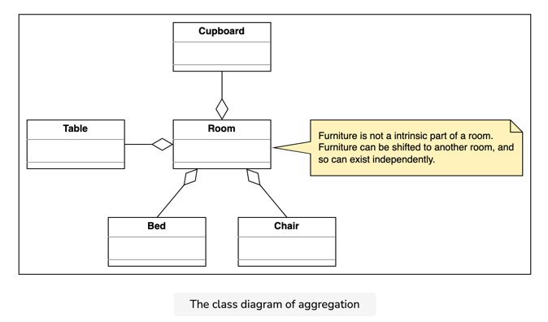

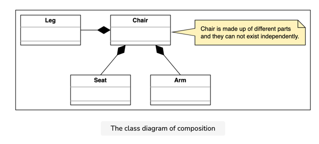

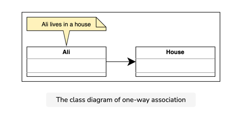

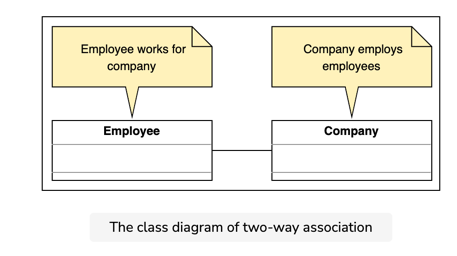

## Sequence Diagram ##

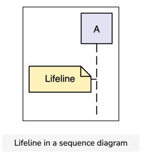

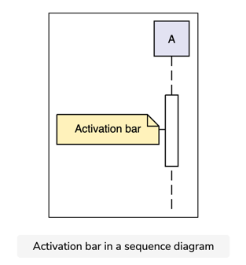

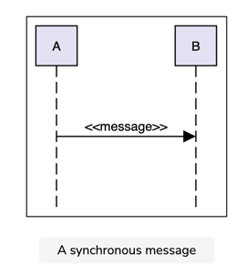

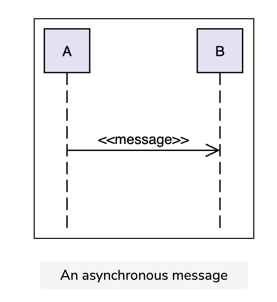

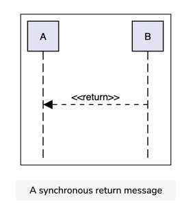


## Activity Diagram ##
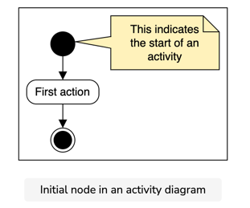

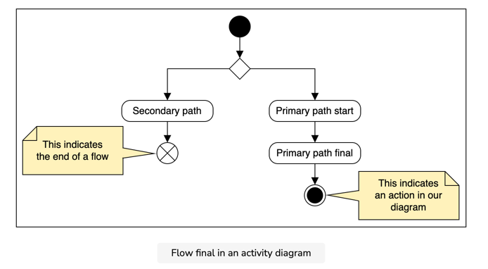
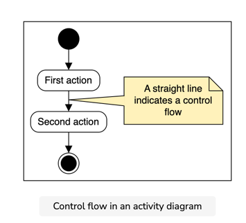
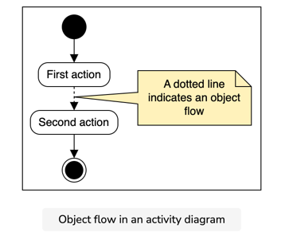
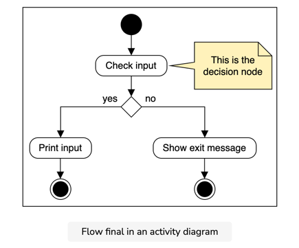
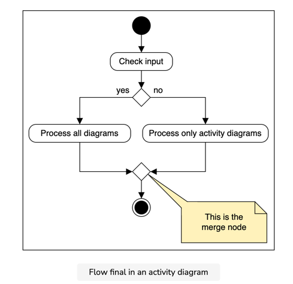
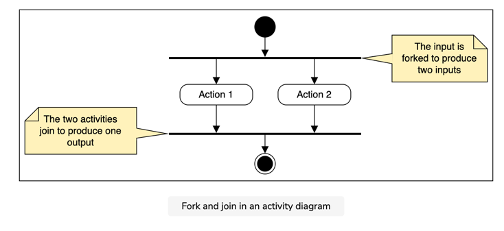


### SOLID Principle ###
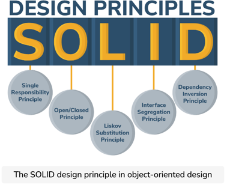

S-> Single responsiblity principle, i.e. Class should be responsible for single part/peice of work
O-> Open/Close principle .i.e Class should be open for extension but closed for change/modification
L-> Liskov Substitution Principle (LSP): Super class object should be replaced by object of child class without breaking system
I->Interface Segregation Principle (ISP) makes fine-grained interfaces that are client specific
D-> Dependency inversion Principle (DIP), ensures that the high-level modules are not dependent on low-level modules. In other words, one should depend upon abstraction and not concretion.

OCP (Open Close):
One might think of OCP as inheritance, but remember that inheritance is only one of the OCP techniques. We use the interface because it is open for extension and closed for modification. Therefore, OCP is also defined as polymorphic OCP.

* A software system should be easy to extend without the need for modification in the existing system. For the software systems, this goal is achieved by OCP.
* The system must be divided into small components, which are arranged, so that core code is always protected from new code.

Liskov Susbstitution principle: 

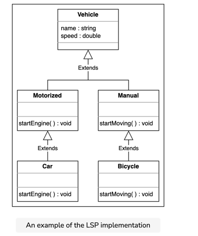
* The LSP is an important principle that should be extended to the level of system architecture. A small violation of the substitutability of classes can cause the system to break down, which is why we should always be on the lookout for violations. A few benefits of the LSP are provided below:
* It avoids the generalization of concepts that may not be needed in the future.
* It makes the code maintainable and easier to upgrade.

Interface segregation principle: Clients should not be forced to depend on methods they do not use.


### Dependency Inversion principle ###
The Dependency Inversion Principle (DIP) states that high-level modules should not depend on low-level modules. The abstractions should not depend on details. Instead, the details should depend on abstractions.

It allows for the flexibility and stability of the software.

It allows for the reusability of the application modules.


## Design pattern ##
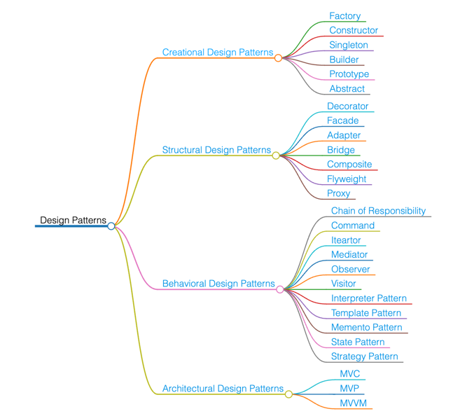

Behavioral design patterns
These patterns are concerned with communication between dissimilar objects in a system. They streamline communication and ensure that the information is synchronized between such objects.


## Creational Design Patterns ##
1. Singleton : Ensures that at most only one instance of an object exists throughout application.
```java
public class Singleton  {    
    private Singleton() {}
    
    private static class SingletonHolder {    
        public static final Singleton instance = new Singleton();
    }

    public static Singleton getInstance() {    
        return SingletonHolder.instance;    
    }
}
```

2. Factory design pattern : defines an interface for creating an object, but let subclasses decide which class to instantiate
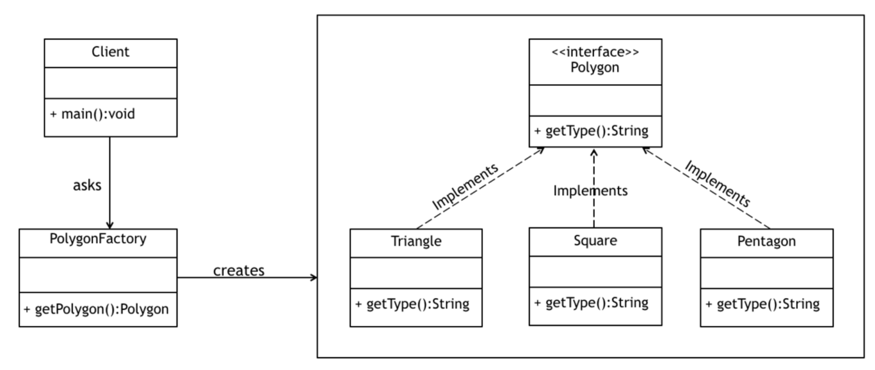

3. Abstract Factory Design Pattern: he Abstract Factory Design Pattern is used to create families of related or dependent objects. It's also sometimes called a factory of factories.

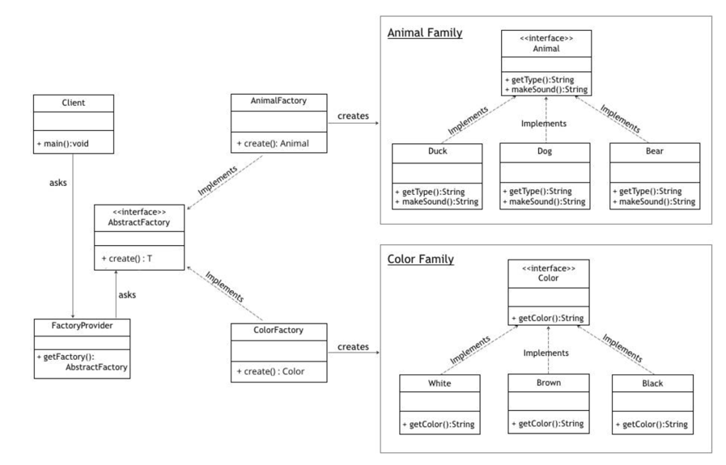

4. Builder Design Pattern: When the complexity of creating object increases, the Builder pattern can separate out the instantiation process by using another object (a builder) to construct the object.

## Structural Design Patterns ##
Structural design patterns are those that simplify the design of large object structures
1. Adaptor pattern:  An adaptor, as the name suggests, acts as an intermediary to convert an otherwise incompatible interface to one that a client expects.
Example are array as list and Readers in java
```java
List<String> musketeers = Arrays.asList("Athos", "Aramis", "Porthos");

InputStreamReader input = new InputStreamReader(new FileInputStream("input.txt"));
```

2. Bridge pattern: allows separation between abstractions and implementations so that they can be developed independently from each other but still have a way, or bridge, to coexist and interact.


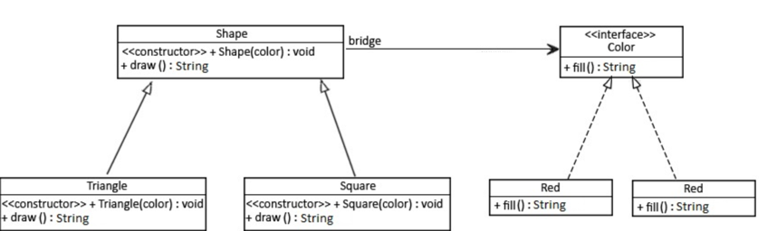
```java
@Test
public void whenBridgePatternInvoked_thenConfigSuccess() {
    //a square with red color
    Shape square = new Square(new Red());
 
    assertEquals(square.draw(), "Square drawn. Color is Red");
}
```

In this example color act as bridge between shape and color implementation
other example is in Java would be the JDBC API. It acts as a link between the database such as Oracle, MySQL, and PostgreSQL, and their particular implementations.

3.  Composite: this pattern arranges objects in a hierarchical fashion so that a client can work seamlessly with either the part of the whole.
    This pattern allows the client to work with these components uniformly, that is, a single object can be treated exactly how a group of objects is treated.

example
```java
public interface Department {
    void printDepartmentName();
}
public class FinancialDepartment implements Department {

    private Integer id;
    private String name;

    public void printDepartmentName() {
        System.out.println(getClass().getSimpleName());
    }

    // standard constructor, getters, setters
}
public class SalesDepartment implements Department {

    private Integer id;
    private String name;

    public void printDepartmentName() {
        System.out.println(getClass().getSimpleName());
    }

    // standard constructor, getters, setters
}

public class HeadDepartment implements Department {
    private Integer id;
    private String name;

    private List<Department> childDepartments;

    public HeadDepartment(Integer id, String name) {
        this.id = id;
        this.name = name;
        this.childDepartments = new ArrayList<>();
    }

    public void printDepartmentName() {
        childDepartments.forEach(Department::printDepartmentName);
    }

    public void addDepartment(Department department) {
        childDepartments.add(department);
    }

    public void removeDepartment(Department department) {
        childDepartments.remove(department);
    }
}

```

4. Decorater pattern: When we want to enhance the behavior of an object without modifying the original object itself. 
example
```java
BufferedInputStream bis = new BufferedInputStream(new FileInputStream(new File("test.txt")));
while (bis.available() > 0) {
    char c = (char) bis.read();
    System.out.println("Char: " + c);
}
```

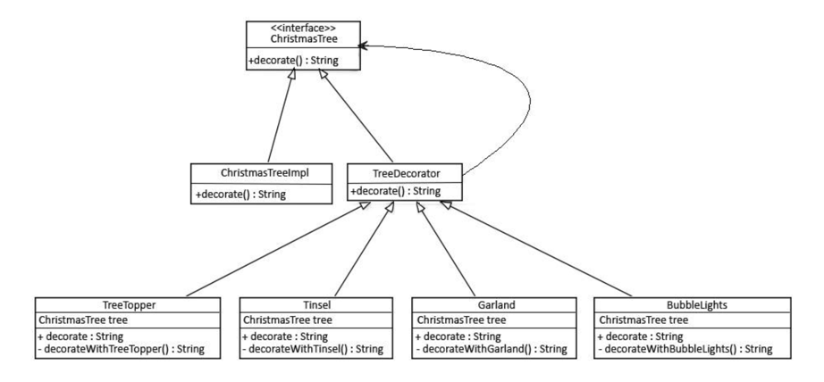

```java

public interface ChristmasTree {
    String decorate();
}


public class ChristmasTreeImpl implements ChristmasTree {

    @Override
    public String decorate() {
        return "Christmas tree";
    }
}

public abstract class TreeDecorator implements ChristmasTree {
    private ChristmasTree tree;

    // standard constructors
    @Override
    public String decorate() {
        return tree.decorate();
    }
}

public class BubbleLights extends TreeDecorator {

    public BubbleLights(ChristmasTree tree) {
        super(tree);
    }

    public String decorate() {
        return super.decorate() + decorateWithBubbleLights();
    }

    private String decorateWithBubbleLights() {
        return " with Bubble Lights";
    }
}

    @Test 
    public void whenDecoratorsInjectedAtRuntime_thenConfigSuccess() {
        ChristmasTree tree1 = new Garland(new ChristmasTreeImpl());
        assertEquals(tree1.decorate(),
                "Christmas tree with Garland");

        ChristmasTree tree2 = new BubbleLights(
                new Garland(new Garland(new ChristmasTreeImpl())));
        assertEquals(tree2.decorate(),
                "Christmas tree with Garland with Garland with Bubble Lights");
    }
```


5.  Facade: Applied to programming, it similarly means providing another face – or rather, interface – to a complex set of objects.
    It hides much of the complexity and makes the subsystem easy to use.
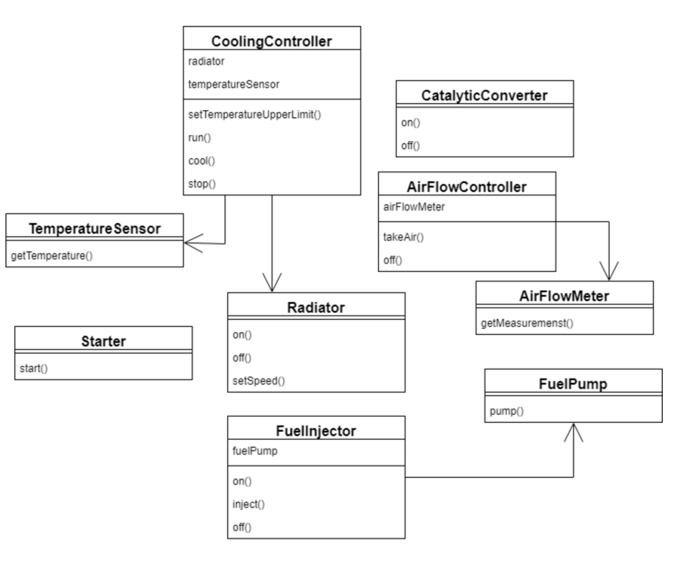
    it can be quite complex and does require some effort to start the engine correctly:
```java
// starting
airFlowController.takeAir()
fuelInjector.on()
fuelInjector.inject()
starter.start()
coolingController.setTemperatureUpperLimit(DEFAULT_COOLING_TEMP)
coolingController.run()
catalyticConverter.on()

//stoping
        fuelInjector.off()
        catalyticConverter.off()
        coolingController.cool(MAX_ALLOWED_TEMP)
        coolingController.stop()
        airFlowController.off()
```

Fasade is wrapper in this case.

```java
public class CarEngineFacade {
    private static int DEFAULT_COOLING_TEMP = 90;
    private static int MAX_ALLOWED_TEMP = 50;
    private FuelInjector fuelInjector = new FuelInjector();
    private AirFlowController airFlowController = new AirFlowController();
    private Starter starter = new Starter();
    private CoolingController coolingController = new CoolingController();
    private CatalyticConverter catalyticConverter = new CatalyticConverter();

    public void startEngine() {
        fuelInjector.on();
        airFlowController.takeAir();
        fuelInjector.on();
        fuelInjector.inject();
        starter.start();
        coolingController.setTemperatureUpperLimit(DEFAULT_COOLING_TEMP);
        coolingController.run();
        catalyticConverter.on();
    }

    public void stopEngine() {
        fuelInjector.off();
        catalyticConverter.off();
        coolingController.cool(MAX_ALLOWED_TEMP);
        coolingController.stop();
        airFlowController.off();
    }
    
    facade.startEngine();
// ...
facade.stopEngine();
```


6. Flyweight: The flyweight pattern takes the weight, or memory footprint, off of our objects by recycling them.
   Flyweight can be spotted all over the Number classes in Java.
The `valueOf` methods used to create an object of any data type's wrapper class are designed to cache values and return them when required.
For example, Integer has a static class, IntegerCache, which helps its valueOf method to always cache values in the range -128 to 127

Each time an object is requested, the factory looks up the object in order to check if it's already been created.
If it has, the existing object is returned – otherwise, a new one is created, stored and then returned
Usecase of flyweight design pattern :
    1. data compression: word processor
    2. Data cache

8. Proxy:
   Consider a heavy Java object (like a JDBC connection or a SessionFactory) that requires some initial configuration. We only want such objects to be initialized on demand, and once they are, we'd want to reuse them for all calls:
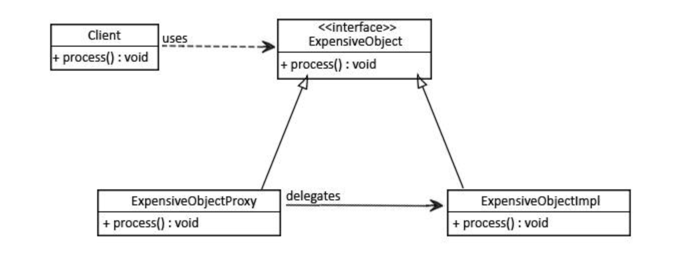
When to use proxy ?
    - When we want a simplified version of a complex or heavy object. (virtual proxy)
    - When the original object is present in different address space, and we want to represent it locally. (Remote proxy)
    - When we want to add a layer of security to the original underlying object to provide controlled access based on access rights of the client. (Protection proxy)

### Behavioural Design pattern ###

1. Chain of Responsibility:
   Chain of Responsibility as a design pattern consisting of “a source of command objects and a series of processing objects”. Each processing object in the chain is responsible for a certain type of command, and the processing is done, it forwards the command to the next processor in the chain.
    Example:
   And now that we've seen how interesting Chain of Responsibility is, let's keep in mind some drawbacks:

Mostly, it can get broken easily:
if a processor fails to call the next processor, the command gets dropped
if a processor calls the wrong processor, it can lead to a cycle
It can create deep stack traces, which can affect performance
It can lead to duplicate code across processors, increasing maintenance


2. Command:
Read => https://www.baeldung.com/java-command-pattern
3. Iterator
Read => https://www.baeldung.com/java-iterator
4. Momento (Undo functionality):
   pattern allows us to write objects that are able to change state, and then revert back to their previous state.
```java
class Undoable {
    private String value;
    private String previous;

    public void setValue(String newValue) {
        this.previous = this.value;
        this.value = newValue;
    }

    public void restoreState() {
        if (this.previous != null) {
            this.value = this.previous;
            this.previous = null;
        }
    }
}
```

5. Observer pattern: The Observer pattern allows for an object to indicate to others that changes have happened. Typically we'll have a Subject – the object emitting events, and a series of Observers – the objects receiving these events. The observers will register with the subject that they want to be informed about changes. Once this has happened, any changes that happen in the subject will cause the observers to be informed:
   An observable is an object which notifies observers about the changes in its state.
```java
class Observable {
    private String state;
    private Set<Consumer<String>> listeners = new HashSet<>;

    public void addListener(Consumer<String> listener) {
        this.listeners.add(listener);
    }

    public void setState(String newState) {
        this.state = state;
        for (Consumer<String> listener : listeners) {
            listener.accept(newState);
        }
    }
}

```

6. Strategy:
```java
interface NotificationStrategy {
    void notify(User user, Message message);
}

class EmailNotificationStrategy implements NotificationStrategy {
    ....
}

class SMSNotificationStrategy implements NotificationStrategy {
    ....
}

```

7. Template: We'll define a base class with the template method and a set of one or more abstract methods
```
class Component {
    public void render() {
        doRender();
        addEventListeners();
        syncData();
    }

    protected abstract void doRender();

    protected void addEventListeners() {}

    protected void syncData() {}
}
```

8. Visitor:  pattern allows our code to handle various subclasses in a typesafe way, without needing to resort to instanceof checks.


