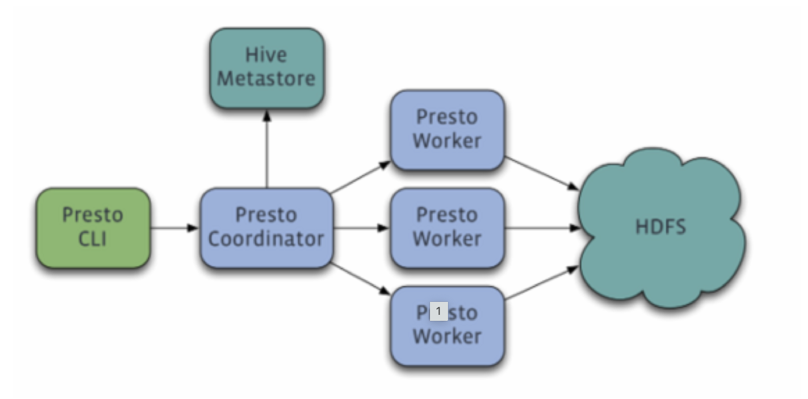
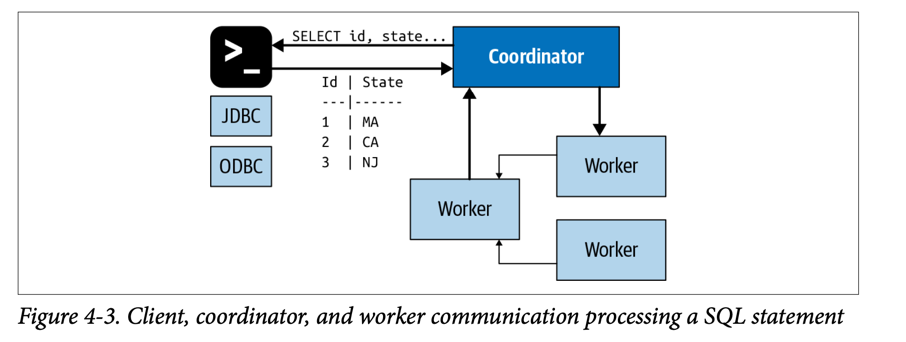
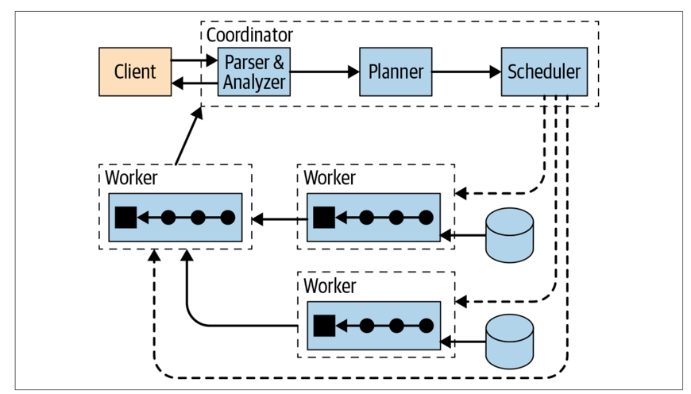
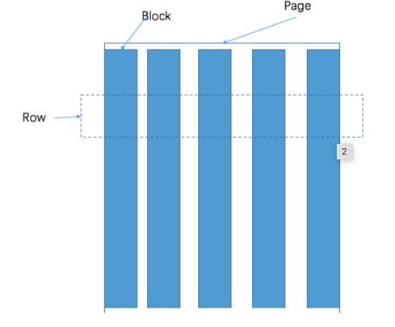

# Presto in Depth

Presto is an open-source distributed SQL engine suitable for querying large amounts of data. It was developed by Facebook in 2012 and subsequently made open-source under the Apache license. The engine does not provide its own database system and is therefore often used with well-known database solutions, such as Apache Hadoop or MongoDB.
Presto is an open source, distributed SQL query engine. It was designed and written
from the ground up to efficiently query data against disparate data sources of all sizes,
ranging from gigabytes to petabytes.

Presto supports SQL, commonly used in
data warehousing and analytics for analyzing data, aggregating large amounts of data,
and producing reports. These workloads are often classified as online analytical
processing (OLAP).

Presto was initially designed to query data from HDFS. And it can do that very effi‐
ciently, as you learn later. But that is not where it ends. On the contrary, Presto is a
query engine that can query data from object storage, relational database manage‐
ment systems (RDBMSs), NoSQL databases, and other systems, as shown in
Figure 1-3.
Presto queries data where it lives and does not require a migration of data to a single
location

## Why Presto :

Object storage systems include Amazon Web Services (AWS) Simple Storage Service
(S3), Microsoft Azure Blob Storage, Google Cloud Storage, and S3-compatible stor‐
age such as MinIO and Ceph. Presto can query traditional RDBMSs such as Micro‐
soft SQL Server, PostgreSQL, MySQL, Oracle, Teradata, and Amazon Redshift. Presto
can also query NoSQL systems such as Apache Cassandra, Apache Kafka, MongoDB,
or Elasticsearch. Presto can query virtually anything and is truly a SQL-on-Anything
system

Presto allows you to get around these problems. You can expose all these databases in
one location: Presto.
You can use one SQL standard to query all systems—standardized SQL, functions,
and operators supported by Presto.
All your dashboarding and analytics tools, and other systems for your business intel‐
ligence needs, can point to one system, Presto, and have access to all data in your
organization.

Presto allows you to do that by using federated queries. A federated query is a SQL
query that references and uses different databases and schemas from entirely different
systems in the same statement. All the data sources in Presto are available for you to
query at the same time, with the same SQL in the same query.
You can define the relationships between the user-tracking information from your
object storage with the customer data in your RDBMS. If your key-value store con‐
tains more related information, you can hook it into your query as well.
Using federated queries with Presto allows you to gain insights that you could not
learn about otherwise.

## Architecture

A coordinator is a Presto server that handles incoming queries and manages the work‐
ers to execute the queries.
A worker is a Presto server responsible for executing tasks and processing data.
The discovery service typically runs on the coordinator and allows workers to register
to participate in the cluster.
All communication and data transfer between clients, coordinator, and workers uses
REST-based interactions over HTTP/HTTPS.

Coordinator

The Presto coordinator is the server responsible for receiving SQL statements from
the users, parsing these statements, planning queries, and managing worker nodes.

The statement is translated into a series of connected tasks running on a cluster of
workers. As the workers process the data, the results are retrieved by the coordinator
and exposed to the clients on an output buffer. Once an output buffer is completely
read by the client, the coordinator requests more data from the workers on behalf of
the client. The workers, in turn, interact with the data sources to get the data from
them. As a result, data is continuously requested by the client and supplied by the
workers from the data source until the query execution is completed.

Discovery server:

Presto uses a discovery service to find all nodes in the cluster. Every Presto instance
registers with the discovery service on startup and periodically sends a heartbeat sig‐
nal. This allows the coordinator to have an up-to-date list of available workers and
use that list for scheduling query execution.
If a worker fails to report heartbeat signals, the discovery service triggers the failure
detector, and the worker becomes ineligible for further tasks.
To simplify deployment and avoid running an additional service, the Presto coordi‐
nator typically runs an embedded version of the discovery service. It shares the
HTTP server with Presto and thus uses the same port

Worker:
A Presto worker is a server in a Presto installation. It is responsible for executing tasks
assigned by the coordinator and for processing data.
Workers communicate with other workers and the coordinator by using an HTTPbased protocol.
multiple workers retrieve data from the data sources and col‐
laborate to process the data, until one worker can provide the data to the coordinator.

Connector-Based Architecture:
A connector provides Presto an interface to access an arbitrary
data source.Presto provides a service provider interface (SPI), which is a type of API used to
implement a connector. By implementing the SPI in a connector, Presto can use stan‐
dard operations internally to connect to any data source and perform operations on
any data source.

Query Execution Model:

coordinator accepts SQL statements from the end user, from the CLI
software using the ODBC or JDBC driver or other clients’ libraries

The coordi‐
nator takes that text and parses and analyzes it. It then creates a plan for execution by
using an internal data structure in Presto called the query plan.

The coordinator uses the metadata SPI to get information about tables, columns, and
types. These are used to validate that the query is semantically valid, and to perform
type checking of expressions in the original query and security checks.

The unit of data that a task processes is called a split. A split is a descriptor for a seg‐
ment of the underlying data that can be retrieved and processed by a worker. It is the
unit of parallelism and work assignment. The specific operations on the data per‐
formed by the connector depend on the underlying data source.
For example, the Hive connector describes splits in the form of a path to a file with
offset and length that indicate which part of the file needs to be processed.

The source tasks use the data source SPI to fetch data from the underlying data source
with the help of a connector. This data is presented to Presto and flows through the
engine in the form of pages. Operators process and produce pages according to their
semantics. For example, filters drop rows, projections produce pages with new
derived columns, and so on. The sequence of operators within a task is called a pipe‐
line. The last operator of a pipeline typically places its output pages in the task’s out‐
put buffer. Exchange operators in downstream tasks consume the pages from an
upstream task’s output buffer.

----------
Presto leverages both well-known and novel techniques for distributed query processing. 
These techniques include in-memory parallel processing, pipelined execution across nodes in the cluster, a multithreaded execution model to keep all the CPU
cores busy, efficient flat-memory data structures to minimize Java garbage collection, and Java bytecode generation

Coordinator (master) is responsible for meta management, worker management, and query resolution and scheduling.
The worker is responsible for computing and reading and writing.
Discovery server is usually embedded in the coordinator node. It can be deployed separately for node heartbeat. In the following, discovery and coordinator share a machine by default.

## How Coordinator failover works

The secondary machine deploys standby discovery and coordinator. Normally, a secondary machine is a cluster that only contains one machine. When the primary machine is down, the heartbeat of the worker is instantly switched to secondary

### Data Model
Presto adopts a three-layer table structure:

The catalog corresponds to a type of data sources, such as hive or MySQL data.
Schema corresponds to the database in MySQL.
Table corresponds to a table in MySQL.
### Storage unit
The Presto storage unit includes:
1. Page: It is a collection of multiple rows of data, which contains data in multiple columns. Only logical rows are provided internally. It is stored in a columnar format.
2. Block: It is a column of data. Different encoding methods are adopted according to different types of data. Understanding these encoding methods is helpful for your storage system to connect to Presto.

   