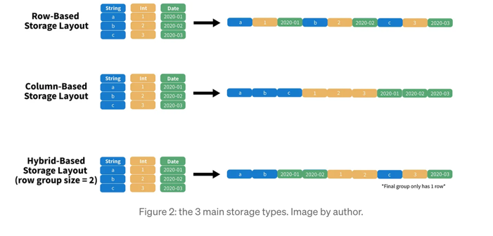
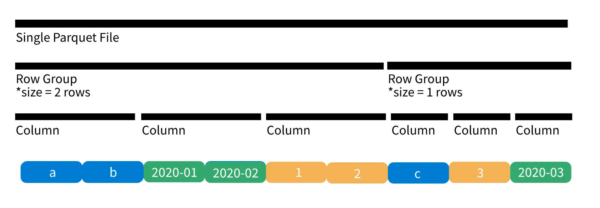

## What is Parquet ?
Apache parquet is an open-source file format that provides efficient storage and fast read speed. It uses a hybrid storage format which sequentially stores chunks of columns, lending to high performance when selecting and filtering data. On top of strong compression algorithm support (snappy, gzip, LZO), it also provides some clever tricks for reducing file scans and encoding repeat variables.
`It takes 87% less space and queries 34x faster (1 TB of data, S3 storage)— src compare to CSV`

## How is Parquet fast ?
**1. Storage**
Parquet use hybrid approach for storing data.Hybrid-base is sequentially store chunks of columns (Parquet).

**Why Hybrid**: hybrid layouts are really effective for OLAP workflows because they support both projection and predicates.

**Projection** is the process of selecting columns — you can think of it as the SELECT statement in a SQL query. Projection is best supported by a column-based layout. For instance, if we wanted to read the first column of a table using a column-based layout, we could just read the first n indices in our binary file, deserialize them, and present them to the user.
**Predicates** is the criteria used to select rows —you can think of it as the WHERE clause in a SQL query. Predicates are best supported by row-based storage. If we wanted all rows according to some criteria, such asInt >= 2, we can just order our table by Int (descending), scan until our criteria is not satisfied, and return all rows above that invalid row.
hybrid-based storage layout gives us a middle ground between columnar and row-based file formats

**Meta Data**

Parquet intelligently solves this by storing max and min values for each row group, allowing us to skip entire row groups, as shown in figure 4. But that’s not all! Since parquet often writes many .parquet files to a single directory, we can look at the column metadata for an entire file in and determine whether it should be scanned.

By including some extra data, we are able to skip chunks of our data and dramatically increase query speeds.

## Parquet File Structure
First, our file root, is just a directory that holds everything. Inside the root we have many individual .parquet files, each containing a partition of our data. A single parquet file is composed of many row groups and a single row group contains many columns. Finally, within our columns are data pages, which actually hold the raw data and some relevant metadata.

## How Parquet solve lot of duplicate data problem ?
Run-Length Encoding (RLE)
Let’s say we have a column with 10,000,000 values, but all the values are 0. To store this information, we just need 2 numbers: 0 and 10,000,000 —the value and the number of times it repeated.

## How Parquet solve very big datatype encoding ?
Dictionary encoding replaces each value in our column with a small integer and stores the mapping in our data page’s metadata. When on disk, our encoded values are bit-packed to take up the least amount of space possible, but when we read the data we can still convert our column back to its original values.

## How Parquet support complex filter ?
In a spark environment, we can avoid reading an entire table into memory through projection and predicate pushdown
