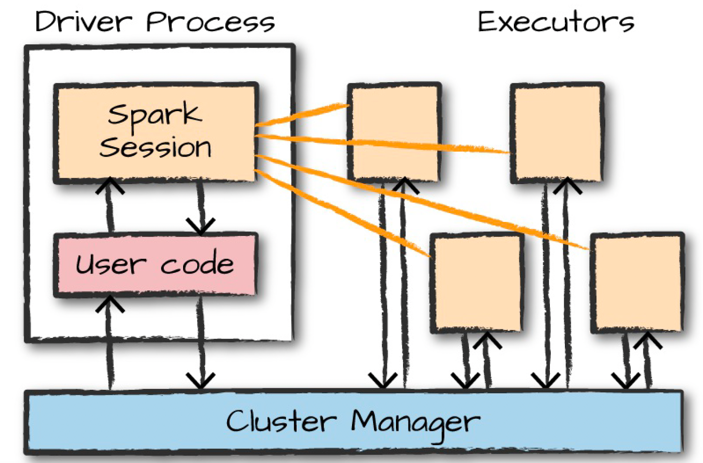

## Spark ##
Apache Spark is a unified computing engine and a set of libraries for parallel data processing on
computer clusters.


### Architecture ###



Driver: The driver process
runs your main() function, sits on a node in the cluster, and is responsible for three things:
maintaining information about the Spark Application; responding to a user’s program or input;
and analyzing, distributing, and scheduling work across the executors

The executors are responsible for actually carrying out the work that the driver assigns them.
This means that each executor is responsible for only two things: executing code assigned to it
by the driver, and reporting the state of the computation on that executor back to the driver node

This can be one of three core cluster managers: Spark’s
standalone cluster manager, YARN, or Mesos. This means that there can be multiple Spark
Applications running on a cluster at the same time.

SparkSession object available to the user, which is the entrance point to running Spark code.
When using Spark from Python or R, you don’t write explicit JVM instructions; instead, you
write Python and R code that Spark translates into code that it then can run on the executor
JVMs.


Transformations allow us to build up our logical transformation plan. To trigger the computation,
we run an action.

To Spark, DataFrames and Datasets represent
immutable, lazily evaluated plans that specify what operations to apply to data residing at a
location to generate some output.

Schemas
A schema defines the column names and types of a DataFrame. You can define schemas
manually or read a schema from a data source (often called schema on read). Schemas consist of
types, meaning that you need a way of specifying what lies where.

Even if we use
Spark’s Structured APIs from Python or R, the majority of our manipulations will operate strictly
on Spark types, not Python types

Dataset verse Dataframe

within the Structured APIs, there are two more APIs, the “untyped” DataFrames and
the “typed” Datasets. To say that DataFrames are untyped is aslightly inaccurate; they have
types, but Spark maintains them completely and only checks whether those types line up to those
specified in the schema at runtime. Datasets, on the other hand, check whether types conform to
the specification at compile time. Datasets are only available to Java Virtual Machine (JVM)–
based languages (Scala and Java) and we specify types with case classes or Java beans.

Execution flow
1. Logical Planning: Spark uses the catalog, a repository of all table and DataFrame information, to resolve
   columns and tables in the analyzer.The analyzer might reject the unresolved logical plan if the
   required table or column name does not exist in the catalog. If the analyzer can resolve it, the
   result is passed through the Catalyst Optimizer, a collection of rules that attempt to optimize the
   logical plan by pushing down predicates or selections


2. Physical Planning: 


```
Logical Plan simply illustrates the expected output after a series of multiple transformations like join, groupBy, where, filter, etc. clauses are applied on a particular table.

Physical Plan is accountable for finalizing the join type, the sequence of the execution of operations like filter, where, groupBy clause, etc.
```

**Partition Pruning**
Partition pruning is a performance optimization that limits the number of files and partitions that Spark reads when querying. After partitioning the data, queries that match certain partition filter criteria improve performance by allowing Spark to only read a subset of the directories and files.
Column Pruning is a technique where unnecessary columns are removed from the query processing pipeline. This can improve the performance of a query by reducing the amount of data that needs to be processed, stored in memory, and transferred over the network. The database system determines which columns are necessarily based on the query, and removes the unused columns before the query is executed.

**Predicate Pushdown**
Spark will attempt to move filtering of data as close to the source as possible to avoid loading unnecessary data into memory. Parquet and ORC files maintain various stats about each column in different chunks aof data (such as min and max values). Programs reading these files can use these indexes to determine if certain chunks, and even entire files, need to be read at all. This allows programs to potentially skip over huge portions of the data during processing.

Predicate Pushdown is a technique where filters, or predicates, are pushed down to the storage layer of a database management system. This way, only the relevant data is retrieved from the storage layer, reducing the amount of data that needs to be processed and thus improving the performance of the query. By pushing down the predicates, the database system can take advantage of any indexing or other optimization that is present at the storage layer.

Please find more detail on Parquet file [here](parquet.md)


Spark UDFs are incredibly powerful because you can write them
in several different programming languages; you do not need to create them in an esoteric format
or domain-specific language. They’re just functions that operate on the data, record by record.
By default, these functions are registered as temporary functions to be used in that specific
SparkSession or Context.
Although you can write UDFs in Scala, Python, or Java, there are performance considerations
that you should be aware of

Spark will serialize the function on the
driver and transfer it over the network to all executor processes. This happens regardless of
language.

If the function is
written in Scala or Java, you can use it within the Java Virtual Machine (JVM). This means that
there will be little performance penalty aside from the fact that you can’t take advantage of code
generation capabilities that Spark has for built-in functions.

If the function is written in Python, something quite different happens. Spark starts a Python
process on the worker, serializes all of the data to a format that Python can understand
(remember, it was in the JVM earlier), executes the function row by row on that data in the
Python process, and then finally returns the results of the row operations to the JVM and Spark.


Starting this Python process is expensive, but the real cost is in serializing the data to Python. This is
costly for two reasons: it is an expensive computation, but also, after the data enters Python, Spark
cannot manage the memory of the worker.

PROBLEM WITH PYTHON UDF
1. for each record on which udf needs to be applied row need to be serde and pass on to python function
2. but also, after the data enters Python, Spark cannot manage the memory of the worker.
   This means that you could potentially cause a worker to fail
   if it becomes resource constrained (because both the JVM and Python are competing for memory on
   the same machine)

There are times when an approximation to a certain degree of accuracy will work just fine, and
for that, you can use the approx_count_distinct function:
// in Scala
import org.apache.spark.sql.functions.approx_count_distinct
df.select(approx_count_distinct("StockCode", 0.1)).show() // 3364
# in Python
```
from pyspark.sql.functions import approx_count_distinct
df.select(approx_count_distinct("StockCode", 0.1)).show() # 3364
-- in SQL
SELECT approx_count_distinct(StockCode, 0.1) FROM DFTABLE
```

You will notice that `approx_count_distinct` took another parameter with which you can specify the maximum estimation error allowed.


Phase of  Spark SQL query execution phases
1. Analysis- > 1st generate Abstract symbol tree from Sql/ API
   then Spark SQL make use of Catalyst rules and a Catalog object 
   that track data in all data sources to resolve these attributes
 
2. Logical -> after analytical phase , constant rules are applied to logical plan
   example contant folding, predicate push down and projection pruning
3. Physical->
   it selects the plan using the cost model. 
  It uses Cost-based optimization only to select `join algorithms`. 
  For small relation SQL uses broadcast join, the framework supports broader use of cost-based optimization. 
   It can estimate the cost recursively for the whole tree using the rule.
   Rule-based physical optimization, such as pipelining projections or filters into one Spark map Operation is also carried out by the physical planner.

   4. Code generation -> Catalyst uses the special feature of Scala language, “Quasiquotes” to make code generation easier because it is very tough to build code generation engines. Quasiquotes lets the programmatic construction of abstract syntax trees (ASTs) in the Scala language, which can then be fed to 
   the Scala compiler at runtime to generate bytecode. 

Question ??
How python works with Spark ? Detail it out please

What this means is, that when you use the PySpark API, even though the actual ‘data-processing’ is done by Python 
processes, data persistence and transfer are still handled by the Spark JVM. Things like scheduling (both DAG and Task), broadcast, networking, fault-recovery etc. are all reused from the core Scala Spark package.
This also means that the Java and Python processes need a means to talk to each other.


 local communication:
n the Python driver program, SparkContext uses Py4J to launch a JVM and create a JavaSparkContext. Py4J is only used on the driver for local communication between the Python and Java SparkContext objects.

RDD transformations in Python are mapped to transformations on PythonRDD objects in Java. On remote worker machines, PythonRDD objects launch Python subprocesses and communicate with them using pipes, sending the user’s code and the data to be processed.


Done? Ok. I’ll just reiterate a couple of salient points about Py4j:

Python interacts with JVM using something called reflection
Before you setup the python side of the gateway, your JVM must be ready, i.e. Py4J does not launch the JVM for you
To communicate with the Java process you need two things, a gateway server and an entry_point
With that in mind let’s revisit the java_gateway module.

We launched the JVM (and the java end of the gateway) by running the spark-submit script.
We launched the Python end of the gateway by using py4j.JavaGateway (step 5 in the pseudo code).
But where’s the entry_point? Is it the JavaSparkContext?

Well… not really. But, in a very lose sense, it could be considered that. It is a part of the Java API for spark and a way for the JVM to access the core Scala packages. And, since the Python API sits on top of the Java API, it is Python’s entry point into functionality written in Scala

-----
Optimizations
-----
1. Broad cast small table, to avoid data suffling:
   The maximum size for the broadcast table is 8GB. Spark also internally maintains a threshold of the table size to automatically apply broadcast joins. The threshold can be configured using spark.sql.autoBroadcastJoinThreshold which is by default 10MB.
2. Use Windows over join in scenerio where when an aggregation is performed on a DataFrame and then the DataFrame resulting from the aggregation is joined to the original DataFrame.
3. Minimize Shuffles: How ? 
   - Selecting best join ( sort merge join , suffleHashJoin, broadcastHashJoin, SortMerge is default)
   
   - Avoid one big suffle by 2 small suffle  
     E.g.  If a medium-sized data frame is not small enough to be broadcasted, but its keysets are small enough, we can broadcast keysets of the medium-sized data frame to filter the large-sized data frame. 
     - In this way, we might achieve that drastically less amount of data are shuffled if we are able to filter a significant amount of data from large-sized data
   hey I have used it :)
   
   - Bucketing: Bucketing is another data organization technique that groups data with the same bucket value.
   It is similar to partitioning, but partitioning creates a directory for each partition, whereas bucketing distributes data across a fixed number of buckets by a hash on the bucket value

By applying bucketing on the convenient columns in the data frames before shuffle required operations, we might avoid multiple probable expensive shuffles. Bucketing boosts performance by already sorting and shuffling data before performing sort-merge joins.
It is important the have the same number of buckets on both sides of the tables in the join.

4. More suffle are good :
 Data is skewed : If the application could not take advantage of all cores in the cluster because of the low level of parallelism, repartition can be applied to increase the partition number.
 Coalease : Secondly, when aggregating over a high number of partitions, the computation can quickly become bottlenecked on a single thread in the driver merging all the results. To mitigate the load on the driver, it can be carried out an extra round of distributed aggregation that divides the dataset into a smaller number of partitions thanks to an aggregate action. The values within each partition are merged in parallel, before sending their results to the driver for a final round of aggregation.

5. Misuse of cache:  Parquet better than cache :)
   In that case, entire data is cached without inspecting whether all data is relevant or not. 
   For instance, in the case of reading from parquet, Spark will read only the metadata to get the count so 
   it doesn’t need to scan the entire dataset. For the filtering query, it will use column pruning and scan 
   only the relevant column. On the other hand, when reading the data from the cache, Spark will read the entire dataset.

6. Checkpointing: Basically spark enable persisting state of data into disk instead of recomputing  . Use it over cache 

7. Avoid UDF in python. If not possible then
   -  If you are still to use UDFs, consider using pandas UDFs which are built on top of Apache Arrow. It promises the ability to define low-overhead, high-performance UDFs entirely in Python 
   - UDFs implemented in Java or Scala might also be called from PySpark.

In the row-at-a-time version, the user-defined function takes a double "v" and returns the result of "v + 1" as a double. In the Pandas version, the user-defined function takes a pandas.Series "v" and returns the result of "v + 1" as a pandas.Series. Because "v + 1" is vectorized on pandas.Series, the Pandas version is much faster than the row-at-a-time version.

8. Tackle with Skew Data — salting & repartition
    - Glom function is used to detect data skewness
   ```
   partition_number = df.rdd.getNumPartitions()
   data_distribution = df.rdd.glom().map(len).collect()
   ```
 - Adaptive query execution (AQE) is query re-optimization that occurs during query execution. ( Sort of run time optimization which is offered starting spark 3)

    ```
    Dynamically changes sort merge join into broadcast hash join.

    Dynamically coalesces partitions (combine small partitions into reasonably sized partitions) after shuffle exchange. Very small tasks have worse I/O throughput and tend to suffer more from scheduling overhead and task setup overhead. Combining small tasks saves resources and improves cluster throughput.

    Dynamically handles skew in sort merge join and shuffle hash join by splitting (and replicating if needed) skewed tasks into roughly evenly sized tasks.

    Dynamically detects and propagates empty relations.
    ```

   Salting technique is applied only to the skewed key. To distribute the data evenly, we append random values from 1 to 5 to the end of key values for the bigger table of join and compose a new column in the smaller table by exploding an array from 1 to 5.
   Repartition does a full shuffle, creates new partitions, and increases the level of parallelism in the application. More partitions will help to deal with the data skewness problem with an extra cost that is a shuffling of full data as mentioned above.

    Another approach is coalesce, differently from repartition that is used to increase or decrease the partition number with shuffling, it is used to reduce the partition number without shuffling. 

9. Proper file format: Parquet
   Apache Parquet is a columnar storage format designed to select only queried columns and skip over the rest. It gives the fastest read performance with Spark. Parquet arranges data in columns, putting related values close to each other to optimize query performance, minimize I/O, and facilitate compression. Furthermore, it implements column pruning and predicate pushdown (filters based on stats) which is simply a process of only selecting the required data for processing when querying a huge table. It prevents loading unnecessary parts of the data in-memory and reduces network usage.


-> In general, tasks larger than about 20 KiB are probably worth optimizing.
-> In general, it is recommended 2–3 tasks per CPU core in your cluster.


Joins in spark 
-------------

Broadcast Hash Join (BHJ)
Shuffle Hash Join (SHJ)
Sort Merge Join (SMJ)
Broadcast Nested Loop Join (BNLP)
Cartesian Product Join (CPJ)

