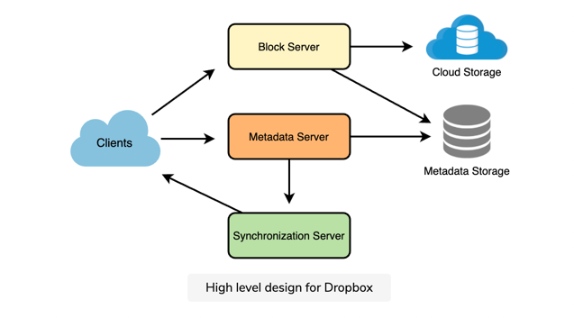
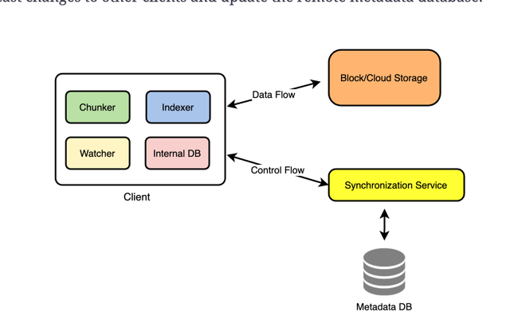
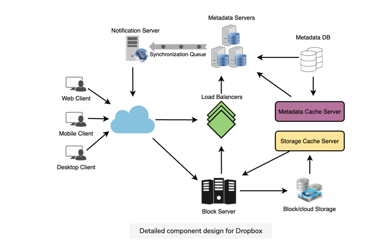

## DropBox ##

### Requirement ###

**Functional**
1. Upload/Download any file from any device
2. Data Size would be in GB
3. Offline data change support and drive should be synced as comes online
4.  ACID guarentee (Atomic , Consistent, Isolation and Durable)
5. Share with other user
6. Should support versioning (Snapshorts) od data.

**NonFunctional**
1. Data durablity
2. High availablity
3. Consistent
4. Scalable

### Design Consideration ###
1. huge read and write
2. 1:1 ratio for r/w
3. File should be stored in small blocks and failure should be handled at block level.

### Back of the envelope calculation ###
- 500M user and 100M DAU 
- Average user  upload 200 files
- average file size is 100KB \
    `total = (100,000,000 X 100)/(1024*1024*1024) = 10 PB`
  

### Component Design ###

**Client**
1. Client monitor workspace on current m/c and update server with any changes
- to handle file tranfer we would only tranfer chunk of file which had changed
- Client will store meta data , this help in offline update and save long round trip
- client will use  http/s long polling concept for communication with server

Client could have 4 parts\
1. Chunker : to chunk files, also resposible to recreate file
2. Meta store : to hold state of files and folder on local device
3. watcher: to listen to any change on local and update indexer. llly  watcher also  implement any change made by remote client
4. indexer: this is responsible to update local meta store based on event recieved from watcher. It is also responsible to communicate 
with remote sync service.
   

- If servers are slow , client should ping on exponential delay
- Mobile client should only update remote changes on  demand bases.

** Metadata **
Data Store to hold metadata for all clients\
prefered is SQL as it comes with inherent ACID\
else with NoSql ACID should be programmed\
* responsible to store info about
- user
- chunk/files (version)
- user device
- workspace

** Sync Service **
- very imp as responsible to propogate local changes to meta data  and obj store
- Also sync clients based on new changes
- to achieve less data transfer only chucks changes with SHA 256 hash. 
check it at server side to see if it is diff else ignore
  
-we need MQ b/w client and sync Service to match up speed and scalability
` Question how ACID is achieved with Queue middle mare `
` Merge conflict resolution ???`

Design looks like this

each device listen to notification queue 

**MetaDB Partition**\
We need to come up with a partitioning scheme that would divide and store our data in different DB servers.
we will use hash partition (base on fileId generated) and can even improve it by using consistent hashing 
- My aproach would be
    -fileid on object stor
    - userId on metadata
    

**Caching**\
- Memcache to store block 20-80 % - this can futhur tune based on user usage pattern
- LRU as cache replacement policy 

  