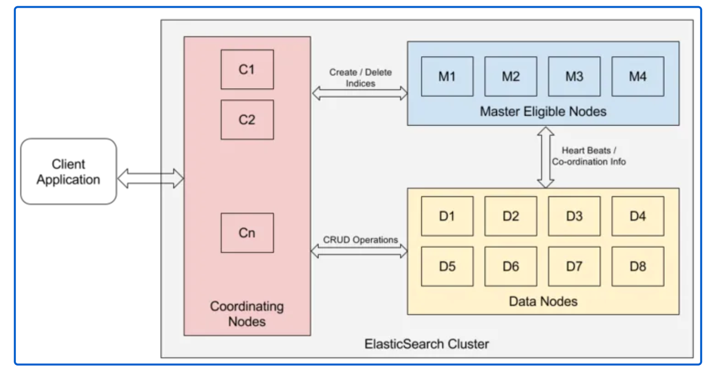

## Elastic Search ##
Elasticsearch is a distributed, open-source search and analytics engine built on Apache Lucene and developed in Java. 
It started as a scalable version of the Lucene open-source search framework then added the ability to horizontally scale
Lucene indices. Elasticsearch allows you to store, search, and analyze huge volumes of data quickly and in near real-time 
and give back answers in milliseconds.

## How it works ##
Elasticsearch uses inverted indices, a data structure that maps words to their document locations,
for an efficient search. Elasticsearch’s distributed architecture enables the rapid search and 
analysis of massive amounts of data with almost real-time performance.

Elasticsearch is meant for `fast text search`.
Elasticsearch is not like a traditional RDBMS. 
It is not suitable for your transactional database needs and hence, in my opinion, 
it should not be your primary data store.

**Cluster**
One or more servers collectively providing indexing and search capabilities form an Elasticsearch cluster. 
The cluster size can vary from a single node to thousands of nodes, depending on the use cases

**Node**
- storage
- computation (Indexing and search and agg)
- health check

1. Data Node
    - Storage and computation; Data is store in shard
    - CPU and IO intense node
    - Default is data node
    
2. Master node:
    responsible for health check of datanode
    Responsible for creating/deleting indexes
    - SPOF is avoided by having odd number of master node. Election is use to elect master.
    - By default, all the nodes are both data nodes as well as master nodes. However, some nodes can be master-eligible nodes only through explicit configuration
3. Coordinator Node:
   Any node, which is not a master node or a data node, is a coordinating node. Coordinating nodes act as smart load balancers. Coordinating nodes are exposed to end-user requests.
   It appropriately redirects the requests between data nodes and master nodes.
   

Index
Index is a container to store data similar to a database in the relational databases
If we take an example of an e-commerce website, there will be one index for products, one for customers, and so on. 
Indices are identified by the lowercase name.

Type:
Types are defined on the basis of documents having similar properties in it. 
It isn’t easy to decide when to use type over index. Indices have more overheads, 
so sometimes, it is better to use different types in the same index for better performance.

Document:
Document is the piece indexed by Elasticsearch. A document is represented in the JSON format. We can add as many documents as we want into an index. 
The following snippet shows how to create a document of type mobile in the index store

Mapping Types:
Mappings can be defined as a list of directives given to Elasticseach about how the data is supposed to be stored and retrieved. 
It is important to provide mapping information at the time of index creation based on how we want to retrieve our data later. 
In the context of relational databases, think of mappings as a table schema.
f no mapping is provided, Elasticsearch tries to identify the schema itself, 
known as Dynamic Mapping

Sharding:
Shard decides the degree of parallelism for search and indexing operations. 
Shards allow the cluster to grow horizontally. The number of shards per index 
can be specified at the time of index creation. By default, the number of shards 
created is 5. Although, once the index is created, the number of shards can not be 
changed. To change the number of shards, reindex the data.

Replication:
A shard, which is being copied, is called a Primary Shard. The copy of the primary shard is called a replica shard or simply a replica. 
Like the number of shards, the number of replication can also be specified at the time of index creation

In the replicated index, only primary shards can serve write requests. However, all the shards (the primary shard as well as replicated shards) can serve read / query requests. The replication factor is defined at the time of index creation and can be changed later if required. 
Choosing the number of shards is an important exercise as once defined, it can’t be changed.

**ELK**
Elasticsearch for log data and wanted a way to easily ingest and visualize that data.

Kibana: Kibana is a data visualization and management tool for Elasticsearch that provides real-time histograms, line graphs, pie charts, and maps. It lets you visualize your Elasticsearch data and navigate the Elastic Stack. You can select the way you give shape to your data by 
starting with one question to find out where the interactive visualization will lead you.

Logstash is used to aggregate and process data and send it to Elasticsearch.
It is an open-source, server-side data processing pipeline that ingests data 
from a multitude of sources simultaneously, transforms it, and then sends it to 
collect. It also transforms and prepares data regardless of format by identifying named fields to build structure,
and transform them to converge on a common format. 