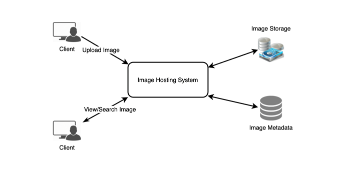
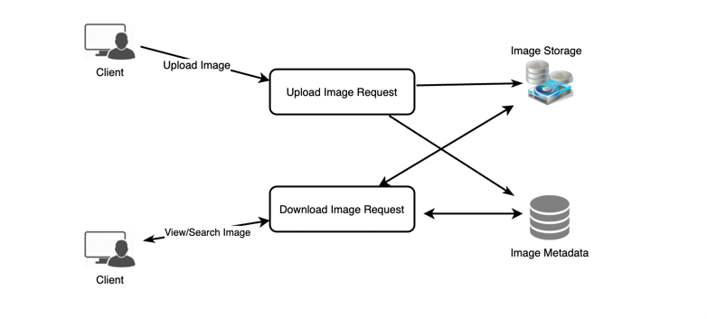

## Instagram ##

### Requirement ###
 **Functional**
1.  Upload/download/View photos
2.  Search based on Video title
3.  Follow other user
4.  New Feed of all users which user follow

**Non functional**
1. HA
2. low latency of as much as 200 ms for new feed generation
3. Highly reliable. No Data loss ever
4. Consistency can be eventual

Please note that  in this use case few things are very important
1. Low latency - it should be reasonably low while watching photo
2. Storage - Since user can practically upload as much photo as he wants so storage management is critical
3. Reliablity : No Loss of data. 100 %

### Back of the Envelope ###
**Storage** 
- 500 M user 
- 1M Active User
- 2M new photo every day ~ 23 photo per sec
- each photo is 200kb 
- total space for photo per day = ~379 GB
 so for 10 year = 1351 tb so after 70% rule = 1930 TB
  
### Design ### :
Focus on two thing 
1. Store : we would use object store for photo/vedio storage
2. search : We would have metadata db for these photo

### Database Design ###

User
- id
- name
- email
- dob
- creates_date
- last_login

follower
- id
- user_id
- follower_id

photo
- photo_id
- user_id
- created_date
- comment
- path

### Component Design ###

1. Application Layer
    - We know write (i.e. photo upload) will be slow process compare to read 
    -Read should be much faster as this could be catered from Cache\
      to tackle this problem we should have different server for read and write.
      

**Reliablity**
- At data store (i.e. object store and DB we would keep replica of each)
- At App Service ( we would have hot-warm concept, warm takeover when hot goes down)

- Photo  to get ID  and stored in shared based on hash value\
    this ID can be generated as auto increment seq from tables (two tbls in two diff schema one for even other for odd)\
  we can also use key DB approach  as that of tiny URL \
  
**Notification**
for Notification we have two approach\
1. Fanout at write: i.e.  New feed for user is computed at write time. this works well when followers are in some 100
2. Fanout at Read: Compute new feeds at read time. this slow down read
3. Hybrid: if follower is some 100 use fanout at write or if inactive / too many follower use fan out at read
 
### Caching ###
- 20-80  rule
- use LRU
