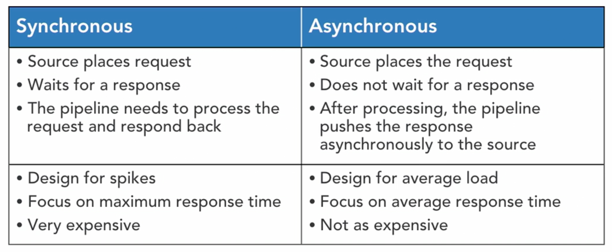
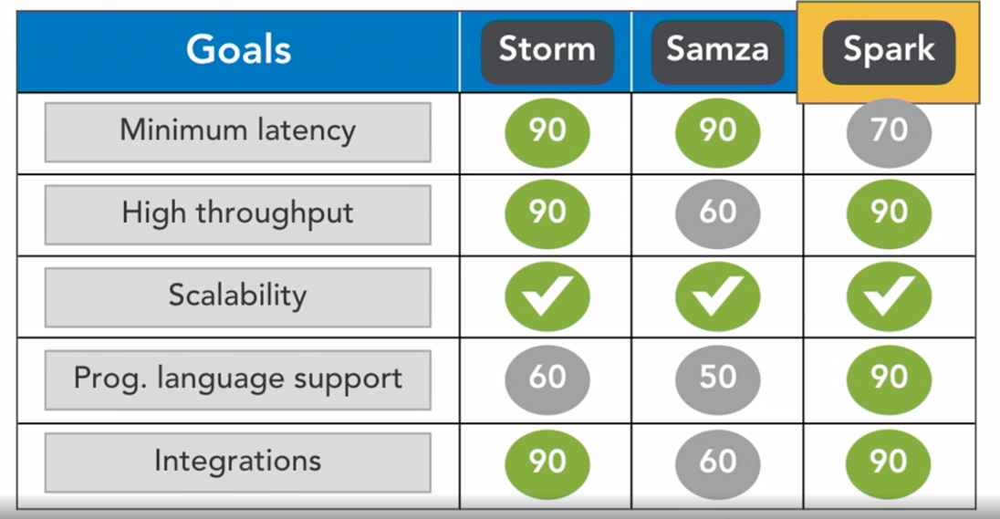
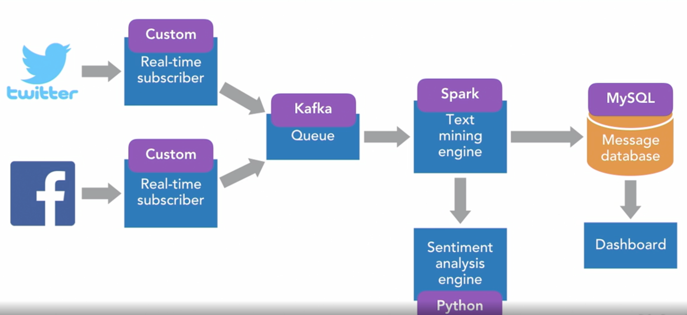
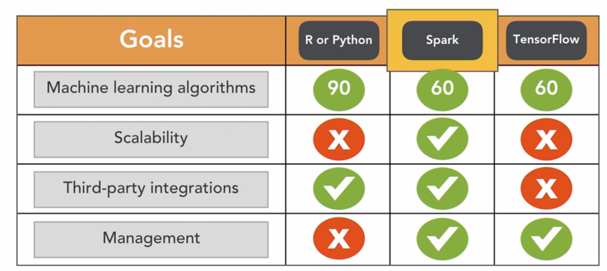
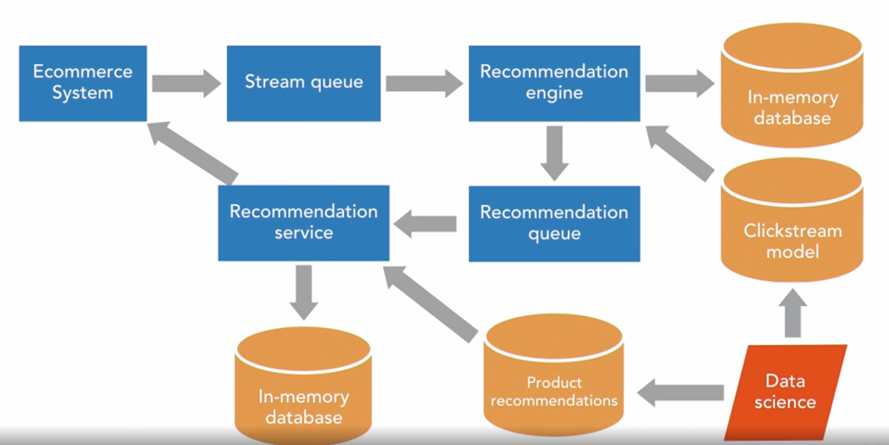
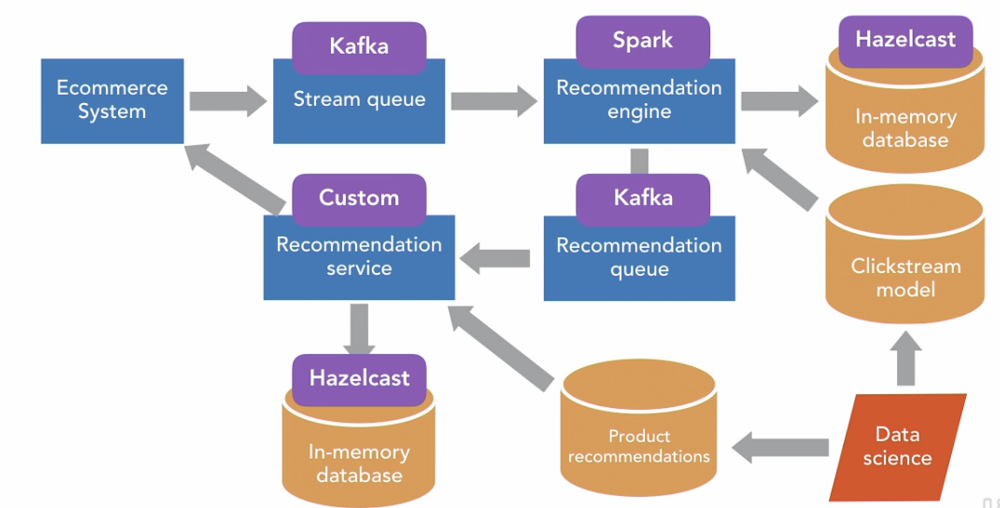
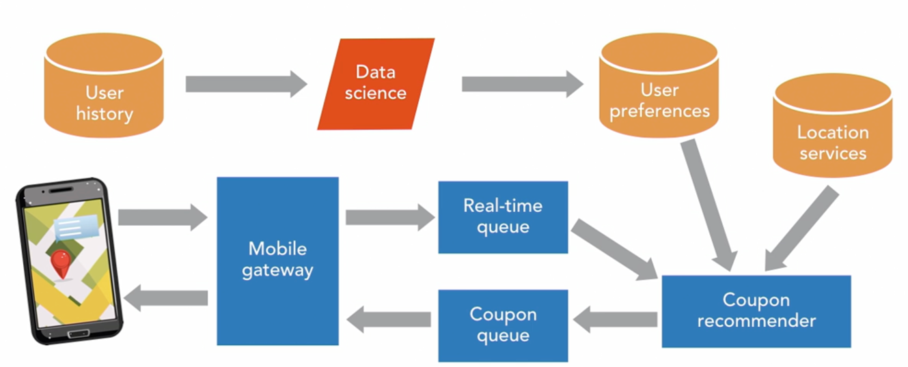
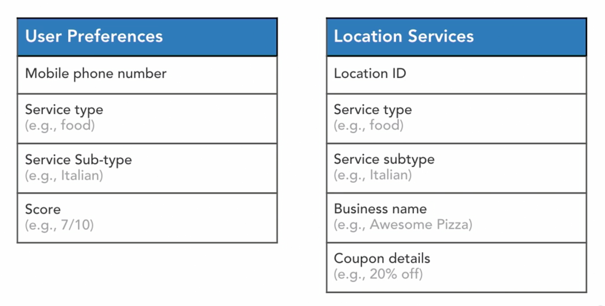

# Designing Realtime systems

**Cost of response ?**
 for realtime system capability you need  to spend extra cost on
 1. H/W : Cluster
 2. S/W : Parallelism
 3. Engineering
 4. Operation
 5. Network: latency 

 
**Four Vs of big data**

1. Volumn
2. Velocity
3. Variety
4. Veracity (correctness)


**Challenge with Realtime **
1. Producer and consumer can work on different throughput capability. so in case if consumer is slow , it can put back pressure on producer .llly if they are too fast , they will waste CPU clock by waiting

2. UX: If pipeline fail it should not impact insight and user experience , with no time to fix and reprocess

##Stratergy for Big Data processing

1. ***Sync and Async pipelines ***


Sync pipeline: Source -> work -> wait for response

Async Pipeline: Src -> push Work : Move on (Example on bottom click -> next page is rendered + pipeline is triggered : a Asyn Ajax script pool pipeline to complete -> paint page with recommendation on pipeline complete)


Use Asyn pipeline when possible  But why ?

- Sync pipeline are designed for spike and are expensive
- Asyn pipeline are designed for avg load and avg response time and are thus not that expensive.

2. ***parallelism and horizontal scaling***

3. Use buffer (Queue) to handle back pressure : this help producer and consumer to have different throughput

4. Stateless services: So that can be horizontally scaled

5. State storage :Data cluster with share nothing architecture (i.e. in memory store which replicate data and allow service to read from any node - read replica)

6. Plan for TTL: Make sure request in real time system has a Time to live and after that it become stale. Drop stale request since processing them would have no value.


## Use Case 

**Sentiment analysis: Architect a real time sentiment anaylsis post on social media , identify negative posts and inform customer case to respond** 

Goals are
1. Real time monitoring
2. Scalabity to support growing consumer base and analytics
3. Realtime summary 
4. Support to add more Social media channels


 - We will start with Twitter  
 - Twitter provide real time streaming API for User, #tag or Handle 
 - We need real time subscriber for this
 -  For FB also we have lllr realtime subscriber
 
 Next
 - We will process tweet and FB post and convert them to standerd msg
 - these standard msg is written to queue
 
 Next
 - text mining engine will extract attribute from this msg like poster, text comment, like count, share count etc

 Next
 - Sntiment analysis engine will analyse post and return score

 Next 
 - Post, attribute (like and share) and sentiment analysed is store in Message DB

 Next
 - Dash board will provide real time summary 

 
 **Technology for implementing it **
 
 Goals are:
 1. Scalable
 2. Programmable
 3. Easy to Integration with MQ , web service ete
 4. Min latency  ( quick response time)
 5. high throughput (llr processing)

 Options were
  Storm /Spark/Samza
 

 
 Problem
 Strom support trift -> so techincally any lang can work but integration is not as tight as apache spark
 
 Samza throughput is not as high as strom or spark. 2ndly only API base programming. Moving data from samza to local DS is local
 
 Spark  Support micro batch and is not msg by msg as above two. batch can be as small as 1 second long
 
 
 Streaming MQ
 Rabbit MQ
 Active MQ
 Kafka
 
 All are good but motivation is apache kafka integration with spark. 
 (+ Offset base msg read capabilty )
 
**Next**
 Message push to kafka - we will build it
 
**Next** Sentiment analysis and Text mining

we will build web service using python to proved sentiment analysis and text mining ( question why not integrate with spark ???)

**Next** DB
MySql for now with sharding . future can be no sql 


## Key design consideration

1. MSG can be proceed independly and sequenc doesnt matter
2. Map operation to clense data 
3. Sentiment analysis engine can be called from map function itself
4. Reduce can be called to get summarized tweet
5. spark batch size can be 1 min 
6. Spark partition = kafka partition

7. Sentiment analysis - we will use NLTK 
8. Scale it horizontally behind Load balancer

## Best practices
1. Gaurantee message delivery (only once, atmost once, atleast once ) only one is not possible
2. Ordering gaurentees : choose msg which can be dequeued in same order and can be replayed 
3. Requery data from earlier point
4. Streaming solution should be reductant (failover support)
5. scalable horizontally


## Real time fraud deduction ##
ecom merchant want to identify payment fraud in matter of mins as order is placed 

Architect real time payment fraud prediction system to identify fradulent transaction before order ship
Goal
1. Realtime (subminute latency)
2. asyn
3. predictive analytics
4. hunam review 

so realtime -spark
asyn -kafka
predictive - ms backed with DB ( we need state)
human review - DB to store  transaction audit logs (Cassandra)


technologies

1. ML Technologies:



Python-R if and only if we have very sophisticated Algorithum. If it is rule based spark can be great fit


Deep dive

1: Prediction model need to be broadcasted to each executor
2. Kafka partition = Spark partition
3. Design system for frequent model update. New model should be updated as soon as available
-> My Idea is cache lookup
```
Lookup reference data to be used in streaming operations

create CacheLookup object with desired cache TTL
wrap that in Broadcast
use CacheLookup as part of streaming logic
For most part this works fine, except for the following

Update the reference data

There is no definitive way achieve this despite the suggestions in these threads, i.e: kill the previous broadcast variable and create new one. Multiple unknowns like what to be expected between these operations.
```

## Key design consideration
1. Test for average response time, Keep it low and test it with real production data
2. Should be with in some mins

## Best Practices
1. Prediction should be scalable
2. Keep prediction process asyn
3. perform bench test with production

## Usecase 3: Website product recommendation

1. Recommend product based on user currently viewing
2. Recommend product based on user click stream data during current browsing duration.
3. Recommendation should be union of both 

Goals:

1. Recommend in real time ( with in secs)
2. Context specific 
3. Scalable

Technology I choose -> with in second (Spark /Strom) , Context specific -> need to track history , recommendation-> python or spark ??
**Few  Recommendation**
1. **recommendation based on product being veiwed** are static in nature since they are base on product. They will change slowly over period
2. **Rcommendation based on user view in current session** is dynamic as it changed  as user navigate
3. Solution should consolidate both



Author choose hazelcast. My choice is Redis.


## Key design consideration
If you see recommendation service is rest api base , why is it not sync ?
1. For syn we need to scale up infra (like n/w stream etc) and if there is problem with pipeline  UX will be impacted
2. User navigation will be delayed if problem with pipeline

- State in hazel cast
- Purge session+ user data as user session expire (may be TTL or LFR)
Hazel cast 
- Data partition
- Fail over approach etc

Best practice 
1. Store all data in central DB 
2. Service should be stateless
3. Service should be behind load balancer
4. Partitioning of Data should be considered


## Usecase 4: Real time mobile couponing 
You sell coupons based on location
Customer get coupon based on his past behaviour, coupon needs to be pushed
you get business if and only if coupon is used.

Goal
1. Real time (second)
2. Coupons should be location specific
3. User based recommendation 
4. Scalable



Spark for coupon recommandation
Kafka for queuing
Mobile gateway : we will have mobile gateways service 

## Key preferences


Coupons will have TTL. If they are stuck in queue for too long they would not be pushed to user.

Best practice 
Use best in bread cluster management - yarn/mesos


 
