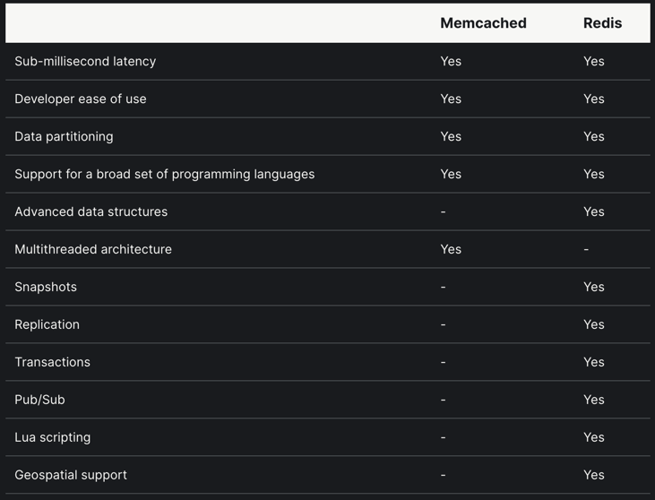

## REDIS 
Redis (“REmote DIctionary Service”) 
is an open-source key-value database server.

Redis is an in-memory database used as a cache in front of another "real" database like MySQL or PostgreSQL to help improve application performance. It leverages the speed of memory and alleviates load off the central application database for:

Data that changes infrequently  and is requested often
Data that is less
mission-critical and is frequently evolving.

Redis kind of deployement
1. Single Node ( with and with data persistence enable)
2. Redis HA: is kept in sync with replication.  As data is written to the main instance it sends copies of those commands, to a replica client output buffer for secondary instances which facilitates replication. The secondary instances can be one or more instances in your deployment. 
   These instances can help scale reads from Redis or provide failover in case the main is lost.
   
Redis Sentinal : Full cluster of redis nodes:
 for more details:
https://architecturenotes.co/redis/