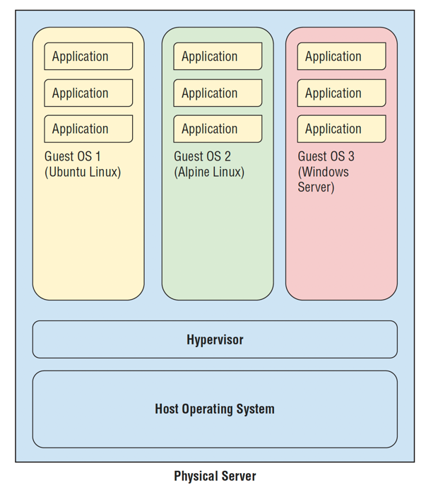
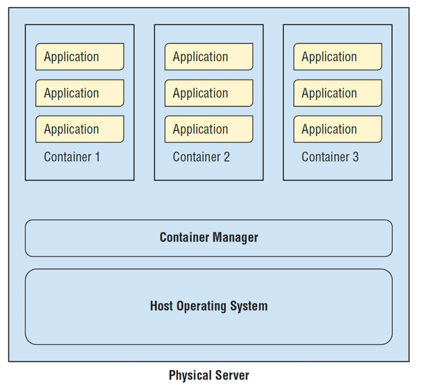
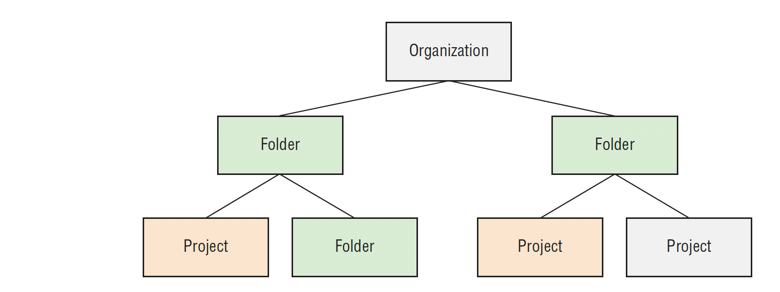

## Introduction ##

Google Cloud Platform (GCP) is a public cloud service that
offers some of the same technologies used by Google to deliver
its own products.

=> New Migration verse integration
For example, a
startup could use GCP’s Cloud Identity and Access Management services for all authentication
and authorization needs. A company that has already invested in a Microsoft Active
Directory solution for identity management may want to leverage that system instead of
working solely with the cloud’s identity management system. This can lead to additional
work to integrate the two systems and keep them synchronized.

=> On-prem  data to and from to cloud
Another area of concern for enterprises with their own infrastructure is establishing and
maintaining a secure network between their on-premise resources and their public cloud
resources. If there will be high-volume network traffic between the on-premise systems and
the public cloud, the enterprise may need to invest in dedicated networking between its data
centre and a facility of the public cloud provider. If the volume of traffic does not justify
the cost of a dedicated connection between facilities, then the company may use a virtual
private network that runs over the public Internet. This requires additional network design
and management that a company that is solely in the cloud would not have to address.

```
Compute resources
■■ Storage
■■ Networking
■■ Specialized services such as Machine Learning Services
```

VM - can be created by console and web api
   - Admin rights to it

Load balancer - that provides a single access point to a distributed back end. 
                This is especially useful when you need to have high availability for your application. 
                If one of the VMs in a cluster fails, the workload can be directed to the other VMs in the cluster.

AutoScaler  - Add or remove VM
            - HA and cost saving

managed clusters 
    --  Managed clusters make use of containers.
    --  In a managed cluster, you can specify the number of servers you would
        like to run and the containers that should run on them. You can also specify autoscaling
        parameters to optimize the number of containers running.
    --  the health of containers is monitored for you. If a container fails,
        the cluster management software will detect it and start another container.

cluster management service
    - Monitoring
    - Networking ??
    - Security management tasks ??

Serverless Computing
---------------------
Serverless computing is an approach that allows developers
and application administrators to run their code in a computing environment that does
not require setting up VMs or Kubernetes clusters

GCP has two serverless computing option
    - APP Engine
    - Cloud Function

App Engine - for applications and containers that run for extended periods
of time, such as a website backend, point-of-sale system, or custom business application.

Cloud Function - Cloud Functions is a platform for running code in response to an event, such as
uploading a file or adding a message to a message queue.


Storage
-------
    - Object
    - Block
    - File
    - Cache 
Object store 
    - Meant to Store blob/ Object
    - Not stored as conventional File System but grouped in buckets
    - Can be access by URL
    - Reductancy for HA and durability ( even in different region)
    - ACL Can be applied on each file
    -  it is serverless. There is no need to create VMs and attach storage to them
    - Google Cloud Platform’s object storage, called Cloud Storage, is accessible from servers running in GCP as well as from other devices with Internet access.

File storage
    - hierarchical storage system for files.
    -Google Cloud Platform has a file storage service called
     Cloud Filestore, which is based on the Network File System (NFS) storage system

Where to use FS ? it is suitable for applications that require operating system–like file access to files.
The file system, its directories, and its files exist independent of VMs or applications that may access those
files.

Block
    -ephemeral and persistent disks attached to VMs
    - you can run applications that access blocks directly. Some relational databases can be designed to access blocks directly rather working through file systems. 
In Linux file systems, 4KB is a common block size. Relational databases often write
directly to blocks, but they often use larger sizes, such as 8KB or more

Ephemeral disks exist and store data only as long as a VM is running.
Ephemeral disks store operating system files and other files and data that are deleted when
the VM is shut down. Persistent disks are used when you want data to exist on a block
storage device independent of a VM. These disks are good options when you have data
that you want available independent of the lifecycle of a VM, and support fast operating
system– and file system–level access.

Object Store  -> Independent of life cycle of VM but slow in access (API based access by protocol like HTTP)
Block Store are fast
Object storage can store large volumes of data that are copied to persistent
disk when needed. This combination gives the advantage of large volumes of storage along
with operating system– and file system–based access when needed.

==> “Latency Numbers Every Programmer Should Know” at https://gist.github.com/jboner/2841832 .
```
Reading 1MB of data. If you have the data stored in an in-memory cache, you can retrieve the data in 250 microseconds, 
or 0.25 millisecond If that same data is stored on an SSD, it will take four times as long to retrieve at 1 millisecond.
If you retrieve the same data from a hard disk drive, you can expect to wait 20 milliseconds
```

There are only two hard things in computer science: cache invalidation and naming things

Networking
    - Internal IP - IP of Virtual private cloud
    - External IP - IP exposed to internet. This can be static or ephemeral
        Static addresses are assigned to a
        device for extended periods of time. Ephemeral external IP addresses are attached to VMs
        and released when the VM is stopped.
    -Firewall, Why ? 
        1. control access to subnet or VM in VPC
        Example: A firewall rule can be configured to limit inbound and outbound
        traffic to the IP address of the application server or load balancer in front of the application cluster.
        2. Peering between on-prem DC verse Cloud VPC

Specialized Services
        - Always serverless e.g. text translation, image processing  etc
        - API based access to functionality of the services
        ■ AutoML, a machine learning service
        ■ Cloud Natural Language, a service for analyzing text
        ■ Cloud Vision for analyzing images
        ■ Cloud Inference API, a service for computing correlations over time-series data

-----------------------------------------------
| Cloud  |  On-prem  |  CoLocated Data center |
----------------------------------------------

 DC - This equipment is often owned or leased for extended periods by the company
    - Accurately predict the number of servers - tough job
    - Doesn't work when peak capacity that is significantly higher than the average workload.

 The unit cost of running servers in the cloud may be higher than that of running the
 equivalent server in the data center, but the total cost of on-premise and short-term in the
 cloud mix of servers may still be significantly less than the cost of purchasing or leasing for
 peak capacity and leaving resources idle

Pay-as-You-Go-for-What-You-Use
-  you will typically pay for a minimum period, such as 10 minutes, and then pay per minute used thereafter.
   The unit cost per minute will
   vary depending on the characteristics of the server. Servers with more CPUs and memory
   will cost more than servers with fewer CPUs and less memory

Elastic Resource Allocation
- In the cloud, you could start 20 servers in a matter of minutes. In an on-premise data center, it could take days or
  weeks to do the same thing if additional hardware must be provisioned.
  

----------------------------------------
Chapter 2 - GC computing services
----------------------------------------
Categories on which this can be divide are :
■■ Computing resources
■■ Storage resources
■■ Databases
■■ Networking services
■■ Identity management and security
■■ Development tools
■■ Management tools
■■ Specialized services


##IaaS - Infra as a service : At one end of the spectrum,
customers can create and manage VMs themselves. This model gives the cloud user
the greatest control of all the computing services.

##Paas - which provides a runtime
environment to execute applications without the need to manage underlying servers, networks,
and storage systems.

IaaS- Compute engine - raw and easy
Paas - Compute function and App engine ( please note that these are server less )
    Compute Engine (IaaS)
    - create VMs, attach persistent storage to those VMs, and make use of other GCP services, such as Cloud Storage

VMs run within a low-level service called a hypervisor. GCP uses a security
hardened version of the KVM hypervisor. KVM stands for Kernel Virtual Machine and
provides virtualization on Linux systems running on x86 hardware.


Making the VM preemptible
The last option, making a VM preemptible, means you may be charged significantly less
for the VM than normal (around 80 percent less), but your VM could be shut down at any
time by Google. It will frequently be shut down if the preemptible VM has run for at least
24 hours.

## Kubernetes Engine 
Managed cluster 
- use features of the host operating system to isolate processes
  and resources. With this approach, there is no need for a hypervisor; the host operating
  system maintains isolation. Instead, a container manager is used.
    containers make use of host operating
  system functionality, while the operating system and container manager ensure isolation
  between the running containers.


Kubernetes Engine is a GCP product that allows users to describe the compute,
storage, and memory resources they’d like to run their services. Kubernetes Engine
then provisions the underlying resources. It’s easy to add and remove resources from a
Kubernetes cluster using a command-line interface or a graphical user interface.
In addition, Kubernetes monitors the health of servers in the cluster and automatically
repairs problems, such as failed servers. Kubernetes Engine also supports autoscaling,
so if the load on your applications increases, Kubernetes Engine will allocate additional
resources.


## App Engine
With App Engine, developers and application
administrators don’t need to concern themselves with configuring VMs or specifying
Kubernetes clusters. Instead, developers create applications in a popular programming language
such as Java, Go, Python, or Node.js and deploy that code to a serverless application
environment. ( Does that mean kubernetes cluster ??)

App Engine is well
suited for web and mobile backend applications.

 - App Engine is available in two types: standard and flexible.

The standard environment is well suited to
applications that are written in one of the supported languages and do not need operating
system packages or other compiled software that would have to be installed along with the
application code.
In the flexible environment, you run Docker containers in the App Engine environment.
The flexible environment works well in cases where you have application code but also need
libraries or other third-party software installed. As the name implies, the flexible environment
gives you more options, including the ability to work with background processes and
write to local disk.
-- what is difference btw standard verse flexible App engine

## Cloud Functions
Cloud Functions runs code in response to an event, like a file
being uploaded to Cloud Storage or a message being written to a message queue. The code
that executes in the Cloud Functions environment must be short-running—this computing
service is not designed to execute long-running code.

Like App Engine, Cloud Functions is a serverless product. Users only need to supply
code; they do not need to configure VMs or create containers. Cloud Functions will automatically
scale as load increases.

# Storage

1. Cloud store - S3
   It is a service that receives, stores, and retrieves files or objects from a distributed storage system
When to use cloud store?
   Cloud Storage is useful for storing objects that are treated as single units of data. For
   example, an image file is a good candidate for object storage. Images are generally read and
   written all at once. There is rarely a need to retrieve only a portion of the image. In general,
   if you write or retrieve an object all at once and you need to store it independently of servers
   that may or may not be running at any time, then Cloud Storage is a good option.

Cloud Storage has some useful advanced features, such as support for multiple regions.
- Not by-default replicates ( How write is performed in multi region?)

--> nearline storage 
Sometimes data needs to be kept for extended periods of time but is rarely accessed.
In those cases, nearline storage is a good option because it costs less than regional or
multiregional storage and is optimized for infrequent access.

The cold storage class is low-cost archival storage designed for high durability and infrequent
access. This class of storage is suitable for data that is accessed less than once per year.

A useful feature of Cloud Storage is the set of lifecycle management policies that can
automatically manage objects based on policies you define. For example, you could define
a policy that moves all objects more than 60 days old in a bucket to nearline storage or
deletes any object in a coldline storage bucket that is older than five years.


2. Persistent Disk (File)
   Persistent disks are storage service that are attached to VMs in Compute Engine or
   Kubernetes Engine. Persistent disks provide block storage on solid-state drives (SSDs) and
   hard disk drives (HDDs).
   Features of  persistent disk
   - An advantage of persistent disks on the Google Cloud Platform is that these disks support
   multiple readers without a degradation in performance. 
   This allows for multiple instances to read a single copy of data. 
     
  - Disks can also be resized as needed while in use
   without the need to restart your VMs.
    
3. Cloud Storage for Firebase
   Cloud Storage for Firebase to be the best combination of cloud object storage and the ability to support uploads and downloads from mobile devices
   with sometimes unreliable network connections.
   
4. Cloud Filestore:
   For these use cases, the Cloud Filestore service provides a shared file system for use
   with Compute Engine and Kubernetes Engine.
   - When random read for file is required , then cloud file can be good fit,
    downside can be IOPS will be not that great ?? qunatify this ?
     
5. Cloud SQL 
   Cloud SQL is GCP’s managed relational database service that allows users to set up
   MySQL or PostgreSQL
   Cloud SQL is
   available in a number of configurations:
   ■■ First-generation MySQL databases use MySQL 5.5 or 5.6 and can have up to 16GB of
   RAM and 500GB of data storage.
   ■■ Second-generation MySQL databases use MySQL 5.6 or 5.7 and can have up to 416GB
   of RAM along with 10TB of data storage. Second-generation MySQL databases can be
   configured to automatically add storage as needed.
   ■■ PostgreSQL 9.6 runs on the second-generation platform and can be configured with
   up to 64 CPUs, 416GB of RAM, and up to 10TB of storage. Cloud SQL PostgreSQL
   also supports common extensions such as PostGIS, cubes for analytic processing, and
   hstore for storing key-value pairs in a single PostgreSQL value.
    Cloud Sql => MySql and Postgres
   ---------------------------
6. Cloud Bigtable (Hbase kind of store) :  Base on NoSQL model known as a wide-column data model, and unlike Cloud SQL that supports relational databases
   Bigtable is suited for applications that require low-latency write and read operations. It is designed to support
   millions of operations per second.
   
   Bigtable integrates with other Google Cloud services, such as Cloud Storage, Cloud
   Pub/Sub, Cloud Dataflow, and Cloud Dataproc. It also supports the Hbase API, which is an
   API for data access in the Hadoop big data ecosystem. Bigtable also integrates with open
   source tools for data processing, graph analysis, and time-series analysis.

7. Cloud Spanner (Relational DB): Cloud Spanner is Google’s globally distributed relational database that combines the key
   benefits of relational databases, such as strong consistency and transactions, with the ability
   to scale horizontally like a NoSQL database. Spanner is a high availability database with
   a 99.999 percent availability Service Level Agreements (SLA), making it a good option for
   enterprise applications that demand scalable, highly available relational database services.
   AWS equivalent is AWS Aurora. Find which is better
   -----------------------------
   
8. Cloud Datastore ( Document store)
   Cloud Datastore is a NoSQL document database. This kind of database uses the concept of
   a document, or collection of key-value pairs, as the basic building block. Documents allow
   for flexible schemas. For example, a document about a book may have key-value pairs listing
   author, title, and date of publication. Some books may also have information about
   companion websites and translations into other languages. The set of keys that may be
   included does not have to be defined prior to use in document databases. This is especially
   helpful when applications must accommodate a range of attributes, some of which may not
   be known at design time.

Cloud Datastore is accessed via a REST API that can be used from applications running
in Compute Engine, Kubernetes Engine, or App Engine. This database will scale automatically
based on load. It will also shard, or partition, data as needed to maintain performance.
Since Cloud Datastore is a managed service, it takes care of replication, backups,
and other database administration tasks.

9. Cloud Memorystore (Server less): Cloud Memorystore is an in-memory cache service. but Cloud
   Memorystore is a managed Redis service for caching frequently used data in memory.
   Caches like this are used to reduce the time needed to read data into an application. Cloud
   Memorystore is designed to provide submillisecond access to data.
   
10. Cloud Firestore: NoSQL database service designed as a backend
    for highly scalable web and mobile applications.
     Why Cloud FireStore: A distinguishing feature of Cloud Firestore is its client libraries that provide offline support, synchronization, and other features
    for managing data across mobile devices, IoT devices, and backend data stores.


Networking Components of Google Cloud Platform
-----------------------------------------------
1. VPC: virtual public cloud
    - Span globally without relying on internet
    - Use google global networl
    - Backend server can access google services like ML and IoT  without public IP
    - VPCs in the Google Cloud can be linked to on-premise virtual private networks using Internet Protocol Security (IPSec).
What is IPSec ???
 Organizations use IPSec to protect against replay attacks. A replay attack, or man-in-the-middle attack, is an act of intercepting and altering ongoing transmission by routing data to an intermediary computer. IPSec protocol assigns a sequential number to each data packet and performs checks to detect signs of duplicate packets.

2. Cloud Load Balancing
Google provides global load balancing to distribute workloads across your cloud infrastructure. Using a single multicast IP address, Cloud Load Balancing can distribute the workload within and across regions, adapt to failed or degraded servers, and autoscale your compute resources to accommodate changes in workload
- Cloud Load Balancing is a software service that can load-balance HTTP, HTTPS, TCP/
  SSL, and UDP traffic.

3. Cloud Armor :
   Cloud Armor is a Google network security service that builds on the Global
   HTTP(s) Load Balancing service. Cloud Armor features include the following:
   ■■ Ability to allow or restrict access based on IP address
   ■■ Predefined rules to counter cross-site scripting attacks
   ■■ Ability to counter SQL injection attacks
   ■■ Ability to define rules at both level 3 (network) and level 7 (application)
   ■■ Allows and restricts access based on the geolocation of incoming traffic
   
4. Cloud CDN:
   CDNs enable low-latency response to these requests by
   caching content on a set of endpoints across the globe. Google currently has more than
   90 CDN endpoints that are managed as a global resource, so there is no need to maintain
   region-specific configurations
   
5. Cloud Interconnect:
    connect your on-prem VPN to cloud
   how ?
   1. Interconnect with direct access to networks uses the Address Allocation for Private
      Internets standard (RFC 1918) to connect to devices in your VPC.
       
   2. Partner Interconnect: This service depends on a third-party
      network provider to provide connectivity between the company’s data center and a Google
      facility.
      
    3. For organizations that do not require the bandwidth of a direct or peered interconnect,
       Google offers VPN services that enable traffic to transmit between data centers and Google
       facilities using the public Internet.
       
6. Cloud DNS:Cloud DNS is a domain name service provided in GCP. Cloud DNS is a high availability,
   low-latency service for mapping from domain names, such as example.com, to IP addresses,
   such as 74.120.28.18.
   
7. Google IAM:
   GCP’s Cloud Identity and Access Management (IAM) service enables customers to define
   fine-grained access controls on resources in the cloud. IAM uses the concepts of users,
   roles, and privileges.

Google has also developed plug-ins to make it easy to work with popular development
tools. These include the following:
■■ Cloud Tools for IntelliJ
■■ Cloud Tools for PowerShell
■■ Cloud Tools for Visual Studio
■■ Cloud Tools for Eclipse
■■ App Engine Gradle Plugin
■■ App Engine Maven Plugin

Management Tools
---------------------
Stackdriver:
This is a service that collects metrics, logs, and event data from applications
and infrastructure and integrates the data so DevOps engineers can monitor, assess, and
diagnose operational problems.

Monitoring:
This extends the capabilities of Stackdriver by collecting performance data
from GCP, AWS resources

Logging: This service enables users to store and analyze and alert on log data from both
GCP and AWS logs.

Error Reporting This aggregates application crash information for display in a centralized
interface.

Trace This is a distributed tracing service that captures latency data about an application
to help identify performance problem areas.

Debugger This enables developers to inspect the state of executing code, inject commands,
and view call stack variables.

Profiler This is used to collect CPU and memory utilization information across the call
hierarchy of an application. Profiler uses statistical

Specialized Services
---------------------
1.Apigee API platform:
It is difficult to predict load on an API, and sometimes spikes in use can occur. For those
times, the Apigee API platform provides routing and rate-limiting based on policies customers
can define.
but is it serverless ?

Data Analytics
------------------
BigQuery, a petabyte-scale analytics database service for data warehousing
■■ Cloud Dataflow, a framework for defining batch and stream processing pipelines
■■ Cloud Dataproc, a managed Hadoop and Spark service
■■ Cloud Dataprep, a service that allows analysts to explore and prepare data for analysis

Cloud AutoML This is a tool that allows developers without machine learning experience
to develop machine learning models.
Cloud Machine Learning Engine This is a platform for building and deploying scalable
machine learning systems to production.
Cloud Natural Language Processing This tool is for analyzing human languages and
extracting information from text.
Cloud Vision This is an image analysis platform for annotating images with metadata,
extracting text, or filtering content .

--------------------
Chapter 3
--------------------
Cloud resource hierarchy

GCP provides a way to group resources and manage them as a
single unit. This is called the resource hierarchy. The access to resources in the resource
hierarchy is controlled by a set of policies that you can define.

this is splitted into 3 levels:
### 1.Organization:
An organization is the root of the resource hierarchy and typically corresponds to a
company or organization. G-suite domains and a Cloud Identity accounts map to GCP
organizations.

### 2. Folders
Folders are the building blocks of multilayer organizational hierarchies. Organizations contain
folders. Folders can contain other folders or projects. 


Access to each of the environments is controlled by policies specific to that environment, so
it makes sense to organize each environment into its own folder

### 3. Project
Projects are in some ways the most important part of the hierarchy. It is in projects that we
create resources, use GCP services, manage permissions, and manage billing options.
The first step in working with a project is to create one. Anyone with the resourcemanager
.projects.create IAM permission can create a project. By default, when an organization is
created, every user in the domain is granted that permission.

For example, since InfoSec wants all VMs to disable serial port access, you could specify
a policy that constrains serial port access and then attach it to the organization. All folders
and projects below the organization will inherit that policy. Since policies are inherited and
cannot be disabled or overridden by objects lower in the hierarchy, this is an effective way
to apply a policy across all organizational resources.

There are two types of service accounts, user-managed service accounts and Googlemanaged
service accounts. Users can create up to 100 service accounts per project. When
you create a project that has the Compute Engine API enabled, a Compute Engine service
account is created automatically. Similarly, if you have an App Engine application in your
project, GCP will automatically create an App Engine service account. Both the Compute
Engine and App Engine service accounts are granted editor roles on the projects in which
they are created. You can also create custom service accounts in your projects.
Google may also create service accounts that it manages. These accounts are used with
various GCP services.

### Billing account
Billing accounts store information about how to pay charges for resources used. A billing
account is associated with one or more projects. All projects must have a billing account
unless they use only free services.


GCP uses APIs to make services programmatically accessible. For example, when you use a
form to create a VM or a Cloud Storage bucket, behind the scenes, API functions are executed
to create the VM or bucket. All GCP services have APIs associated with them. Most,
however, are not enabled by default in a project.
To enable service APIs, you can select APIs & Services from the main console menu.
This will display a dashboard, as shown in Figure 3.20.