## What is cloud?
Cloud companied offer three flavor of service to ease bussiness

1. IaaS : Infra managed by vendor. this include Server, LB, Network, file store etc
2. PaaS : IaaS + OS and application runtime e.g. FairGate
3. SaaS: Paas + Actual application + Data , in short every thing is managed by cloud service provider

AWS provide all of these (200 +)

## Why Cloud ?

1. Minimum upfront cost for H/W
2. Just-in-time infra ( pay for what you use)
3. No Long term commitments - companies can experiment with different configurations
4. Infrastructure become scriptable ( cloud fountain)
5. Auto scaling : infra can be scaled up or done ( getting bigger m\c) or can be scaled in -out ( add or remove servers)
6. Cloud allow proactive scaling ( incase of events) and can be scaled down after event 
7. Testing in production kind of volumn / infra and env
8. HA and disaster recovery : AZ and region are not just for HA  but also to cater required based on nearest proximity

## Cloud Elastic ?
Capabilty of scaling infra is called cloud elasticity

Scale -out : Horizontal scaling
Scale - up : Vertical scaling

##  Cloud Constaint 
which porting we may not be able to find exect fit interm of infra in cloud ( like Ram, CPU GPU)
so we should try to split it in horizontal blocks and even try to thing of redesigning 

So earlier a general purpose Infra was setup but now IT Support / Admin need to more about apllication they need to support.
For example DBA now need to know more in cloud like
1. Using API and scripting to change infra
2. Need to know how to distribute system accross geography
3. Different data stores available

## Thing to consider while application design

1. Remove SPOF in infrastructure
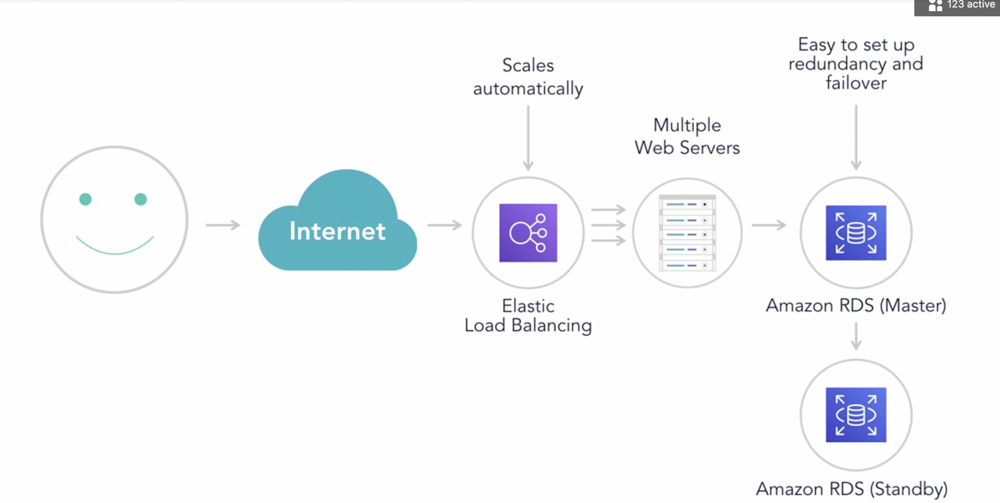

2. Elasticity : Act of scaling up or out infra
	Can be done on following criteria
	- Time of day : Example scaling on bussiness hrs etc
	- Events: Like scaling on Christmas, diwali
	- Based on metrics : Set metrics threshold and scaling out or in if threshold is breach . This metric can be based on things like Spikes in CPU and network IO 

	
### Bootstrapping
 Bootstrapping refers to creating a self-sustaining start-up process that can run on its own. In the context of AWS, it typically means the process needed to get applications up and running on an EC2 instance.  
 
 As an architect we should make sure that Application should take advantage of elasticity of cloud.

3. Decouple components: 
So consider 3 tier architecture where you have web server which interact with application server which finally interact with DB.
Loosely coupling idea is to make web server work idenpendly without knowing if there is app server or not.
this can be achived by fillting components like elastic load balancer, or queues like SQS , SNS etc

4. Performance optimization:
- decreasing latency and increasing through put

Example If i want to build static web site, I can start with EC2 to host my web server.  but if you see carefully , I can just use s3 with cloud front (CDN) I dont need any thing.

I can use Lambda to execute code and can remove need of app server at all. Dynamo DB and elastic cache can help me remove need for DB setup at all

- Need to monitor app performance in cloud. this is done thru aws cloud watch. this will monitor and send notification if threshold breach. this alarm when integrated with services like lambda , sqs , sns can help in taking appropiate action. 
- Also keep on experimenting with new services in AWS


5. Security :
Responsibilty segregation between cloud provide and customer


Data in motion protection: 
Https : i.e HTTP over SSl (TLS) ( Read this in depth )

Data at rest:
Encrypt file while storing (KMS based encrytion)
File system to be encrypted

Securing access : 
 Another security practice that cannot be overlooked is protecting and managing account access credentials. Almost all AWS services have an available API. To use the APIs, security credentials called access keys are needed in the request. 
 1. Therefore, all API requests sent from the public internet should be sent over HTTPS. 
 2. Rather than storing this key as part of an application code bundle, the application should be designed such that this value could be passed in as input during the launch of an application.
 3.  Encrypting this information before sending should also be considered. 
 4. Another approach would be to make use of roles within the identity and access management service on AWS. Instances can be launched in an IAM role. And as such, the instance will have access to the credentials and permissions associated with that role. 
 5. It's also recommended to rotate keys often to ensure an unknown or undetected compromised key will not live forever.

 IAM service for identification and access management
 - Create user and give then just sufficent permission

 - Create `Security group` which are as good as **fire wall for access control**
 - Also protect your code 

 
 6. Cost Optimization:
 
 - Embrace consumption payment model ( Pay as you use)
 - Use only resources that are needed
  Good  example is test server: just tern them on when used, so this mean 40 hr weekly use verse 148 weekly and  which mean 75% saving.
  
  - Auto scaling : In addition, AWS has a service called auto scaling, which allows the adding and removing of resources exactly as needed, an approach that will always ensure supply matches demand. 
  - Find right size of resources to be used : Example AWS EC2 , use just the right size

  Continues monitoring is need.
  
Even after ensuring supply and demand are matched, and resources are being utilized in a cost-effective manner, continuous monitoring is required to continue to optimize over time. AWS provides tools such as cost calculators, detailed billing reports, trusted advisor recommendations, and billing alerts to help eliminate surprise bills and stay on top of spending and make cost-saving suggestions.
 
 
## Security (Keep things Secure)

- Secure every layer of application
- Aws work on `share security model`
- Customer are responsible for security in the cloud , aws assure security of the cloud

So AWS provide all three Iaas PaaS and SaaS. So security need to be applied on each of these.

So this diagrams take responsiblity at each layer 

**Iaas**

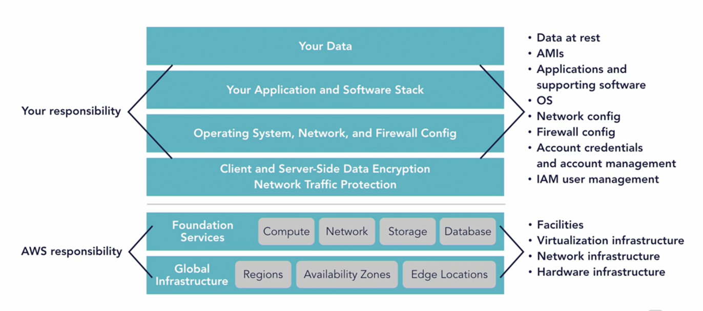

**PaaS**


**SaaS**
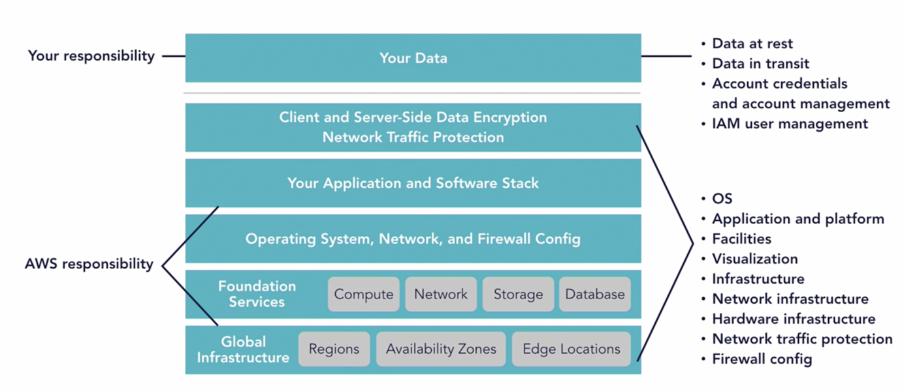


Even if you use any model **one thing which need to be secure always** is the customer account. Roles, permissions and access configuration.

once you create account in AWS , account which is created is called as Master account. this is as good as Root account . Multifactor auth is recommendate for master account.

### IAM 
this provide capablity to manage access control entity ( AKA Principle) User , Group, Roles, Permission

Ways are
1. User : Create user and give them permission
2. Group: Create group with permission(s) associated and add user to that group
3. Roles : An IAM role is similar to a user. It is an AWS identity with permission policies that determine access in AWS. However, instead of being uniquely associated with one person, a role is intended to be assumed by any **resource** that requires it. Also, a role does not have any fixed login, nor fixed API access credentials associated with it. Instead, whenever a role is assumed, **necessary access keys are created dynamically**, and provided to the **user** or **service** that assumed that role. When a role is created, one or more access permissions are assigned to that role. A role is basically this set of access permissions. Whenever a user or service assumes a role, the permissions assigned to the role will be allowed, and will be available while the role is being used. **Any other permissions that may have been previously defined for that user or resource are temporarily suspended** while the **role is assumed**. Only the permissions associated with the role are allowed when a user or service has assumed a role. IAM roles allow users or services that otherwise don't normally have access to resources to act on behalf of the account owner. IAM users, or AWS services, can assume a role to obtain temporary security credentials that can be used to make AWS API calls. By using roles, credentials don't have to be shared, and permissions don't have to be defined for each entity that requires access to a resource. For example, say a business is using an external vendor to temporarily help troubleshoot an application problem. `This vendor might need access to a few services in that business's AWS account. Rather than creating a new IAM user for the external vendor to use, thereby providing them with explicit security credentials to access the account, a role can be used.` Using IAM, a role can be created for the vendor to assume, and when using this role to access the business's AWS account, they will only have access to the permissions assigned to that role. Using roles for this purpose provides much less administrative overhead than creating new users and groups for this use case. Roles also simplify the permissions needed by applications running on EC2, which may require access to other AWS resources. To grant applications on an EC2 instance access to AWS resources, a role can be created with the required permissions, and then the EC2 instance can launch itself into that role. This then embeds the needed access keys into the instance metadata. Applications can access this metadata on the instance to retrieve the access they need. Allowing applications to assume these roles provides better security than providing long term dedicated access credentials to each application. So, when architecting applications in the cloud, remember to never use the master account for routine access to resources or to manage your services. Create separate users, groups, roles, and permissions in IAM, and only allow access when absolutely needed, and only to the specific resources that are needed.


#### Created admin user.

Difference between admin user and master user is  admin user **cannot see billing info** .

#### Generating Key Pair

AWS uses public private key cryptography to encryption credentials to EC2 Instance

So we can create key value pair from AWS User account. It create and download PEM file which is private key 

Once we create pem file , we need to make sure we set right permission on it (0400). should just have read access. 

### AWS Security group
Security group are like virtual firewall will control on inbound and outbound traffice  to application
A resouce can be tagged to one or more security groups. By default each of them is taged to security group which say's no external access

`Security group is defined for all which can take direct ingress traffic`

Contain of these are rules are
1. Traffic type : What is traffic type allowed example ssh , RDP or http-https 
2. Protocal: Fixed by traffic type choosen - tcp, udp or custom rules under ICMP 
3. Port range: Specify one or more port open for traffic
4. Source:  Ip address or security group which restrict traffic in that security group ??? ( need more clarification)

When specifing IP for domain CIDR is used. See diagram below:
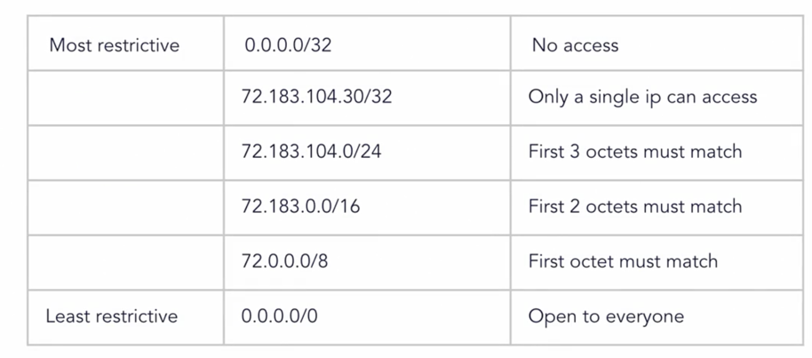

Example


Security group rule for this is as follows


Use security group to control inbound traffic to aws and use principle of least privilege when defining security group.

### Practice creating Securtiy group 

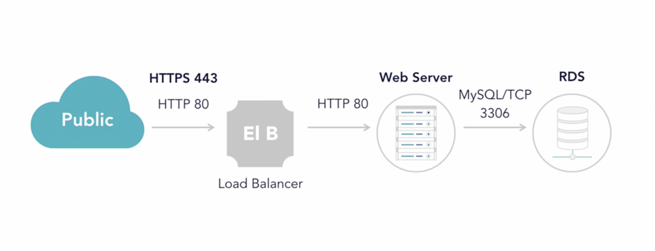

## VPC in aws 
Virtual Prival cloud 


Before VPC, Aws had concept of EC2 classic, which was flat network for all instance created by all customer.
Each not IP was public IP and no concept of private IP. It was stopped after Dec 2013

**Thing to consider creating non default VPC**

1. Choose your region
2. Specify range of IP address for entire VPC network. this is done by using CIDR, ensure range is enough for future growth 
3. After IP block is choosen to create subnetwork is created under VPC. Subnet is subset of VPC and is limited to one Availablity Zone.
4. After subnet is setup gateway interfaces are attached

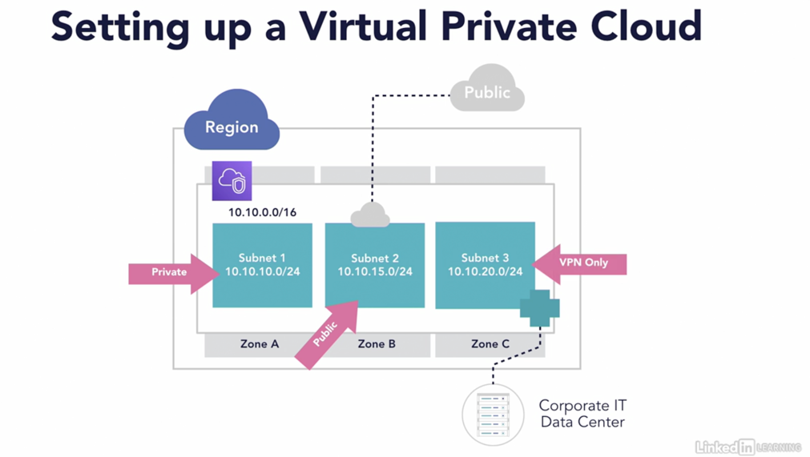

Setup vpc to full control security, topology of network

```
VPC, both the public and private network interfaces can be controlled. A private IP range is specified which can then be architected into a combination of public and/or private subnetworks. Also within a VPC, both the inbound and outbound traffic can be controlled. In a VPC, multiple IP addresses, elastic IP addresses, and elastic interface networks can be assigned to the instances. And if the use case arises, existing IT on premise infrastructure can be connected with a VPC network through an encrypted VPN connection. VPC offers more flexibility and more control than EC2 Classic. This comes at the cost of complexity and configuration. Setting up a VPC from scratch takes a little more work and planning, however, Amazon offers the default VPCs available in each AWS region. The default VPC available in each account is ready for use without having to perform any additional configuration steps. The default VPC combines the benefits of the advanced networking features provided by the VPC platform with the ease of use of the EC2 Classic platform. While the default VPC allows launching instances without the need to know anything about Amazon VPC, there may come a time when setting up a non-default VPC is desired. At a high level, here are the steps taken when setting up a custom VPC. 
```


## Design for failure
### Elastic IP
These are public exposed IP which could be used to expose resouce to internet. However elastic IP is not mapped to resource (EC2) but to account. this means if Nodes goes down elastic IP can be quickly remapped to new node.

```
Elastic IP addresses are static IP addresses designed for dynamic cloud computing. An elastic IP address is created at the account level and is not specific to a particular server instance. When a new elastic IP is created within an account, the account controls this address until a choice is made to explicitly release it. Unlike a traditional IP address, an elastic IP allows for an easy remap of a public IP to any instance in the account.
```

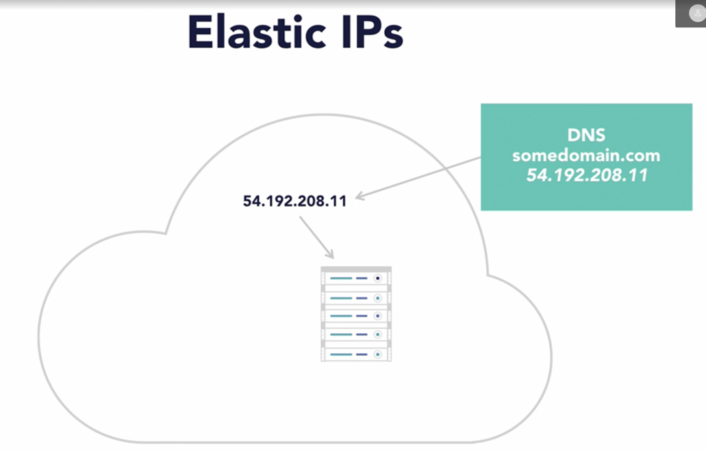

Failover gracefully by using elastic IP.

### Region and Availablity Zone

```
Every region has at least two Availability Zones. Each of these Availability Zones are connected by a fast fiber network connection and each are physically isolated from each other. A local disaster, such as a fire, flood, tornado or other physical breach occurring in one Availability Zone, will not effect the other zones. Using multiple Availability Zones within a region, is an excellent option for meeting high availability and disaster recovery needs. When architecting your applications in the Cloud, consider using multiple Availability Zones and even multiple regions if required. Availability Zones are conceptually like logical data centers. Deploying system and application architecture, to multiple Availability Zones, insures high availability and ease of disaster recovery.
```

```
According to some tests, i can see like 600 microseconds (0.6 ms) latency between availability zones, inside the same region. A fiber has 5 microseconds delay (latency) per km, and between azs there is less than 100km, hence the result matches.
```

### AMI : Amazon Machine Image

An AMI typically includes the following, a template for the root volume for the instance. For example, an operating system, an application server and supporting application libraries, launch permissions that control which AWS accounts can use the AMI to launch instances. A block device mapping that specifies the elastic block storage volumes to attach to the instance when it's launched. When creating a new EC2 instance, an AMI is specified that is responsible for setting up and booting up your instance. And once an instance is up, running and configured as desired, you can create an AMI from that instance. This AMI is then used to create clones of that instance. When first creating an instance, there are a number of AMIs from which one can choose. There is a group categorized as Quick Start, which are those that Amazon has put together. These include the operating system and other basic tools needed for common applications, and allow for a good starting point. There are many from which to choose. Then, there are My AMIs, which are the ones that have been created by you or users of the account. Then there are those that are available in what's called the AWS Marketplace. The AWS Marketplace is a catalog that contains a curated selection of open source and commercially available software from well-known vendors. These have undergone vetting for quality and are typically available for purchase. Then there are these community AMIs, which are contributed by individuals and development teams for the purpose of sharing development projects. Typically, once an EC2 instance is up and running and configured exactly as needed for a specific application, an AMI is created for that instance. This AMI is then used to easily recreate the instance as many times as needed, across multiple availability zones. **So when architecting applications in the cloud, maintain Amazon Machine Images, so that you can restore and clone environments very easily across multiple availability zones.**


## Bootstrapping

 Bootstrapping refers to creating a sustainable startup process that can run on its own, and in the context of AWS, it typically means the process needed to get an application up and running on an EC2 instance. 
 
 Very important because during auto scaling server need to be ready ... this is done by bootstrapping
 
 To aid in this effort, AWS offers a few tools to help run custom scripts as part of the bootstrapping process. One such tool to help with bootstrapping offered by AWS is something called cloud-init for Linux servers or EC2Config for Windows servers.
 
 So when architecting applications in the cloud, remember to take the time to write the scripts or configure management tools necessary to bootstrap instances. Automating this process will allow you to best take advantage of the cloud's elastic nature.


**AWS service for bootstrapping**


## Elastic Block Storage 

Block storage are file storage which let data in Ec2 to leave beyond instance life cycle.

they are of two type. 
1. Standard
2. IOPS optimized i/o operation optimized

- EBS can be as big as 16 TB in size
- EBS can be snapshot on period interval in S3
- Multiple volumn of EBS can be mapped to single instance
- When formated with file system , they can be used as file storage

- Point in time snapshots of EBS can be created and persistend in S3 , These snapshots are incremental
- These snapshot can be used to instantiate new volumn. this way data could be replicated around regions
- Use cloud watch to monitor EBS volumn on metric like thoughput and Latency 

Aws charges for only delta in this point snapshots

these snapshot are used to create data replica in different AZ or region

- Restore from Snaphot is time consuming process and is executed in lazy approach , meaning latest is retrieved first
- Snapshot are also important if you want to resize EBS.

```
So, when architecting applications in the cloud, consider utilizing EBS to keep persistent data independent of EC2 instances and take advantage of the portability and power of the incremental EBS snapshots to replicate data across availability zones and regions.
```

## ELB setup
ELB is meant to load balance in multiple availablity zone (AZ)
- ELB also scale by itself

**Characteristic of ELB**


What is CNAME : CNAME is canonical name is name of website which is mapped to IP Address(es)
Single Cname ELB is mapped to multiple IP and it is taken care in scaling out or in. ELB is by it self HA.

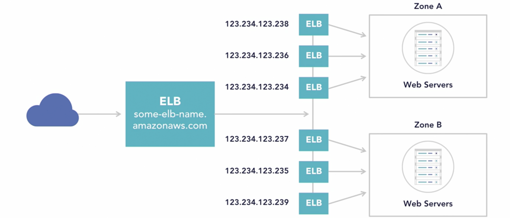


## For setting up EC2 Instance  
we need SG and VPC and LB configured 


## RDS 

Amazon Relational Database Service, or simply RDS, provides a way to setup, operate and scale a relational database in the cloud. RDS provides access to a full-featured database engine without the need to install or configure the software. It also helps ease the burden of ongoing database administration by taking on common tasks like backups, patch management and database engine software and hardware security management. RDS is also configured in such a way to help achieve high availability and fault tolerance requirements. Using RDS is straight-forward. First, a database instance is created using the web console or the API, and when doing so the engine type is specified. Currently RDS supports the following engine types, **MySql, Postgres, Aurora, MariaDB, Oracle, and SQL Server**. Then the DB instance size is specified, including needed memory, storage capacity and processing power. And then once created, CloudWatch can then be set up to monitor the general health and performance of the RDS service. **Unlike with EC2 instances, RDS does not allow direct access to the servers running the database engine**. While this may at first seem like a limitation, it is actually one of the benefits of using RDS. It means turning over a lot of the administrative tasks to Amazon. Amazon RDS will apply security patches and updates. It also takes care of backups, storing these backups for a configurable retention period, and enabling point-in-time recovery from these backups. RDS can also be deployed in multiple availability zones, which means high availability and fault tolerance requirements can be met by having your database tier geographically distributed. For supporting database engines, RDS allows for the creation of **read replicas of the database for increased performance and scalability**. All of these tasks can be challenging to achieve with a self-managed and self-hosted database solution. Allowing Amazon to handle these complex administration and configuration tasks allows companies to focus their resources on building what really matters for their business. So, as you architect your applications on AWS consider taking advantage of RDS to simplify relational database security, administration, backups, redundancy, failovers, scalability and geographical distribution.


## Autoscaling component

Autoscaling service has three primary component

1. launch config :  this defines what to scale. This is where you define what EC2 instance **size** to use, what **AMI** to use, what **security** group, the **storage** needs, etc. Similar to what has been defined when launching a new EC2 instance. 

2. Auto Scaling Group: **Where** to launch instances. This defines **where to launch instances** and also **defines limits on the number of instances** to launch should certain events occur. One of these is a desired capacity number and Auto Scaling will work to keep the number of instances equal to the **specified desired capacity**.

3. Scaling policy : defines the win and under what conditions scaling should happen .This is where monitoring alarms can be defined based on certain metrics breaching specified thresholds. Referring to the initial example, it is in the scaling policy where the conditions are defined to have two or more instances added if the average CPU utilization rises above 75% and have two instances removed if that same metric falls below say 35%. It is best to define both as scale out and as scale in policy in order to fully take advantage of elasticity. The system needs to scale out to handle increase in load but also needs to scale back in when load decreases to keep costs low and avoid waste 

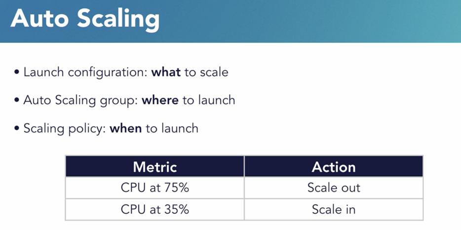

( Revision - auto scaling 1. Auto scaling config  - what to scale i.e. AMI , Disk , scurity group, storage etc, 2. auto scaling group: where to scale and limit of instance to launch in certain event. 3. Auto scaling scaling policy: define policy on went to scale )
 
## Amazon cloud watch

It provide telemetry fro cloud based system. it is mostly free 
but is paid when 
- need monitoring at high frequency 
- Needed larger number predefined matrics
- Monitor agg metrics in similar group

## Elastic BeanStalk
Free self managed template for deploying Applications

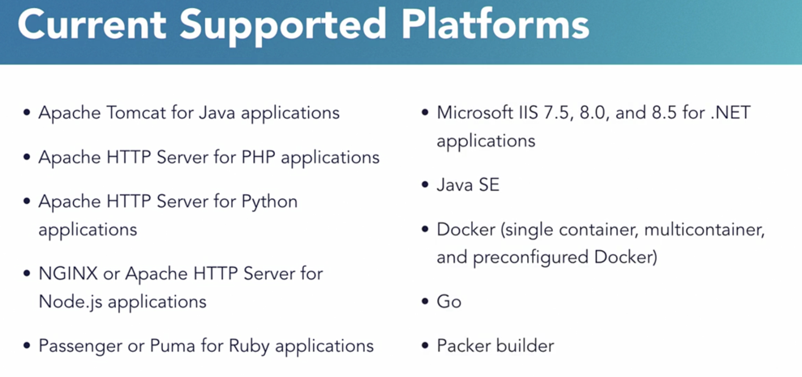

And good thing is its free. You need to pay for resources you have used

One important feature of Elastic Beanstalk is that full control over the AWS resources that Elastic Beanstalk creates is retained. So while Elastic Beanstalk does offer a lot of convenience and provisions all of the resources, control of the created resources is not relinquished. With Elastic Beanstalk, both the resources supporting the application and software running on the instances can be controlled. When using Elastic Beanstalk, the first step is to write code. Application code is managed using whatever existing application development process is in place. When the application is ready to be deployed, a version is saved with a specific label, such as Version 1.0. This version is then stored in an Amazon S3 bucket. So for example, an application version might refer to a specific Git deployment of a PHP application. Elastic Beanstalk provides a number of tools to help with creating application versions. You can use the AWS Management Console, Git deployment, and the command line interface, the AWS Toolkit for Visual Studio, and the AWS Toolkit for Eclipse. Once the application version is available in S3, Elastic Beanstalk can deploy it, at which point, Elastic Beanstalk launches it into an environment. An environment represents all of the AW resources created specifically to run the application. For example, a load balancer, an auto-scaling group, EC2 instances, and needed security groups. Elastic Beanstalk automatically handles the messy details of provisioning needed capacity, load balancing, auto-scaling, and application health monitoring. Elastic Beanstalk will send a notification when it is done creating the environment, and when complete, Elastic Beanstalk provides the application with a URL, which can be typed into a browser to access the running application. When updates to the application code are made and a new version is ready to deploy, the new version can be deployed to the existing running environment. This also allows rolling back to a previous version of your application, should that ever be necessary. Part of the convenience Elastic Beanstalk provides is due in part to the many predefined default configuration settings when creating the environment. However, customizations to the environment and to the software that runs on the EC2 instances can be made. Default environment settings can be changed directly in the Management Console. Settings such as the EC2 instance type, adding RDS or DynamoDB database services, enabling HTTPS on the load balancer, and adjusting auto-scaling settings are just a few of the changes that can be made. To alter application settings and software configurations that run on the EC2 instances created by Elastic Beanstalk, configuration files can be added to a specifically named folder in the application code versions, which are applied during the deployment process. To use configuration files, a folder named .ebextensions is created at the top level of the project's source code. Then files with the extension .config are added to specify options, as shown here. For example, when using a load balancer, a URL is often used as the healthcheck for the instances. The load balancer needs to know if an instance is no longer healthy so it can prevent sending traffic to the bad instance. The configuration file shown here could be used to tell Elastic Beanstalk to set the application's healthcheck to /healthcheck. This configures the ELB load balancer in the Elastic Beanstalk environment to make an HTTP request to the path /healthcheck to each EC2 instance to determine if it is healthy or not. Our example here used JSON, but configuration files can be in either YAML or JSON format. There is no additional charge for using the AWS Beanstalk service. You only pay for the AWS resources actually used to store and run your application. So, when architecting applications in the Cloud, consider taking advantage of Elastic Beanstalk to fully manage application deployment and infrastructure in the Cloud, and let Beanstalk take care of the scalability, high availability, and performance requirements.


## AWS OpsWorks
Full managed application management and automation service 
This is designed for app from small to large size

Aws OpsWork has three offerings
1. for Puppet
2. for Stacks
3. for Chef

So when architecting cloud applications on AWS, and when dealing with an application architecture that is not supported by Elastic Beanstalk, or simply if more granular deployment and set up control is designed, consider using OpsWorks. OpsWorks helps manage the complexities of the application architecture, configuration management and deployment management, and eases the ability for AWS applications to take advantage of the elastic nature of the cloud.

## AWS Cloud formation
CLoud formation and cloud former 
is used to managed a collection of resource
is used to code infra based on text based template files
Support version control

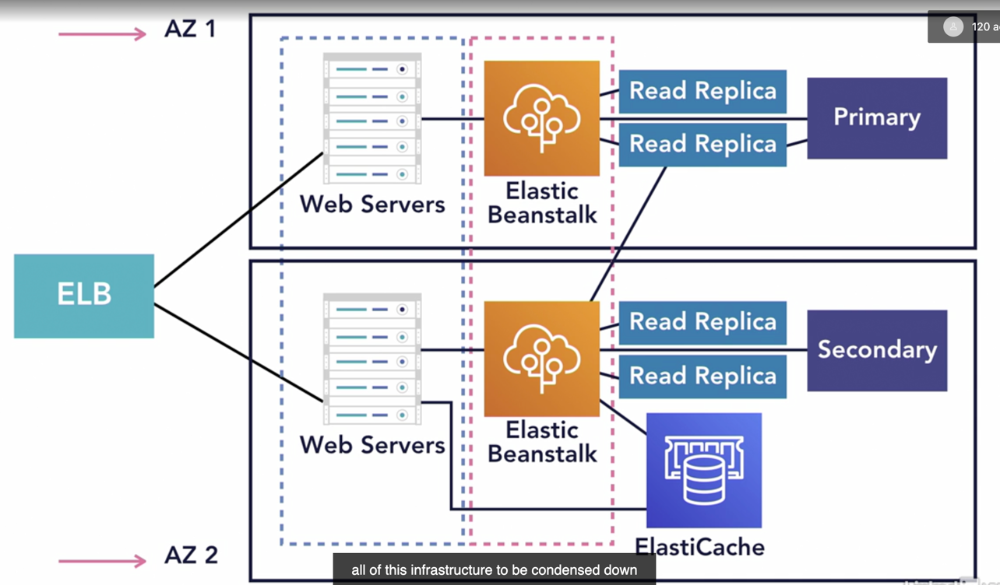

Whole is of this can be condensed to text based template file

**Why need CloudFormation?**
1. deployed to development and QA
2. move env from one region to another
3. Share stack with some one else

 For example, there may be a need to clone an entire application stack for a development environment or for a QA testing environment. Or perhaps the need arises to move everything to a new AWS region, or the application architecture stack could be created in another AWS account. Once the template files are defined, the Application Management Console or API can be used to deploy the application.
 
**Cloud former**

while the syntax and structure is fairly straightforward, they can certainly get fairly complicated, especially for stacks with a lot of different components. This is where a tool called CloudFormer can help. Once an application stack has initially been created via the console or API tools, CloudFormer helps to create a CloudFormation template from this existing stack. CloudFormer is itself an AWS CloudFormation stack. It runs on a single micro instance and does not need any additional resources. The CloudFormer tool can then be used to create CloudFormation template files from the existing stack. Then the CloudFormation stack is shut down, as it is no longer needed beyond its utility to help create the template files.

```
when architecting cloud applications on AWS consider using CloudFormation templates to manage and version control entire AWS application stacks, and then use them to programmatically replicate full stacks to new environments, new accounts, or new geographical regions.
```
## Code Deploy
==> It is not fully managed service like beam stalk 
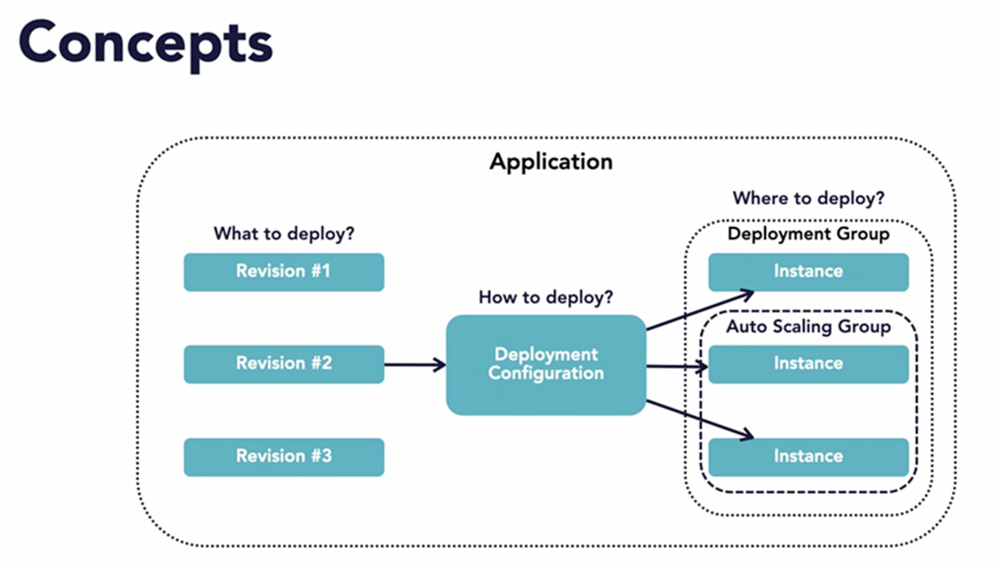

when architecting applications on AWS, and when dealing with an existing application that has existing steps or scripts for deployment, consider using CodeDeploy as a straightforward method to allow that application to take advantage of the elasticity in the cloud.

--> In short use it when your team already have deployment scripts etc.

## AWS ElasticCache
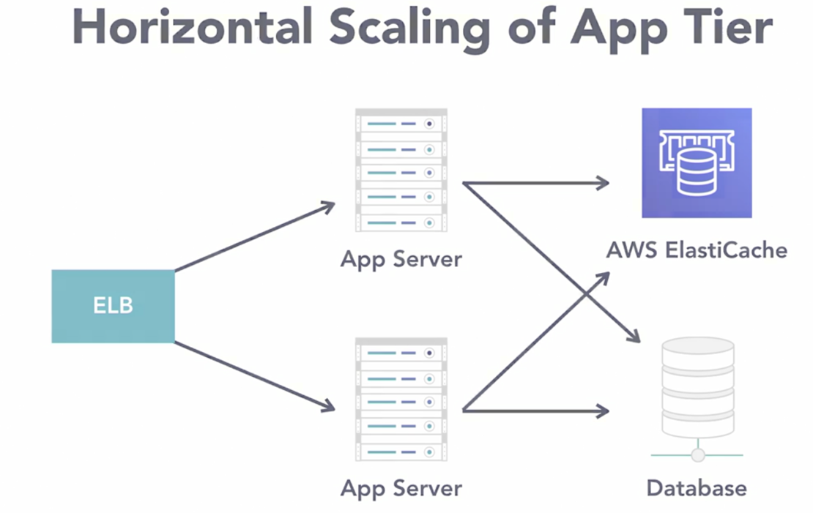
With just a few lines of code added to an application, a caching layer can be added that will greatly improve speed, increase throughput, and is more cost-effective than trying to scale out your own database layer. 

**Memcached**
Memcached has been around since 2003, and is a tried-and-true and tested caching engine. It's popular and well-supported in most application languages and frameworks. It is a fairly flat cache. It has one datatype into which to store data, which is a single string type, and this string type has a default size limitation of up to one megabyte, though in newer versions, you can configure it support larger-sized objects. Memcached has no persistence, so in adding nodes into a Memcached cluster, if something happens to one of the nodes, the data will be lost. The d in Memcached stands for distributed, which means it has been built with scalability in mind. Redis is the other caching engine supported by ElastiCache.

**Redis **
Redis supports everything that Memcached does but also has some additional features. It supports the string type but also allows up to **512 megabytes **of data in this type. Redis supports persistence, so if the data stored in the cache needs to be able to survive a memory failure, Redis supports this. **A scripting language called Lua** can be used to write business logic which can be executed in memory. It is highly available and supports a master and read replica architecture. Redis also supports other **datatypes**, such as **sets, sorted sets with scoring, lists, and hashes**.


So memcached is flat cache and is good if app is simple and has backed in support for app
Other wise redis is much better for future prospective

### Cache pattern 

1. Write tru : first data is written to cache then to DB . Disadv is every data is written to cache irrespective of weater it is needed at read time or not
2. Lazy Loading : first data is red from cache. if not found then red from db and then written to cache. Problem is with approach is high chance of cache miss and potential to low performance 

In practice both are used with TTL

Elastic cache can increase read thru put by 10-15 times 

when architecting applications on AWS, consider using ElastiCache as an in-memory data access solution to eliminate bottlenecks with database data access, and speed up the overall delivery of application data.

### AWS Cloud Front

CDN stands for content delivery network. A CDN is a large network of distributed caching servers that help deliver content to end-users in the most performant manner by attempting to store the data as close as possible to the origin of the requests being made for that data.

* CloudFront offers another option. It can store in cache an application's most popular static content at globally distributed Edge locations around the world. Keeping the data in cache ensures quick accessibility which greatly improves performance. And it prevents every single request from having to hit the server.

* It can also increase a delivery of dynamic data. Without CloudFront, user requests for data are at the mercy of general internet routing rules, which are not often optimized. CloudFront can be used to proxy requests for dynamic content which are then routed back to your source server via routes that have been optimized for performance. 

**Component of cloud front**
1. A Distribution: This specify what content to deliver with configuration rules about how to deliver these rules
2. Edge location: Where this distribution exsists. These Edge locations are the geographically distributed network of caches from which either a response can be delivered with the needed data from cache or an optimized route is provided for the request to be sent to content origin servers. These Edge locations are the key to the performance that CloudFront provides. These are globally distributed, which allows your content to reside as close as possible to your users. CloudFront is optimized to ensure the fastest delivery of your content and uses latency-based routing. When a request comes in for your content, it gets routed to the least latent network node in the network, which may or may not be the closest one to the end-user.
 
 
 3. Additionally it has concept called as **Regional Edge server** : These are regional caches around the world which provide an additional caching tier
 
**Before**
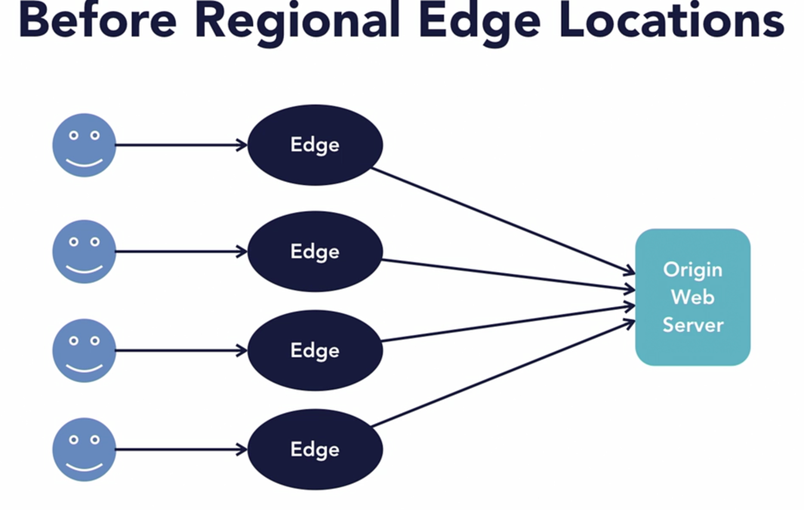

**After**
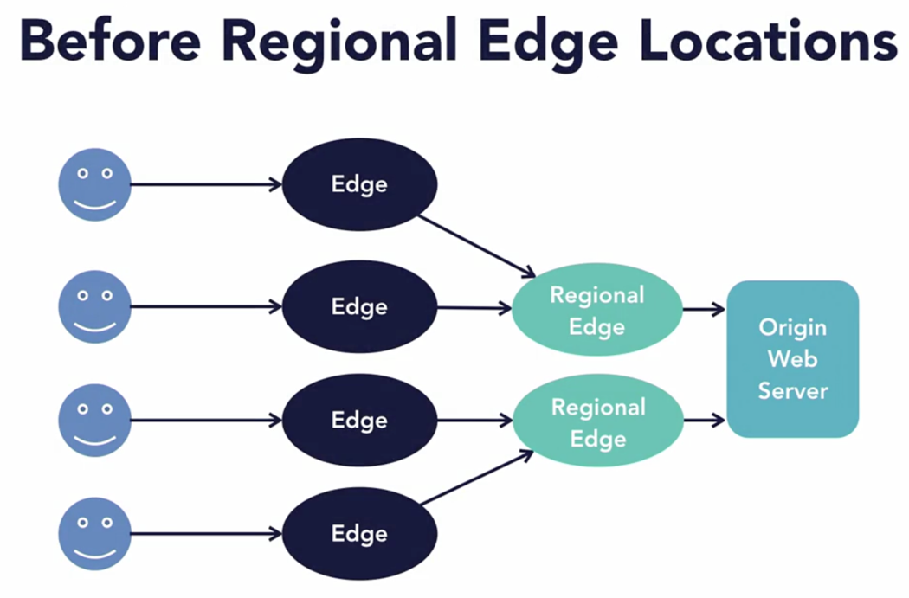

As you architect your applications using AWS, consider taking advantage of Amazon CloudFront. It can help speed up the delivery of web and mobile application content. It also helps with scalability in an application, while at the same time, reducing the load on application servers, enabling more throughput with less server infrastructure.


## AWS Cloud Search 

Why not DB for searching ?

DB are not good for searching 1. they are slow and return all results.

Search engine are fast and return top N best  results

as you architect your applications in the Cloud, and when search is part of the feature requirements of an application, a dedicated search engine should be used. So consider AWS CloudSearch to help improve user experience and maximize engagement.


## AWS S3 Storage 

EFS - Elastic file storage 
EBS - Elastic Blocj Storage
s3 - Object storage

 In an object store, objects are stored in a flat organization which are referred to as "**buckets**" in S3. These objects are retrieved by a unique identifier called "keys". A **key can be any string and can be constructed to mimic hierarchical attributes**. This means it can be made to look like a directory structure but it should not be confused with one. Objects are any blob of data, such as back-ups and archives, log files, videos, images, and audio files. In object storage, such as S3, objects are stored in a non-hierarchical flat address space which allows for greater scalability and very fast object retrieval. There are some feature trade-offs with object storage compared to file storage. For example, S3 does not natively offer the ability to search across all objects in storage. S3 is built to be incredibly durable.
 
 S3  is super durable by reducting data in multiple availablity zone. If need S3 can have r**educed reductancy storage (RRS)** for non critical data and obiviously reduce storage cost. this is mostly for storing data which can be recomputed if lost example thumbnail from actual image file
 
 Object size limit in S3 is **5TB** but **no limit on object we can store**
  Object can be accessed by rest api from S3
  
  S3 is eventually consistent . So object store is **not good for data which changes frequently ** ( example delete may take time to propogate)
  
## AWS Glacier
its extension of s3 and is intended for archivel. -data would be accessed very infrequently and retievel time of some hr is acceptable. Glacier also provide same level of durability with much much less cost.

Object in glacier are not accessed directly, instead obj in s3 are mpved to glacier when ready to archieve.

 when architecting AWS applications, consider taking advantage of the available object storage options in AWS to improve scalability, availability, durability and performance of storing and accessing your application assets.
 
Boto3 is the Amazon Web Services (AWS) Software Development Kit (SDK) for Python, which allows Python developers to write software that makes use of services like Amazon S3 and Amazon EC2. 

```python
## How to download very large file from s3?
import boto3
s3 = boto3.resource('s3')
s3.meta.client.download_file('mybucket', 'hello.txt', '/tmp/hello.txt')
```

### S3 as web server
Use s3 as static website, create a bucket and open it for public to access. I will give public end point

### AWS API Gateway 

API Gateway use rest arch.

#### But why to use aws gateway services ?
1. Throttling rules at request per second on different rest rules (Put, get, post, delete, patch, options, head)
2. Used based throttling to setup user useage plans ( demo user verse pro user)
3. Request caching

AWS Account has limit for max request per second. this can be increased on submitting request to aws


Other imp feature of AWS API gateway is
1. multiple version running llrly
2. Stage release
3. Automatic SDK generation
4. Monitoring and logging using AWS Cloud Watch

So, when architecting applications on AWS, and when an API is a requirement in the architecture, consider using the Amazon API Gateway to offload the design, implementation, and maintenance of this API layer.

### AWS Lambdas 
True serverless as only function that need to be executed is considered. every thing else is taken care by AWS

Lambda components are:
1. Lambda function : Actual code. Some custom code written and uploaded to service.
Lambda function contain few things:
- code
- dependency
- configuration (CPU , time out , IAM rules etc)

2. Event source: Something that is capable of publishing event which would evently envoke lambda function. These can be
	- Other aws service which generate event ( S3, dynamoDB, kenisis, SNS, API gateway)
	- custom application generating event

* Common usecase of AWS are designing **Micro services**. In this case** AWS Api gate way** is used as **event source** and lamba as processing function

* other usecase is S3 invoking Lambda for tranformation and writing to some other store.  In this example, the raw data needs to be cleaned up and formatted before it can be used in some internal application. When the data is added to the S3 bucket, S3 triggers the object-created event, which then invokes the Lambda function. S3 knows which Lambda function to invoke based on the event source mapping that is stored in the bucket notification configuration. The Lambda function runs, cleans up the data, and then writes it out to a data storage to be used by some internal application.

 So when architecting applications on AWS consider the level of abstraction that can be tolerated by the business use cases and application being designed. Take advantage of the virtualization options the cloud provides and consider removing as much maintenance and administrative overhead as possible. Consider using Lambda functions and focus solely on the business logic and functions needed to implement the features of an application.

### AWS DynamoDB
 Low latency, high performance and high throughput
 
 DynamoDB - use Solid state drive  and is by default replicated to multiple AZ for high durablity
 
 it is best fit if we want to store state which is to be used by multiple app services. eg. is user session
 
 Sticky Session : this is supportedin ELB in which each session user to directed to same app server. Better solution is to store session info into state store 
 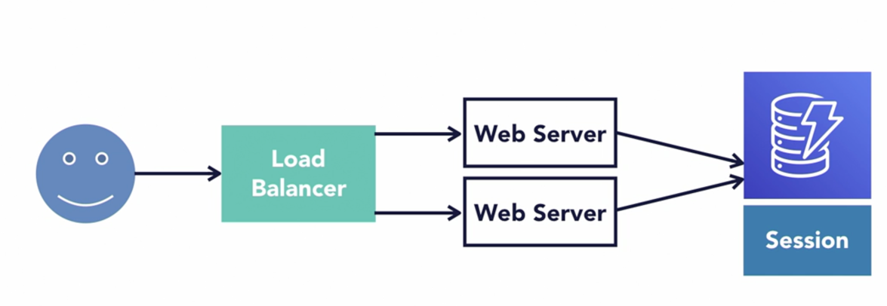
 
when architecting applications on AWS, keep the server components of applications as stateless as is possible. And when session state is needed, store this in a centralized storage, using an engine that has been optimized for state storage and retrieval, such as DynamoDB.

**Cross-Origin Resource Sharing (CORS)** - if I am accessing from same domain (qbc.com ) it works perfectly fine ( i am in qbc). But when I try to access from multiple domain (abc.com qbc.com ) together, browser will fail because of CORS failure

this is because browser do some thing called as pre-request which send details like domain name and method to domain b service. So domain b service block this pree flight request.

to make it work b domain service need to apply "Access control allow origin" and "Access control allow mthod"

### SQS : AWS Simple Queue services
- Relieable
- scalable 
- Distributed Queuing service

So when architecting cloud applications on AWS consider using SQS as the communication glue to bind independent components together into a fail-safe, scalable, and high performant cohesive, loosely coupled application.

### Simple Work Flow service (SWF)

 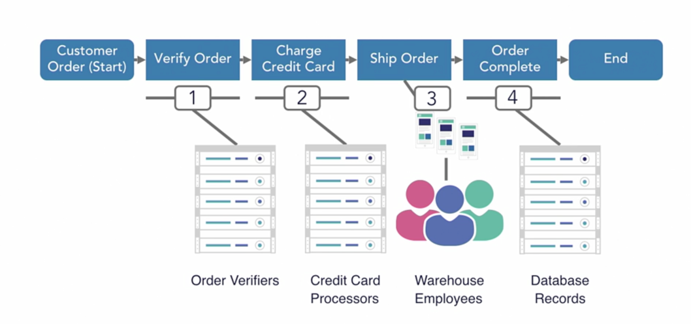

Water marking using SWF. Please note here all past of wm is run as task not as service.
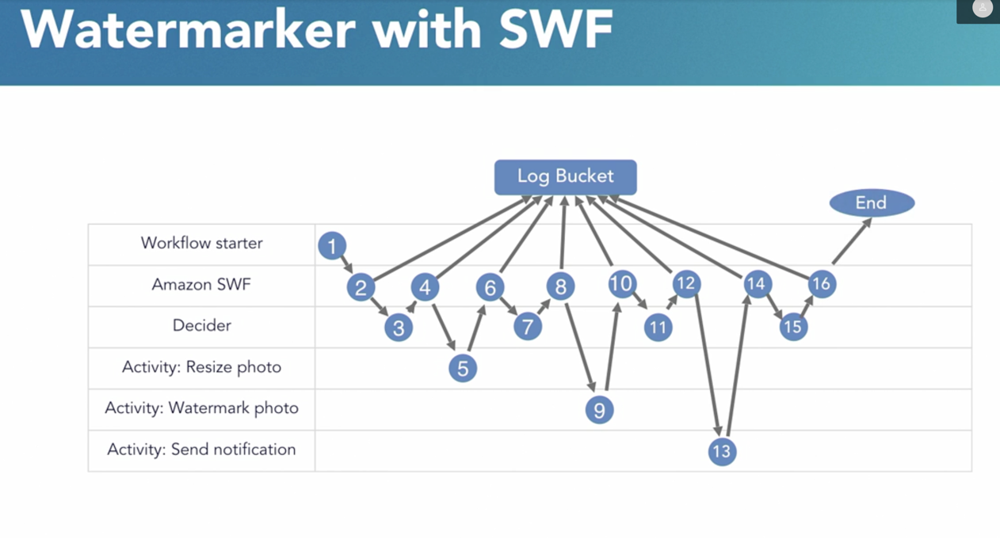

So, as you're architecting your applications using AWS, consider using SWF to help with more complex workflows and to help keep components independent from one another.

### simple notification service (SNS)

SNS uses pub sub mechanism to publish notification to subs 


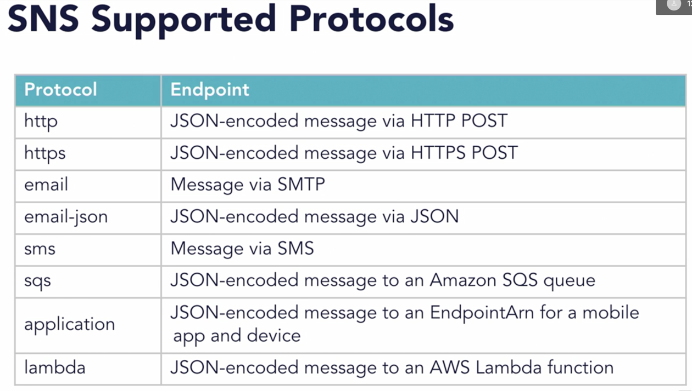

SNS follows push approach where as SQS uses pull aproach.

when architecting applications on AWS, consider taking advantage of the SNS push approach to help with communication between system components as well as for having those components work in parallel for highly and efficient scalable systems.


### Optimizing cost
1. Should be able to forcast spending and analyse useage
2. Tool provided for this is simple month calculator , it helps us  in estimating spendings
3. Once we are done with estimates planing, we need to see if our model is in track of estimates or not ... this is done by details billing report 
- detail Billing report present data at monthly daily hourly level or at acc level or at service level or at tag level.

Please note that this service is not free, we need to turn this ON.

Once we enable details billing report, cost explore tool is made available for us :
Once detailed billing is turned on, another tool, called the Cost Explorer becomes available. Cost Explorer is a tool that provides an Interactive Graphical User Interface for viewing reports, designed to make it easier to view and analyze historical spend on AWS. The data behind these reports is updated daily, allowing access to the most up to date spending information.

Billing alarm is tool to avoid suprize bills at end of month. It send notification once certain billing limit is reached.

4. **Budgets**: Budgets allow for the creation of custom budgets that will automatically send alerts when AWS cost are exceeded. Or are forecasted to exceed the threshold set. This is similar to setting up a billing alert, but the Budget's tool has more features, and certainly something to be aware of.

5. Using IAM:  A final thing to mention when thinking about controlling and keeping tabs on resource usage is using IAM to control permissions and restrict access to starting and creating resources. By setting up rolls and groups with different permissions, the creation of resources can be forced to funnel through various departments or groups in an organization. This can help prevent unnecessary or unexpected use of resources in the first place.

when architecting applications on AWS, take the time to become familiar with the available tools for modeling and monitoring cloud expenses. And take the time to set up billing or budget alerts to stay aware of costs, and to avoid any surprises.


### Matching supply and demand


Ways to save in AWS configurations are
1. Trusted advisor: 
 unneeded resources is key to optimizing for cost. One of the best tools to use to determine if there are idle resources being paid for in an account is to use the cost optimization feature within **AWS Trusted Advisor**. It checks over 100 configurations and recommends savings. It provides information about low utilization on EC2 instances, idle load balancers, underutilized EBS volumes, unassociated elastic IP addresses, idle RDS DB instances and underutilized Amazon Redshift clusters. It's available within business or enterprise support and one of the best ways to quickly determine if your supply is outweighing your demand. 
 
 2. Type resources: So how to identify if we have picked resources of right size ? Use cloud watch. This way, actual usage can be compared to actual needs and can help determine the appropriate instance type. 

 Instance types: 
 
**Important learning:**
There is an instance type called a **T3 **which offers a good example of how understanding the different types of resources can make a difference to costs incurred. The T3s offer what is called burstable performance. Burstable performance instances provide a baseline level of CPU performance with the ability to burst above that baseline based on credits. T3 instances are for workloads that don't use the full CPU often or consistently, but occasionally need to burst. **These can be great for web servers or development servers** that don't need consistently high levels of CPU but do sometimes need and benefit significantly from having full access to very fast CPUs from time to time. Comparing the T3 against those in other families that deliver constant compute shows the cost savings compared to instances with the same or even less CPU or memory specifications. The T3 can burst up to the same capacity of the compute optimized family, so if the capabilities of a high compute instance are needed occasionally but not consistently, the T3 series is more likely to help match supply with demand and optimize for cost
 
 
 
So when architecting applications on AWS, use tools such as CloudWatch to monitor usage patterns and AWS Trusted Advisor to identify discrepancies between usage and need. And stay aware of the different types of resources available to ensure the right tools are being chosen for the jobs at hand.

### Utilizing cost effective purchase 

On-demand means the resource is **paid for by the second**, for every second they are running, with no upfront payment nor long-term commitment. When the instance is running, you pay for it. When it's not, you don't. Reserved instance payment provides an option for longer-term cost savings. **A certain amount is paid upfront to lock in lower hourly rates**. This can result in up to 75% cost savings over time when compared to on-demand pricing, and the scheduled/reserved options allows you to purchase based on needs that occur on a daily, weekly or monthly basis with a specified start time and duration. Spot instances provide another payment option. **A spot instance is an unused EC2 instance that can be requested for use at steep discounts,** discounts that can be up to 90% off on-demand pricing. When dealing with non-stateful workloads or if jobs can tolerate being interrupted and don't have specific fixed timelines within which they must complete, taking advantage of spot instances will likely result in the best cost performance. With spot instances, excess availability compute capacity within AWS is put on a marketplace for bidding. With spot bidding, the per-hour pricing fluctuates depending on the supply and demand at a given moment. A bid is placed for use of this compute capacity, and **when the market hits or drops below the bid, compute capacity becomes available**. From that point on, billing is at the market price, never exceeding the initial bid. For example, if I were to bid $1 and the current market price is $.20, I'd only pay $.20. Similarly, if the market rates rise again above the bid, the compute capacity becomes unavailable. As the name suggests, it's spotty. The trade-off is significant cost savings.

 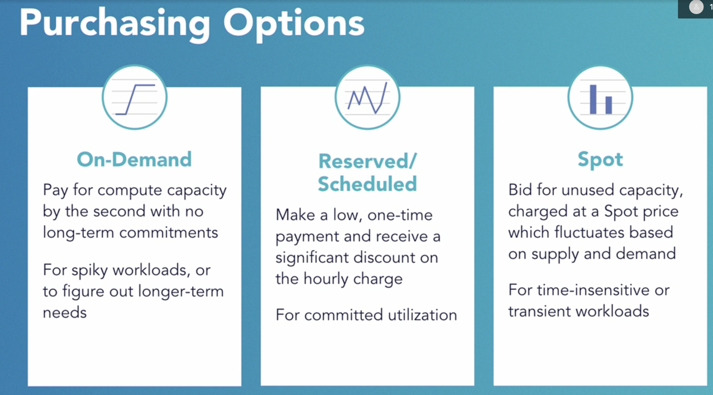
 
  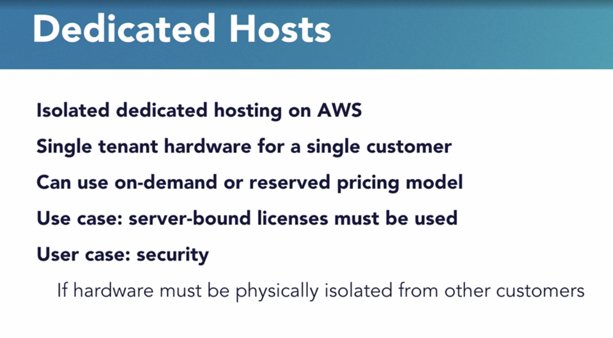
  
  ```
  To recap on the savings potential, if the compute requirements are predictable and will remain consistent for at least a year or possibly up to three years, 40 to 75% savings can be realized by moving to reserved instance pricing, and if your workloads can tolerate starting and stopping and some instance flexibility, savings of up to 90% can be realized by going with spot instance 
  ```
  
** let AWS handle as much of the technical administrative work as possible**. There is little need to employ expensive database administrators just to have them be doing backups or software updates or other server administrative tasks. That's something AWS can provide. AWS provides many managed services that eliminate the need to handle many tedious administrative tasks, allowing your team to stay lean and focused. 
 