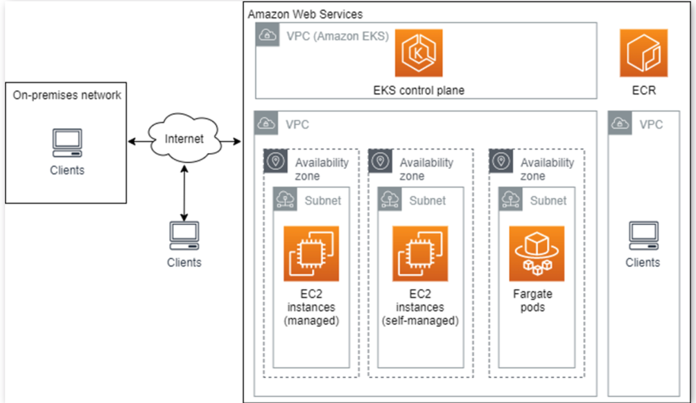

## ECS ##

Amazon Elastic Container Service (ECS) is a cloud-based and fully-managed container orchestration service. It lets you run your applications in the cloud without having to `configure and maintain` the infrastructure

you can leverage ECS to scale containers and release updates as needed.
ECS simplifies the management of containers, **but it does not automate the entire process**. You can still fine-tune and customize the process.

How is ECS contain defined ?

To prepare your application to run on Amazon ECS, you need to create a task definition. A task definition is a text file (in JSON format) that describes one or more containers (up to 10) that make up your application.
Almost everything you can run in a command-line Docker command can be defined using ECS task definitions.


The Amazon ECS Task Scheduler is responsible for placing tasks in a cluster. There are two primary scheduler strategies:

- The REPLICA strategy places a desired number of tasks in your cluster, and maintains this number of tasks, restoring them if some of them fail.
- The DAEMON strategy places one task on each active container instance that meets the relevant criteria.


ECS Cluster -  is a logical grouping of services, each composed of one or more tasks.
The first time you use Amazon ECS, a default cluster is created. You can create additional clusters in your account to achieve resource isolation for different workloads or projects. There are **two ways** to run **cluster** resources—on **EC2 instances** or via **Amazon Fargate**.


Container Agent - runs on each container instance in an Amazon ECS cluster. sends information about currently running tasks, and resource utilization, to Amazon ECS. Amazon ECS can use the agent to start and stop tasks as needed.

## Deployment of ECS

1. In EC2 cluster: ECS can use Elastic Compute Cloud (EC2) instances to run containers. EC2 instances are deployed as part of the Amazon EC2 service, and “registered” in a defined ECS cluster, meaning that EC2 can use those instances to deploy containers. You can run an ECS cluster within an existing VPC, making it accessible to existing AWS resources running in that VPC.

2. Amazon fargate: Fargate removes responsibility for provisioning, configuring, and managing EC2 instances, allowing AWS to manage EC2 instances for you.With Fargate you don’t need to manage servers, **but you must ensure that task definitions are stateless**. Currently, you cannot attach a storage volume (such as an Elastic Block Storage volume) to the container defined in the job.
This means that if you use Fargate with persistent storage, you will need to use external storage services like S3 or Relational Data Service (RDS).

```
Use ECS with EC2 when:
Your entire infrastructure runs in AWS
You have already defined VPC and subnetsYou have existing processes for provisioning and managing EC2 instances
Applications require directly-attached persistent storage

Use ECS Fargate when:
You do not have an existing VPC
You have some resources running on Amazon and some on other cloud environments
Applications are stateless or do not require directly-attached storage volumes

```

ECS versus Amazon  Elastic BeanStalk

AWS Elastic Beanstalk, on the other hand, automatically manages the infrastructure for you. You can use **Beanstalk** in cases **when you need to focus only on the code**.


AWS Elastic Beanstalk is a cloud-based service that helps you easily deploy and scale applications and services. Beanstalk automatically manages services, such as ELB, EC2, Auto Scaling, RDS, deploys applications, and monitors the health of the application.

When working with Beanstalk, you need to specify the container images you want the service to deploy, as well as the memory and CPU requirements, the container links, and port mappings. Once you define this information, Beanstalk starts automatically handling all management. It provisions the ECS cluster, manages auto-scaling and monitoring, performs load balancing, and deploys containers in clusters.


## Amazon EKS 
Elastic Kubernetes service: is a managed AWS Kubernetes service that scales, manages, and deploys containerized applications.  

 It typically runs in the Amazon public cloud, but can also be deployed on premises. The Kubernetes management infrastructure of Amazon EKS runs across multiple Availability Zones (AZ)
 
 Main component of EKS 
 
 1. Control Plan : EKS clusters are composed of the following main components—a control plane and worker nodes. Each cluster runs in its own, fully managed Virtual Private Cloud (VPC).The control plane is composed of three master nodes, each running in a different AZ to ensure AWS high availability. Incoming traffic directed to the Kubernetes API passes through the AWS network load balancer (NLB).

 2. Worker nodes run on Amazon EC2 instances located in a VPC, which is not managed by AWS. You can control and configure the VPC allocated for worker nodes. You can use a SSH to give your existing automation access or to provision worker nodes. 

 
 Deployment options 
 
 1. One cluster per application
 2. One cluster for multiple application : you can define IAM security policies and Kubernetes namespaces  to deploy one cluster for multiple applications.

 
 **Networking**: EKS provides Amazon VPC network policies. Only authorized clusters and accounts, defined by Kubernetes role-based access control (RBAC), can view or communicate with control plane components
 
 
 
### Control Plane:
 -> Run on EC2 instances in an Amazon-managed AWS account, and provides an API endpoint that can be accessed by your applications. responsible for controlling Kubernetes master nodes, such as the API Server and etcd
 
 ->Data is encrypted by KMS aws key and master nodes are distributed in multiple AZ for HA ( not in region) 
 
### EKS Node:

worker nodes run on EC2 instances in your organization’s AWS account. They use the API endpoint to connect to the control plane, via a certificate file. A unique certificate is used for each cluster.

  
 Self managed Node : 
 
 A “node” in EKS is an Amazon EC2 instance that Kubernetes pods can be scheduled on. Pods connect to the EKS cluster’s API endpoint. Nodes are organized into node groups. All the EC2 instances in a node group must have the same:Amazon instance typeAmazon Machine Image (IAM)IAM role
 
 
 Managed Node Groups
 
Amazon EKS provides managed node groups with automated lifecycle management. This lets you **automatically create, update, or shut down nodes **with one operation. EKS uses Amazon’s latest Linux AMIs optimized for use with EKS. When you terminate nodes, **EKS gracefully drains them to make sure there is no interruption** of service. You can easily apply Kubernetes labels to an entire node group for management purposes.Managed nodes are operated using **EC2 Auto Scaling groups** that are managed by the Amazon EKS service. You can define in which availability zones the groups should run. There are several **ways to launch **managed node groups, including the **EKS console, eksctl, the Amazon CLI, Amazon API, or Amazon automation tools including CloudFormation**.




By default, EKS exposes a public endpoint. If you want additional security for your cluster, you can enable a private endpoint, and/or limit access to specific IP addresses. You can configure connectivity between on-premises networks or other VPCs and the VPC used by your EKS cluster.

### When to use EKS verse ECS ???

1. EKS 
- deploy and manage complex, large-scale applications, then EKS is the best choice
- if you need support for the Kubernetes API, or if you need to migrate existing workloads.
- cost-effective and efficient way to deploy containers across multiple infrastructures and take advantage of the flexibility of Kubernetes
- Control Plane: EKS is a great option if you don’t mind investing in the control plane in exchange for the full capabilities of Kubernetes

2. ECS 
- Simple ,  easy-to-use solution for deploying and managing applications
-  if you don’t need the additional features that EKS offers
-  work exclusively on AWS and have limited expertise and resources to invest in learning Kubernetes


```
Docker verse kubernetes

While Docker is a containerization platform, Kubernetes is an orchestration tool used to manage multiple containers. Docker provides a simple and efficient way to create and deploy containers, while Kubernetes provides more complex functionality for managing containers at scale

```


