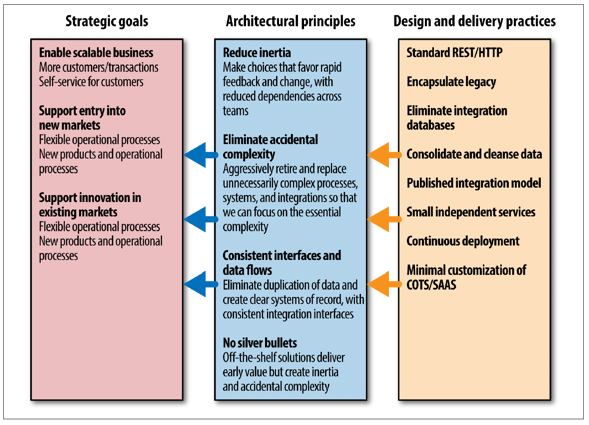
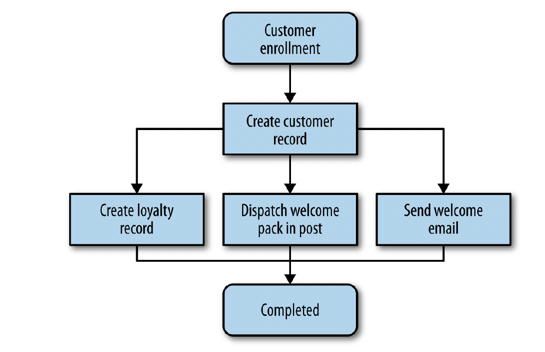
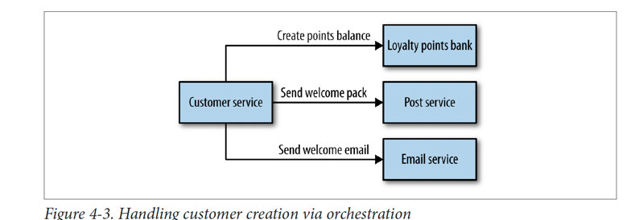
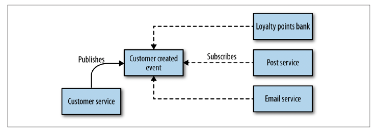
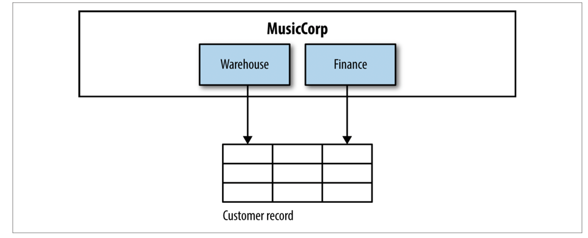
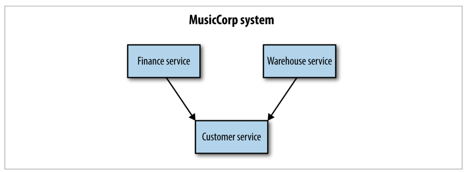
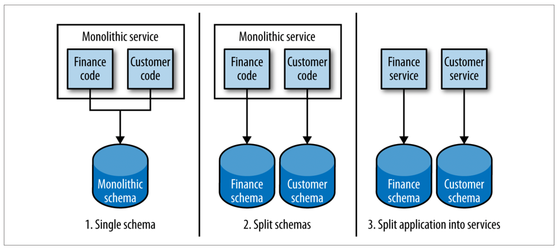
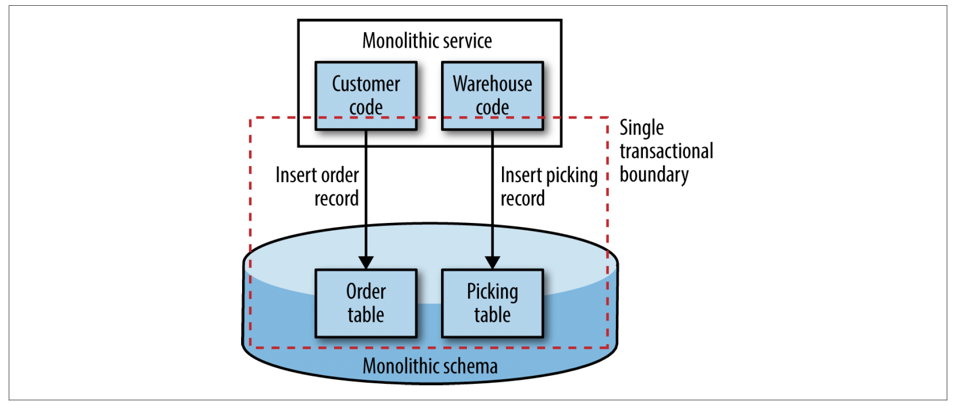
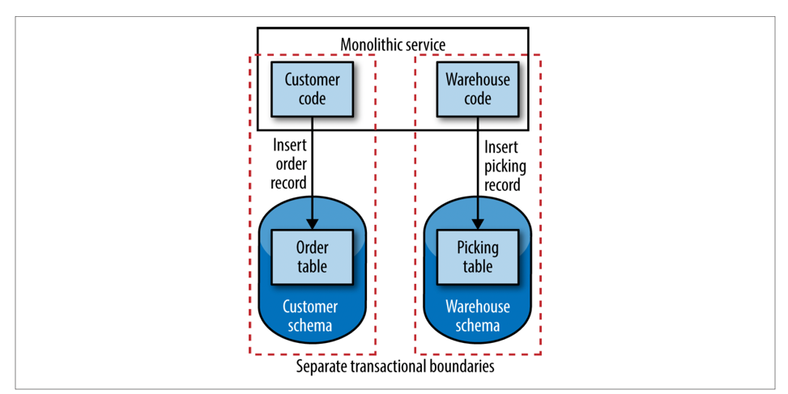
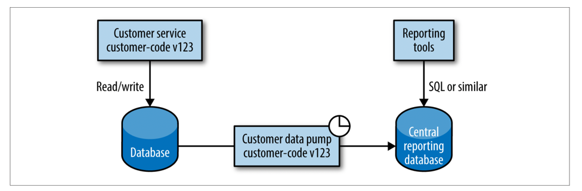

# Micro Services #
- Domain-driven design. 
  Continuous delivery. 
  On-demand virtualization. 
  Infrastructure automation. 
  Small autonomous teams. 
  Systems at scale. 
  
Microservices have emerged from this world.
###1. Small
Microservices are small, autonomous services that work together. 

    This is reinforced by Robert C. Martin’s definition of the Single
    Responsibility Principle, which states “Gather together those things that change for the
    same reason, and separate those things that change for different reasons.”

But how much small is small
    - a microservice as something that could be rewritten in two weeks, a rule of thumb that makes sense for his particular context.
###2. Autonomous

Autonomous. These services need to be able to change independently of each other, and be deployed by themselves without requiring consumers to change.
        The golden rule: can you make a change to a service and deploy it by itself without changing anything else?

service-oriented architecture ??? What is it ???

### Key Benefit
1. Technology Heterogeneity :This allows us to pick the right tool for each job,
   rather than having to select a more standardized, one-size-fits-all approach that often
   ends up being the lowest common denominator.  ( Write each MS in right technology)
   
2. Resilience: If one component of a system fails, but that failure doesn’t cascade, you can isolate the problem and the rest of the
   system can carry on working. Service boundaries become your obvious bulkheads. but with
   microservices, we can build systems that handle the total failure of services and
   degrade functionality accordingly. ( Key word is service bounderies and fail cascading is handled)
   
3. Scaling: With smaller services, we can just scale those services that need scaling, allowing us
   to run other parts of the system on smaller, less powerful hardware
   
4. Ease of Deployment:  With microservices, we can make a change to a single service and deploy it independ‐
   ently of the rest of the system. This allows us to get our code deployed faster. If a
   problem does occur, it can be isolated quickly to an individual service, making fast
   rollback easy to achieve. It also means we can get our new functionality out to customers faster.
   
5. Organizational Alignment: Microservices allow us to better align our architecture to our organization, helping us
   minimize the number of people working on any one codebase to hit the sweet spot of
   team size and productivity.
   
6. Composability: Should be open to be consumed by multiple sources. With microservices, think of us opening up seams in our system that are addressable
   by outside parties.
   
7. Optimizing for Replaceability:  Teams using microservice approaches are comfortable with completely rewriting
   services when required, and just killing a service when it is no longer needed. When a
   codebase is just a few hundred lines long, it is difficult for people to become emotion‐
   ally attached to it, and the cost of replacing it is pretty small.
   - use it and throw it. 
     
Service-oriented architecture
-------------------------------     
Service-oriented architecture (SOA) is a design approach where multiple services col‐
laborate to provide some end set of capabilities. A service here typically means a com‐
pletely separate operating system process. Communication between these services
occurs via calls across a network rather than method calls within a process boundary.


The Open Source Gateway Initiative (OSGI) is worth calling out as one technology specific approach to modular decomposition.

Before we finish, I should call out that microservices are no free lunch or silver bullet.
d. If
you’re coming from a monolithic system point of view, you’ll have to get much better
at handling deployment, testing, and monitoring to unlock the benefits we’ve covered
so far. You’ll also need to think differently about how you scale your systems and
ensure that they are resilient. Don’t also be surprised if things like distributed transac‐
tions or CAP theorem start giving you headaches, either


Chapter 2:
----------
The Evolutionary Architecture
----
->Architect is more like town planner
->architects have a duty to ensure that the system is habitable for developers too.
->As architects, we need to worry much less about what happens inside the
zone than what happens between the zones.
->That means we need to spend time thinking
about how our services talk to each other, or ensuring that we can properly monitor
the overall health of our system.

-> Making decisions in system design is all about trade-offs, and microservice architectures
give us lots of trade-offs to make!

Interesting
-----------
```
if one of your strategic goals as
an organization is to decrease the time to market for new features, 
you may define a
principle that says that delivery teams have full control over the lifecycle of their software
to ship whenever they are ready, independently of any other team
```
```the 
if another
goal is that your organization is moving to aggressively grow its offering in other
countries, you may decide to implement a principle that the entire system must be
portable to allow for it to be deployed locally in order to respect sovereignty of data.
```
=> Principle followed by Heroku’s 
https://12factor.net/



Logging
-------
You might choose to adopt a push mechanism, where each service needs to push this
data into a central location. For your metrics this might be Graphite, and for your
health it might be Nagios. Or you might decide to use polling systems that scrape data
from the nodes themselves. But whatever you pick, try to keep it standardized. Make
the technology inside the box opaque, and don’t require that your monitoring systems
change in order to support it. Logging falls into the same category here: we need
it in one place.

Architectural Safety
------
We cannot afford for one badly behaved service to ruin the party for everyone
each downstream service gets its own
connection pool, and you may even go as far as to say that each also uses a circuit
breaker.

Tailored Service Template
----------------------

Dropwizard and Karyon are two open source, JVM-based microcontainers. They
work in similar ways, pulling together a set of libraries to provide features like health
checking, serving HTTP, or exposing metrics. So, out of the box, you have a service
complete with an embedded servlet container that can be launched from the command
line. This is a great way to get going, but why stop there? While you’re at it, why
not take something like a Dropwizard or Karyon, and add more features so that it
becomes compliant for your context?

Circuit breaker: In that case, you
might integrate a circuit breaker library like Hystrix.

Anyone introducing a new technology stack would mean
having to reproduce all this effort. The main concern for Netflix is less about the
duplicated effort and more about the fact that it is so easy to get this wrong. The risk
of service getting newly implemented fault tolerance wrong is high if it could
impact more of the system. Netflix mitigates this by using sidecar services, which
communicate locally with a JVM that is using the appropriate libraries.

For other
organizations, you may need to be more structured, perhaps maintaining a debt log
that is reviewed regularly.

Governance ensures that enterprise objectives are achieved by evaluating stakeholder
needs, conditions and options; setting direction through prioritisation and decision
making; and monitoring performance, compliance and progress against agreed-on
direction and objectives.

They need to ensure there is a set of
principles that can guide development, and that these principles match the organization’s
strategy. They need to make sure as well that these principles don’t require
working practices that make developers miserable. They need to keep up to date with
new technology and know when to make the right trade-offs.

they need to spend some time with the teams to understand the impact of their decisions,
and perhaps even code too.

With larger, monolithic systems,
there are fewer opportunities for people to step up and own something. With microservices,
on the other hand, we have multiple autonomous codebases that will have
their own independent lifecycles. Helping people step up by having them take ownership
of individual services before accepting more responsibility can be a great way to
help them achieve their own career goals, and at the same time lightens the load on
whoever is in charge!

I am a strong believer that great software comes from great people. If you worry only
about the technology side of the equation, you’re missing way more than half of the
picture.

Chapter 3: How to Model Services
----------------------

SOA Base : loose coupling and high cohesion.
### 1. Loose Coupling: 
The whole point of a microservice is being able to make a change
to one service and deploy it, without needing to change any other part of the system.
This is really quite important

A loosely coupled service knows as little as it needs to about the services with which it
collaborates. This also means we probably want to limit the number of different types
of calls from one service to another, because beyond the potential performance problem,
chatty communication can lead to tight coupling.

### 2. High Cohesion
We want related behaviour to sit together, and unrelated behaviour to sit elsewhere

Making changes in lots of different places is slower,
and deploying lots of services at once is risky—both of which we want to avoid.
So we want to find boundaries within our problem domain that help ensure that
related behavior is in one place, and that communicate with other boundaries as
loosely as possible.

### Bounded Context
bounded contexts I like is “a specific responsibility enforced by
explicit boundaries.”
If you want information from a bounded context, or want to
make requests of functionality within a bounded context, you communicate with its
explicit boundary using models.

### Shared and Hidden Models
For MusicCorp, we can then consider the finance department and the warehouse to
be two separate bounded contexts. They both have an explicit interface to the outside
world (in terms of inventory reports, pay slips, etc.), and they have details that only
they need to know about (forklift trucks, calculators).

Shared model -> for example it needs to know about stock levels to keep the accounts up to date
In general, microservices should cleanly align to bounded contexts.

So, if our service boundaries align to the bounded contexts in our domain, and our
microservices represent those bounded contexts, we are off to an excellent start in
ensuring that our microservices are loosely coupled and strongly cohesive.

When you start to think about the bounded contexts that exist in your organization,
you should be thinking not in terms of data that is shared, but about the capabilities
those contexts provide the rest of the domain.
So ask first “What does this context do?”, and then “So what data
does it need to do that?”

Bounder -> split to further boundaries
---------------------------------------
At the start, you will probably identify a number of coarse-grained bounded contexts.
But these bounded contexts can in turn contain further bounded contexts. For example,
you could decompose the warehouse into capabilities associated with order fulfillment,
inventory management, or goods receiving.

whether you choose the nested approach over the full separation approach
should be based on your organizational structure. If order fulfillment, inventory
management, and goods receiving are managed by different teams, they probably
deserve their status as top-level microservices. If, on the other hand, all of them are
managed by one team, then the nested model makes more sense. This is because of
the interplay of organizational structures and software architecture,

I called this onion architecture, as it had lots of layers and made me cry when we had to cut through it.
Now on the face of it, the idea of splitting the previously monolithic system along
geographical/organizational lines makes perfect sense,

Integration
---------------
Strong cohesion and loose coupling- directly integrating with DB , its gone

These two different modes of communication can enable two different idiomatic
styles of collaboration: 
`request/response`  With request/response, a client
initiates a request and waits for the response. - synchronous
it might kick off an operation and register a callback, asking the server to let me know
when my operation has completed. - async

`Event driven`: Instead of a client initiating
requests asking for things to be done, it instead says this thing happened and expects
other parties to know what to do.Event-based systems by their nature are asynchronous.

example of each  => Onboarding new customer


Synchronous way
--- 
Having one service doing it step by step

- Downside : The downside to this orchestration approach is that the customer service can become
  too much of a central governing authority.
  I have seen this approach result in a
  small number of smart “god” services telling anemic CRUD-based services what to
  do.
  ?? Roll back is also a problem na ???

Asynchronous way
----------------  

With a choreographed approach, we could instead just have the customer service
emit an event in an asynchronous manner, saying Customer created. The email service,
postal service, and loyalty points bank then just subscribe to these events and
react accordingly

What if one of the service doesn't behaved as expected
One approach I like to deal with this is to build a monitoring system that explicitly matches the
view of the business process

I strongly prefer aiming for a `choreographed system`, where each service is smart enough to understand
its role in the whole dance.

RPC verse Rest
---------------
RPC
All these technologies, however, have the same, core characteristic
in that they make a local call (Stub) look like a remote call.

like SOAP, which makes nominal use of HTTP. The fact that I can just make a normal method call and theoretically ignore the rest is a
huge boon.

Problem with RPC?
1. technology coupling ( JAVA RMI - only jvm based)
Solution in gRpc or thrift
   
2. Since Stub method look and feel are like local method developer keep invoking then frequently. This should be avoided

3. Brittleness:
   RPC endpoints often end up
   having a large number of methods for different ways of creating or interacting with
   objects. This is due in part to the fact that we are still thinking of these remote calls as
   local ones.
   1. If I remove /add field, I need to regenerate stub at server and client side
   2. If I use DS like list or Map, I will loose benefit of RPC like  I’ll still have to manually match and
      extract the fields I want.

   Thrift mitigate some of sins of
   the past by avoiding the need for lock-step releases of client and server code.

   A `lock-step` deploy is when you have 2 or more services that are deployed at the same time, in the same CI/CD setup.

REST
---------
REpresentational State Transfer (REST)

HTTP verbs (e.g., GET, POST, and PUT) already have wellunderstood
meanings in the HTTP specification as to how they should work with
resources.
HTTP also brings a large ecosystem of supporting tools and technology. We get to
use HTTP caching proxies like Varnish and load balancers like mod_proxy, and
many monitoring tools already have lots of support for HTTP out of the box. These
building blocks allow us to handle large volumes of HTTP traffic and route them
smartly, in a fairly transparent way

Hypermedia As the Engine of Application State
One of the downsides is that this navigation of controls can be quite chatty, as the
client needs to follow links to find the operation it wants to perform. Ultimately, this
is a trade-off.

disadvantages
-----
REST over HTTP payloads can actually be more
compact than SOAP because it supports alternative formats like JSON or even binary,
but it will still be nowhere near as lean a binary protocol as Thrift might be

WebSockets, for example, has very little to do with the Web. After the initial
HTTP handshake, it’s just a TCP connection between client and server, but it can be a
much more efficient way for you to stream data for a browser. If this is something
you’re interested in, note that you aren’t really using much of HTTP, let alone anything
to do with REST.

For server-to-server communications, if extremely low latency or small message size
is important, HTTP communications in general may not be a good idea. You may
need to pick different underlying protocols, like User Datagram Protocol (UDP), to
achieve the performance you want, and many RPC frameworks will quite happily run
on top of networking protocols other than TCP.

Event driven arictecture
---------------
1. Use Message queue as broker  (Rabbit MQ)
    problem: Additional system dependency. Need to manage that system
   
2. ATOM in rest can be tried if #1 is not available. but prefer #1

Complexities of Asynchronous Architectures
-------------

E.g. Pricing event -> Queue-> competing consumer pattern worker from pool 
Problem when bug with one kind of pricing request which was causing worked to die
* -> We were using a transacted queue: as the worker died, the lock on the request timed out, and the pricing request was put
back on the queue—only for another worker to pick it up and die

Fix was :
1. configured a maximum retry. But we also
   realized we needed a way to view, and potentially replay, these bad messages
2. We ended up having to implement a message hospital (or dead letter queue), where messages
   got sent if they failed.
   Ensure you have good monitoring in place, and strongly consider the use of correlation IDs

Must read : `Enterprise Integration Patterns`

I still think that REST over HTTP makes for a much more sensible integration technology
than many others, but whatever you pick, keep this idea in mind.

React:
As you find yourself making more service calls, especailly when making multiple calls
to perform a single operation, take a look at the reactive extensions for your chosen
technology stack.

DRY Principle :
---------

DRY: don’t repeat yourself. avoid duplicating our system behavior and knowledge.
This is very sensible advice in general

My general rule of thumb: don’t violate DRY within a microservice, but be relaxed
about violating DRY across all services. The evils of too much coupling between services
are far worse than the problems caused by code duplication.

The Netflix client libraries handle service discovery, failure modes, logging, and other aspects that aren’t actually about the nature of the service
itself. Without these shared clients, it would be hard to ensure that each piece of
client/server communications behaved well at the massive scale at which Netflix operates

Postel’s Law
--------

(otherwise known as the robustness principle), which states:
`Be conservative in what you do, be liberal in what you accept from others.`

Semantic versioning
-------------------
is a specification that
allows just that. With semantic versioning, each version number is in the form
MAJOR.MINOR.PATCH. When the MAJOR number increments, it means that backward
incompatible changes have been made. When MINOR increments, new functionality
has been added that should be backward compatible. Finally, a change to PATCH states
that bug fixes have been made to existing functionality.

Coexist Different Endpoints
---------------------------
I have used successfully to handle this
is to coexist both the old and new interfaces in the same running service. So if we
want to release a breaking change, we deploy a new version of the service that exposes
both the old and new versions of the endpoint.

Build if it is unique to what you do, and
can be considered a strategic asset; buy if your use of the tool isn’t that special.”

Summary
-----------
Avoid database integration at all costs.
• Understand the trade-offs between REST and RPC, but strongly consider REST
as a good starting point for request/response integration.

• Prefer choreography over orchestration.

• Avoid breaking changes and the need to version by understanding Postel’s Law
and using tolerant readers.

• Think of user interfaces as compositional layers.


## Chapeter 5 - Splitting monolithic services ##

Concept of seams : `Seams` that is, a portion of the code that can be treated in isolation and worked on without impacting the rest of the codebase.

Dynamically typed language where the IDEs have a harder time of performing refactoring - down side of python

While splitting monolith we need to find domain boundries. Package can loosely be good example.
Refactor and try to pull all dependent in similar package. if there is dependency in code e.g. fin team code is dependent on inventry team, then we need to remove this dependency.

Now I have identifiec seams in my code ... but question is where to start from ?
Answer is following approach ..
1. Pace of Change : Code which changes alot should be first to target.
2. Team structure: each team can work independently and own one peice. split should be made that way.
3. Security: Split peice which deal heavy with sensitive data. we can provide additional protections to this individual service in terms of monitoring, protection of data at transit, and protection of data at rest.
4. Technology: ML can use python over flask /clay , Java spring boot
5. Tangled Dependencies: Code which had least dependency need to be pulled out first.
6. Database: findout seams for which DB can be splitted.


Repository layer: Basically this layer try to map over object to DB tables using technolgy like JPA  or hibernate.
SchemaSpy - tool to plot DB relation.


Example :
**Case1**: If we have table which has foreign key reference to another table. After spliting it into two MS we would use MS call to get this table join.
Yes it will be performance hit but as said : `Sometimes making one thing slower in exchange for other things is the right thing to do, especially
if slower is still perfectly acceptable.`


**Case 2**: How to take case of table which is common between two MS ??? like country_code 
- Best approach can be to see if this data can be moved to config or enum and can be part of code
- if it is hard to do and config are too much we can develop config service alltogeter as solution (flipper in Uber)

**Case 3**: Now if two service try to share and change state of object example customer object can be updated by finance service (for refund case) and ware house (order)
so in this cas create new service customer which take care of this shared object life cycle




**How to approach with Monolithic split?**

 Code split -> Db Split -> service split 
 
 
 
 **Case 4**: Transaction with service cann't be consistent at same time bit would be rither eventually consistent ( by retry on failure mechanism)
 
 --- Initial state ---
 
 
 After spliting
 
 
 **Case 5** Aborting or unwinding transaction in MS eco system. for this we have to issue a compensating transaction which would bring system in consistent state. But who will do it ???
 
Distributed transactions try to span multiple transactions within them, using some overall governing process called a transaction manager to orchestrate
the various transactions being done by underlying systems (2PC appraoch i.e. 2 phase commit) . But this is complex to implement and takes lock in all DB involve in transaction. Second issue is transaction manager is single point of failure.


Reporting on data in this kind of distributed environment?

You could resolve this by exposing batch APIs to make reporting easier. For example,
our customer service could allow you to pass a list of customer IDs to it to retrieve
them in batches, or may even expose an interface that lets you page through all the
customers.

2nd approach is data pump : we could instead have the data
pushed to the reporting system. An alternative option is to have a standalone program that directly accesses
the database of the service that is the source of data, and pumps it into a reporting
database
 
 Down sides is coupling databases. and Service owning team should also own datapump.
 
 
 Alternative Destinations- like S3 ??
 
 **Event data pump**: Service emit event on entity change and entity mapper  apply this to reporting DB
 
 
 
 Downside of this approach are that all the required information must be
broadcast as events, and it may not scale as well as a data pump for larger volumes of
data that has the benefit of operating directly at the database level. Nonetheless, the
looser coupling and fresher data available via such an approach makes it strongly
worth considering if you are already exposing the appropriate events.
 
