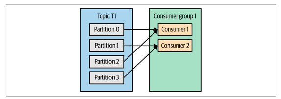
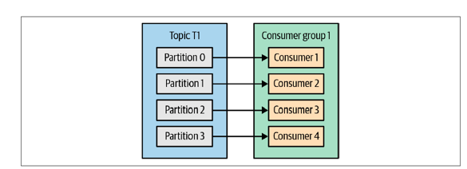
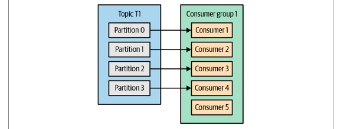
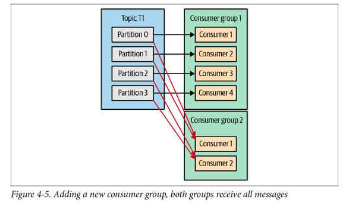

## Definition
Apache Kafka was developed as a publish/subscribe messaging system.It is often described as a “distributed commit log” or more
recently as a “distributing streaming platform.” A filesystem or database commit log is
designed to provide a durable record of all transactions

## Why Kafka

Five Reasons:

1. Multiple Producers:able to seamlessly handle multiple producers

2. Multi consumer: Kafka is designed for multiple consumers to read
any single stream of messages without interfering with each other client. This is in
contrast to many queuing systems where once a message is consumed by one client, it
is not available to any other.

3. Disk-Based Retention:

Not only can Kafka handle multiple consumers, but durable message retention means
that consumers do not always need to work in real time. Messages are written to disk
and will be stored with configurable retention rules.

4. Scalable:
Kafka’s flexible scalability makes it easy to handle any amount of data. Users can start
with a single broker as a proof of concept, expand to a small development cluster of
three brokers, and move into production with a larger cluster of tens or even hundreds
of brokers that grows over time as the data scales up.

5. High Performance:
Producers, consumers, and brokers can all be scaled out to handle very large message streams with ease.


## Kafka Producer


ProducerRecord, which must
include the topic we want to send the record to and a value. Optionally, we can also
specify a key, a partition, a timestamp, and/or a collection of headers. Once we send
the ProducerRecord, the first thing the producer will do is serialize the key and value
objects to byte arrays so they can be sent over the network.

A **Kafka producer** has three mandatory
properties:

1. bootstrap.servers: This list doesn’t need to include all brokers, since
the producer will get more information after the initial connection. But it is recommended
to include at least two, so in case one broker goes down, the producer
will still be able to connect to the cluster.

2. key.serializer: Name of a class that will be used to serialize the keys of the records we will produce
to Kafka. **key.serializer** should be set to a name of a class that implements the
**org.apache.kafka.common.serialization.Serializer** interface.

3. value.serializer: Name of a class that will be used to serialize the values of the records we will produce
to Kafka. The same way you set key.serializer to a name of a class that
will serialize the message key object to a byte array, you set value.serializer to
a class that will serialize the message value object.


```
Properties kafkaProps = new Properties();

kafkaProps.put("bootstrap.servers", "broker1:9092,broker2:9092");

kafkaProps.put("key.serializer",
"org.apache.kafka.common.serialization.StringSerializer");

kafkaProps.put("value.serializer",
"org.apache.kafka.common.serialization.StringSerializer");

producer = new KafkaProducer<String, String>(kafkaProps);

```

There are three primary methods of sending msgs in kafka

1. **Fire-and-forget**
We send a message to the server and don’t really care if it arrives successfully or
not.

```

ProducerRecord<String, String> record =
new ProducerRecord<>("CustomerCountry", "Precision Products",
"France");

try {
producer.send(record);
} catch (Exception e) {
e.printStackTrace();
}

```

2. **Synchronous send**
Technically, Kafka producer is always asynchronous—we send a message and the
send() method **returns a Future object**. However, we use get() to **wait on the
Future and see if the send() was successful** or not before sending the next
record.

```
ProducerRecord<String, String> record =
new ProducerRecord<>("CustomerCountry", "Precision Products", "France");
try {
producer.send(record).get();
} catch (Exception e) {
e.printStackTrace();
}

```

3. Asynchronous send
We call the send() method with a callback function, which gets triggered when it
receives a response from the Kafka broker.

>In
most cases, we really don’t need a reply—Kafka sends back the topic, partition, and
offset of the record after it was written, which is usually not required by the sending
app. On the other hand, we do need to know when we failed to send a message completely
so we can throw an exception, log an error, or perhaps write the message to an
“errors” file for later analysis.


**Handling error in async scenerio**


```

private class DemoProducerCallback implements Callback {
@Override
public void onCompletion(RecordMetadata recordMetadata, Exception e) {
if (e != null) {
e.printStackTrace();
}
}
}
ProducerRecord<String, String> record =
new ProducerRecord<>("CustomerCountry", "Biomedical Materials", "USA");
producer.send(record, new DemoProducerCallback());

```

## Message ACK 
**acks=0** :The producer will not wait for a reply from the broker before assuming the message
was sent successfully.

**acks=1** : The producer will receive a success response from the broker the moment the
leader replica receives the message.

**acks=all**: The producer will receive a success response from the broker once all in sync
replicas receive the message.

> In order to maintain consistency, Kafka
will not allow consumers to read records until they are written to
all in sync replicas.

## Important Producer config

1. linger.ms: By default, the producer will
send messages as soon as there is a sender thread available to send them, even if
there’s just one message in the batch. By setting linger.ms higher than 0, we instruct
the producer to wait a few milliseconds to add additional messages to the batch
before sending it to the brokers. This increases latency a little and significantly
increases throughput—the overhead per message is much lower, and compression, if
enabled, is much better.

2. buffer.memory: This config sets the amount of memory the producer will use to buffer messages waiting
to be sent to brokers

3. compression.type: messages are sent uncompressed. This parameter can be set to snappy,
gzip, lz4, or zstd, in which case the corresponding compression algorithms will be
used to compress the data before sending it to the brokers.


>Snappy compression was
invented by Google to provide decent compression ratios with low CPU overhead
and good performance, so it is recommended in cases where both performance and
bandwidth are a concern.

> Gzip compression will typically use more CPU and time
but results in better compression ratios, so it is recommended in cases where network
bandwidth is more restricted. By enabling compression, you reduce network utilization
and storage, which is often a bottleneck when sending messages to Kafka.


4. batch.size: When multiple records are sent to the same partition, the producer will batch them
together. This parameter controls the amount of memory in bytes (not messages!)
that will be used for each batch. When the batch is full, all the messages in the batch
will be sent.

5. max.in.flight.requests.per.connection: This controls how many message batches the producer will send to the server without
receiving responses.

### Ordering concern
```
Setting the retries parameter to nonzero and the max.in.
flight.requests.per.connection to more than 1 means that it is
possible that the broker will fail to write the first batch of messages,
succeed in writing the second (which was already in-flight), and
then retry the first batch and succeed, thereby reversing the order.
Since we want at least two in-flight requests for performance reasons,
and a high number of retries for reliability reasons, the best
solution is to set enable.idempotence=true. This guarantees message
ordering with up to five in-flight requests and also guarantees
that retries will not introduce duplicates.

```

6. max.request.size

This setting controls the size of a produce request sent by the producer.with a default maximum request size
of 1 MB, the largest message you can send is 1 MB

7. enable.idempotence: you can set enable.idempotence=true. When the idempotent producer
is enabled, the producer will attach a sequence number to each record it sends.
If the broker receives records with the same sequence number, it will reject the second
copy and the producer will receive the harmless DuplicateSequenceException

## Kafka and Avro love story

One of the most interesting features of Avro, and what makes it a good fit for use in a
messaging system like Kafka, is that when the application that is writing messages
switches to a new but compatible schema, the applications reading the data can continue
processing messages without requiring any change or update.

Example:

```
## Schema 1

{"namespace": "customerManagement.avro",
"type": "record",
"name": "Customer",
"fields": [
{"name": "id", "type": "int"},
{"name": "name", "type": "string"},
{"name": "faxNumber", "type": ["null", "string"], "default": "null"}
]
}

## Schema 2

{"namespace": "customerManagement.avro",
"type": "record",
"name": "Customer",
"fields": [
{"name": "id", "type": "int"},
{"name": "name", "type": "string"},
{"name": "email", "type": ["null", "string"], "default": "null"}
]
}


```

The reading application will contain calls to methods similar to getName(), getId(),
and getFaxNumber(). If it encounters a message written with the new schema, get
Name() and getId() will continue working with no modification, but getFax
Number() will return null because the message will not contain a fax number.

Now suppose we upgrade our reading application and it no longer has the getFax
Number() method but rather getEmail(). If it encounters a message written with the
old schema, getEmail() will return null because the older messages do not contain
an email address.

***Schema Registry pattern ***
The idea is to store all the schemas used to write data to Kafka in the registry. Then
we simply store the identifier for the schema in the record we produce to Kafka. The
consumers can then use the identifier to pull the record out of the Schema Registry. and deserialize the data. The key is that all this work—storing the schema in the registry
and pulling it up when required—is done in the serializers and deserializers. The
code that produces data to Kafka simply uses the Avro serializer just like it would any
other serializer

###Partitioning in Kafka
Starting in the Apache Kafka
2.4 producer, the round-robin algorithm used in the default partitioner when handling
null keys is sticky.

If a key exists and the default partitioner is used, Kafka will hash the key and use
the result to map the message to a specific partition.

### Quota mechanism and throttling

Kafka brokers have the ability to limit the rate at which messages are produced and
consumed. This is done via the quota mechanism. **Kafka has three quota types**: `produce,
consume, and request`. Produce and consume quotas limit the rate at which clients
can send and receive data, measured in bytes per second. Request quotas limit
the percentage of time the broker spends processing client requests.

>When a client reaches its quota, the broker will start throttling the client’s requests to
prevent it from exceeding the quota. This means that the broker will delay responses
to client requests; in most clients this will automatically reduce the request rate and bring the client traffic down to a level
allowed by the quota.


### Reading Data from Kafka

#### consumer group:
Kafka consumers are typically part of a consumer group. When multiple consumers
are subscribed to a topic and belong to the same consumer group, each consumer in
the group will receive messages from a different subset of the partitions in the topic

|
:-------------------------:|:-------------------------:
|

Moving partition ownership from one consumer to another is called a **rebalance**.

There are **two types of rebalances**, depending on the partition assignment strategy
that the consumer group uses

1. Eager rebalances: During an eager rebalance, all consumers **stop consuming**, **give up their ownership**
of all partitions, **rejoin the consumer group**, and get a brand-new partition
assignment. This is essentially a short window of unavailability of the entire consumer
group.

2. Cooperative rebalances: Cooperative rebalances (also called incremental rebalances) typically involve reassigning
only a small subset of the partitions from one consumer to another, and
allowing consumers to continue processing records from all the partitions that
are not reassigned. This incremental approach may take a few iterations until a stable partition
assignment is achieved, but it avoids the complete “stop the world” unavailability
that occurs with the eager approach. This is especially important in large
consumer groups where rebalances can take a significant amount of time.

>When a consumer wants to join a group, it sends a JoinGroup
request to the group coordinator. The first consumer to join the
group becomes the group leader. The leader receives a list of all
consumers in the group from the group coordinator (this will
include all consumers that sent a heartbeat recently and that are
therefore considered alive) and is responsible for assigning a subset
of partitions to each consumer. It uses an implementation of
PartitionAssignor to decide which partitions should be handled
by which consumer.


