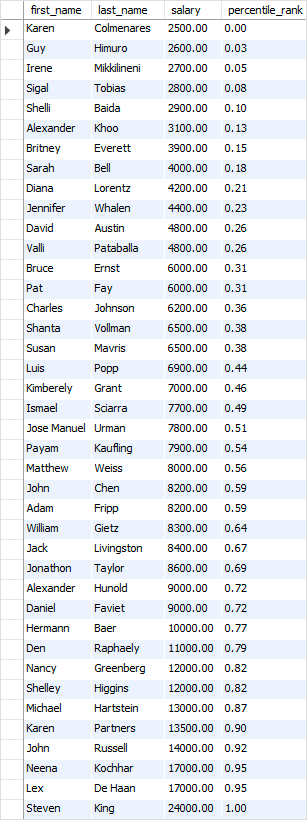
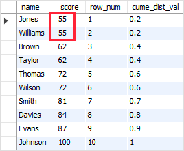

## NTILE
NTILE() in Standard Query Language (SQL) is a window function that is used to divide sorted rows of a partition into a specified number of equal size buckets or groups. Each bucket is assigned a rank starting from 1. Each row in the partition is assigned a bucket number based on the group to which it belongs.

For further understanding, NTILE() functionality can be considered as placing 10 letters in three envelopes. It is a ranking function that will divide a result set of m rows or records into n groups or buckets with m/n records in each bucket. In cases where the result set is not exactly divisible into an equal number of rows, it assigns more records to the starting buckets and less to the following ones.

In this example, we observe that NTILE(4) has divided the 9 records into 4 buckets. But we can see that the first bucket has 3 rows whereas the rest of them have 2 rows each. This is because NTILE() assigns more records to the starting buckets and less to the following ones in situations when the recordset cannot be divided equally.

## Percantage Rank

Using SQL PERCENT_RANK() over the query result set example
The following query finds the percentile ranks of employees by their salaries:

SELECT
first_name,
last_name,
salary,
ROUND(
PERCENT_RANK() OVER (
ORDER BY salary
)
,2) percentile_rank
FROM
employees;



Let’s analyze some rows in the output.

Karen has the lowest salary which is not greater than anyone so her percentile ranking is zero. On the other hand, Steven has the highest salary which is higher than anyone, therefore, his percentile ranking is 1 or 100%.
Nancy and Shelley have the percentile ranking of 82% which means their salary is higher than 82% all other employees.

## Row Number verse rank 

You will only see the difference if you have ties within a partition for a particular ordering value.

RANK and DENSE_RANK are deterministic in this case, all rows with the same value for both the ordering and partitioning columns will end up with an equal result, whereas ROW_NUMBER will arbitrarily (non deterministically) assign an incrementing result to the tied rows.

Example: (All rows have the same StyleID so are in the same partition and within that partition the first 3 rows are tied when ordered by ID)
```sql
WITH T(StyleID, ID)
AS (SELECT 1,1 UNION ALL
SELECT 1,1 UNION ALL
SELECT 1,1 UNION ALL
SELECT 1,2)
SELECT *,
RANK() OVER(PARTITION BY StyleID ORDER BY ID)       AS [RANK],
ROW_NUMBER() OVER(PARTITION BY StyleID ORDER BY ID) AS [ROW_NUMBER],
DENSE_RANK() OVER(PARTITION BY StyleID ORDER BY ID) AS [DENSE_RANK]
FROM   T  
Returns

StyleID     ID       RANK      ROW_NUMBER      DENSE_RANK
----------- -------- --------- --------------- ----------
1           1        1         1               1
1           1        1         2               1
1           1        1         3               1
1           2        4         4               2
```
You can see that for the three identical rows the ROW_NUMBER increments, the RANK value remains the same then it leaps to 4. DENSE_RANK also assigns the same rank to all three rows but then the next distinct value is assigned a value of 2.

### Cume_dist
The CUME_DIST() is a window function that returns the cumulative distribution of a value within a set of values. It represents the number of rows with values less than or equal to that row’s value divided by the total number of rows.
The returned value of the CUME_DIST() function is greater than zero and less than or equal one (0 < CUME_DIST() <= 1). The repeated column values receive the same CUME_DIST() value.

SELECT
name,
score,
ROW_NUMBER() OVER (ORDER BY score) row_num,
CUME_DIST() OVER (ORDER BY score) cume_dist_val
FROM
scores;


For the first row, the function finds the number of rows in the result set, which have value less than or equal to 55. The result is 2. Then CUME_DIST() function divides 2 by the total number of rows which is 10: 2/10. the result is 0.2 or 20%. The same logic is applied to the second row. \



## LAG AND LEAD
LAG() and LEAD() are positional functions. These are window functions and are very useful in creating reports, because they can refer to data from rows above or below the current row. In this article, we will look at these two in detail.

More resources => https://learnsql.com/blog/lead-and-lag-functions-in-sql/
