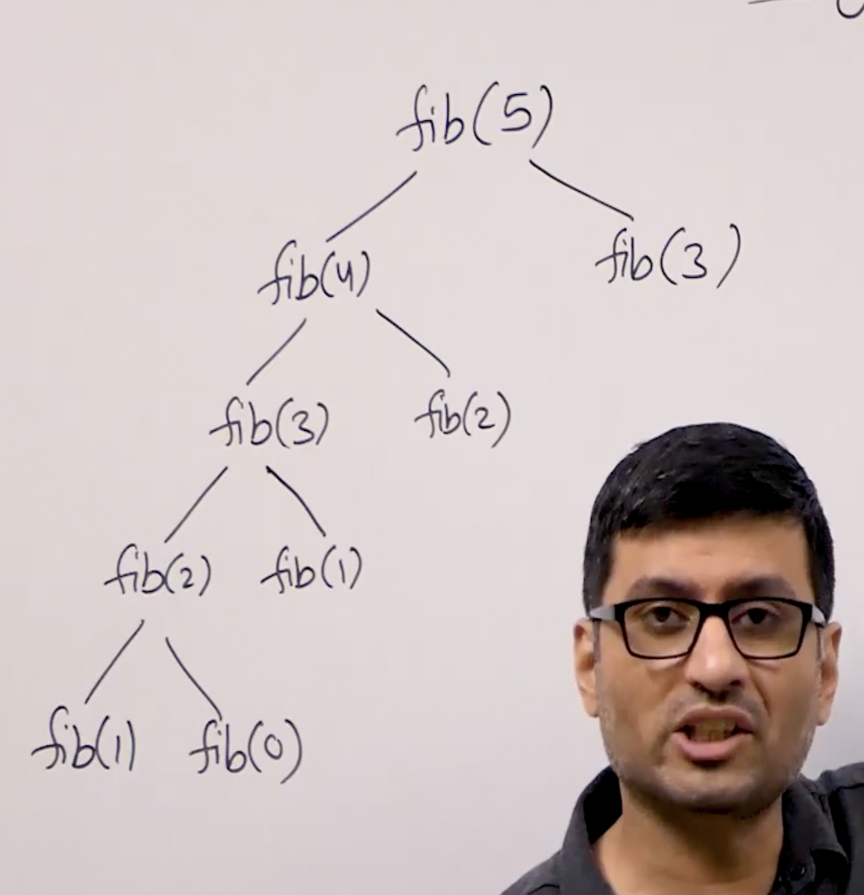

## Dynamic Programming ##

it is an optimization over recusion where solution of over lapping sub problem are reused.
Hense great on computation cost.

### Type of DP ###
1. Memoization ( top down)
2. Tabulation ( bottom up )

### Application ###
Huge application. Small list is as follows
1. Bellman ford  Algo  ( Shortest path from a to b used in routing)
2. Floyd warshall Algo (shortest path between every pair of vertices)
3. Diff Utility ( Longest common subsequence -KMP)
4. Search Closest Word ( Edit Distance)
5. Resource allocation (0-1 KnapSack)

### Memoization ###
Find nth fibbonaci number of given n
e.g. f0=0 f1=1 f2=1 f3=2 f4=3 f5=5 f6=8  so n6=8


```java
public int fibbonaci( int n){
    if(n==0|| n==1)
        return 0;
    else
       return fibbanaci(n-1) +  fibbonaci(n-2);
}
```

complixity of this solution is exponential 
i.e. 2^n

We can optimize it to linear time complexity using DP (memoization)\
**Converting it to DP**

```java
private static int[] mem= new int [n+1];
static {
    for ( int i=0;i<=mem.length;i++)
        mem[i]=-1;
}

public static int fibbanaci(int n){
    
    if(mem[n]==-1){
        if(n==0||n==1){
            return 0;
        }
        else{
            mem[n]= fibbanaci(n-1)+fibbanaci(n-2);
        }
    }
    return mem[n];

}

```

**Time complexity**
 n - for right tree
n-1 -for left part 
so (2n-1) iteration  and each iteration some assignment only so theta(1)\
so complexity is (2n-1)Xtheta(1)
or Big O(n) which is much better than exponential


> This is top Down\
> **Dimension of mem array** = no. of parameter changing\
> **Size of Mem Array** = Max possible value idx +1

### Tabulation ###
In this we don't use recursion but start with iterative approach\
we start with base cases and continue building till we reach N\

Rule are same
> **Dimension of Tab array** = no. of parameter changing\
> **Size of Tab Array** = Max possible value idx +1 (i.e. Range)

Example
```java
private static int[] tab= new int [n+1];
static {
        for ( int i=0;i<=mem.length;i++)
        tab[i]=-1;
}

public static int fibbanaci(int n){
        tab[0]=1;
        tab[1]=1;
        for ( int i=2;i<=n;i++){
            tab[i]=tab[i-1]+tab[i+1];
        }
        return tab[n];

}        
```
Complexity
time = Theta (N)
space= Theta(N)

### Comparision between Memoization and Tabulation ###
1.  Mem method are easy to right but have performance penalty because of recursive calls 
2.  Tab are hard to write but better performant

Example
Q1
```java
org.dreambig.ds.dp.easy.CommonSubSequence;
``` 
Using **Memoization** Time complexity is O(mXn)
recursive solution is exponential thetha(1) X MN 

Q2
```java
import  org.dreambig.ds.dp.easy.CoinToss;
```

Using **Tabulation** Time Complexity is O(MN)

Please try this https://practice.geeksforgeeks.org/tracks/DSASP-DP/?batchId=154&tab=1
