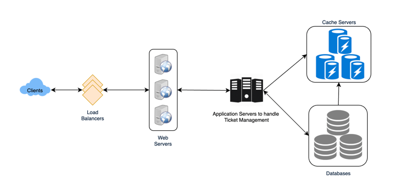

## Ticket master ... (BookMyShow) ##

### Requirement ###
All functionality of BookMyShow

#### Technical Requirement ####
1. Highly Concurrent 
2. System should be secure and ACID for transaction

#### Back of Envelope computation ####

***Network Traffic***
- 3B page view per month 

***Storage Computation***
 - 500 cities
 - each city 10 theatre
 - 2000  seats  per theatre 
 - 2 shows per day  each theatre
 
data per booking is 50B
Movie related data is 50 B
so 
    500 X 10 X 2000 X2 X(50+50)= ~1.86 ~ 2 GB
    for 5 years 
    2 X 365 X 5 =3.650 TB

#### API Design ####
- search
` search( api_dev_key, city, pincode, lat_lon, keyword, spelling_check,  result_per_page, sorting_order )`
- book
  ` search( api_dev_key, session_id, movie_id, show_id,seats_to_reserve [] )`
    Session_id is time bond and user reservation on seat will be removed after time expire.
- cancel
 ` cancel(api_dev_key, session_id, book_id)`
  

### High level design ####

    

 

